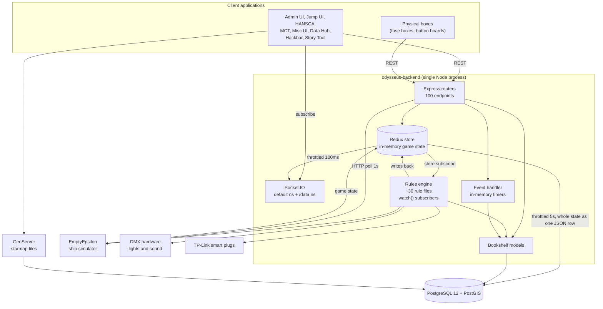

# Odysseus backend — system overview for a rewrite

This document describes the backend as it is today. It is the entry point for
the rewrite documentation set. Read `CONVENTIONS.md` for the tag meanings.

## 1. What the system is

The backend serves a live-action role-play (LARP) game that simulates a
spaceship. Players use about ten separate front-end applications and some
physical hardware. The backend holds all game state, applies game rules,
controls stage lights and sound through DMX, and connects to an external
spaceship simulator called EmptyEpsilon.

The system is not a normal web application. It is a real-time game server with
a REST API bolted on. Most of the interesting behaviour is not in the routes.
It is in the rules engine, which reacts to state changes.

## 2. Numbers

| Item | Count |
|---|---|
| Source files under `src/` and `db/` | 220 |
| Lines of source (`.ts` + `.js`, no `node_modules`) | ~17,900 |
| HTTP endpoints on express routers | 93 |
| HTTP endpoints defined inline in `src/index.ts` | 7 |
| Database migrations | ~50 |
| Bookshelf models | 20 |
| Rule files | ~30 |
| Client applications | 10+ |

Development history: 100 commits in 2018, 455 in 2019 (the main build), then
almost nothing until 160 commits in 2024. The 2019 code was written by junior
developers under time pressure for a live event. The 2024 work added the Story
DB, TypeScript, and the artifact and hacking systems.

## 3. Technology

| Layer | Technology | Rewrite concern |
|---|---|---|
| Runtime | Node 18, TypeScript 4.9 + Babel-era JavaScript mixed in one tree | Half the files are untyped `.js` |
| HTTP | Express 4 | Standard |
| Sockets | Socket.IO 2.x | Old major version. Clients pin to it. |
| SQL builder | Knex 2.4 | Keep or replace |
| ORM | Bookshelf.js, from a **forked git repository** | `[BOOKSHELF]` The fork is the reason this cannot be upgraded. See `models-bookshelf.md`. |
| Database | PostgreSQL 12 + PostGIS | `[PG]` `[GIS]` See `database-schema.md` |
| In-memory state | Redux (`redux-starter-kit` 0.4) | The live game state. See `rules-engine.md`. |
| API docs | `express-swagger-generator`, also a **fork** | JSDoc comments generate `/api-docs` |
| Validation | Zod, but only in files written in 2024 | Most routes validate nothing |
| Hardware | `dmx` package, `tplink-smarthome-api` | Physical side effects |
| Metrics | `prom-client`, `express-prometheus-middleware` | `/metrics` |

Two dependencies come from forked GitHub repositories rather than npm:
`bookshelf` (`OdysseusLarp/bookshelf`) and `express-swagger-generator`
(`nicou/express-swagger-generator`). A rewrite removes both.

## 4. Runtime architecture

### 4.1 Two state systems that do not share rules

This is the central architectural fact. The backend has **two separate state
stores** with different semantics:

**A. Relational state — Bookshelf models over PostgreSQL tables.**
Persons, ships, grids, map objects, posts, votes, logs, artifacts, tags,
infoboard entries, SIP contacts, story data. Normal rows, normal queries,
written directly by route handlers.

**B. Live game state — a Redux store held in process memory.**
Boxes, tasks, ship systems, jump state, EmptyEpsilon mirror, misc settings.
Addressed as `data[type][id]`, exposed over `/data` REST routes and the
`/data` Socket.IO namespace.

Store B is persisted by serialising **the entire store into a single row** of
the `store` table (`id = 'data'`, column `data`) at most every 5 seconds
(`src/store/storePersistance.ts:15`). `[SIDE-EFFECT]` Consequences:

- Up to 5 seconds of game state is lost on a crash.
- There are no per-object transactions. The last write of the whole blob wins.
- Two backend processes cannot run at the same time. They would overwrite each
  other's full state.
- The row grows without bound as new blob types are added.

The rewrite must decide whether store B becomes real tables. See
`rules-engine.md` and `side-effects-catalog.md`.

### 4.2 The rules engine

`loadRules()` (`src/rules/rules.js:8`) reads every subdirectory of `src/rules/`
and `require`s every file. Requiring a file registers its rules as a side
effect of the import. There is no registry and no list. To find every rule you
must read every file.

A rule calls `watch(path, callback)` (`src/store/store.ts:70`). This subscribes
to the Redux store. When the object at `path` changes by reference, the
callback runs through `setTimeout(..., 0)`. The callback usually writes back to
the store. That write triggers other rules. Cascades and feedback loops are
possible and some exist. `side-effects-catalog.md` lists them.

### 4.3 Startup order

`src/index.ts:159` loads the persisted Redux state from the `store` table,
then initialises the state, enables persistence, loads the rules, starts
TP-Link scanning, starts the HTTP listener, and starts the EmptyEpsilon poll
loop. Swagger and the Socket.IO store bridge are set up outside that promise,
so they run before the state exists. `[SIDE-EFFECT]` If the database is slow,
the process accepts Socket.IO connections before the game state is loaded.

## 5. Subsystem map

| Subsystem | Routes | State | Storage | Notes |
|---|---|---|---|---|
| Starmap and navigation | `/starmap`, `/fleet` | relational | PostgreSQL + PostGIS `[GIS]` | Grid geometry, jumps, scans. Cannot move to SQLite. |
| Personnel | `/person` | relational | PostgreSQL | Largest route file. Player characters. |
| Social | `/post`, `/vote`, `/log` | relational | PostgreSQL | Ship-internal social media and voting. |
| Science and artifacts | `/science`, `/tag`, `/operation` | mixed | PostgreSQL + Redux | Timed artifact analysis. Timers live in memory. |
| Infoboard | `/infoboard` | relational | PostgreSQL | News screens. |
| Communications | `/sip`, `/messaging` | relational | PostgreSQL | SIP phone directory. In-game chat over the `/messaging` Socket.IO namespace, stored in `com_message`. No external service. |
| Generic data store | `/data` | Redux | `store` table, one JSON row | Boxes, tasks, ship systems. |
| Engineering and boxes | `/data` + rules | Redux | `store` table | Physical puzzle boxes. Heavy rules. |
| Ship simulation | `/state`, `/state/full-push` | Redux | `store` table | EmptyEpsilon mirror, polled every 1s. |
| Hardware effects | `/dmx` | none | none | DMX lights and sound, TP-Link plugs. |
| Story DB `[STORY-DB]` | `/story` | relational | PostgreSQL | Added 2024. To be split out. See `story-db.md`. |
| Metrics and health | `/metrics`, `/ping` | none | none | Prometheus. |

## 6. The four rewrite concerns

### 6.1 Bookshelf.js to plain SQL

The risk is not the queries. It is the invisible behaviour:

- Model lifecycle hooks and `Model.on(...)` listeners fire on save. A plain SQL
  rewrite drops them silently.
- Virtual attributes appear in JSON responses but are not columns. Clients
  depend on them.
- `hasTimestamps` writes `created_at` and `updated_at` without the caller
  asking.
- `db/index.ts:12` sets `requireFetch = false`. A missing row returns `null`
  instead of throwing. Route code depends on this and often does not check.
- Eager loading through `fetchWithRelated` hides the real query count.

`models-bookshelf.md` documents every model with the equivalent plain SQL.

### 6.2 PostgreSQL to SQLite for the non-GIS parts

Everything with a `the_geom` column, every `ST_*` call, and the
`starmap_grid_info` view must stay on PostGIS. The starmap is also served by a
separate GeoServer instance that reads the same tables directly, so those
tables cannot move at all.

`database-schema.md` gives a portability verdict per table and a full inventory
of PostgreSQL-only features.

**A second process reads the same database directly.** GeoServer
(`odysseus-geoserver`) connects to the same PostGIS instance as the backend —
host `odysseus-database`, port 5432, database `postgres`, schema `public`
(`~/git/odysseus-geoserver/data_dir/workspaces/odysseus/odysseus/datastore.xml`).
It publishes 13 WMS/WFS layers built on these tables and views:

| Layer | Kind |
|---|---|
| `grid` | table `[GIS]` |
| `starmap_bg` | table `[GIS]` |
| `starmap_fleet` | SQL view |
| `starmap_grid_alert` | SQL view |
| `starmap_grid_info` | SQL view |
| `starmap_jump_range` | SQL view |
| `starmap_object_star`, `starmap_object_star_text` | SQL view |
| `starmap_object_visible` and its four text variants | SQL view |
| `starmap_object_all`, `starmap_object_bh` | table or view |

Consequences for the rewrite:

- These tables, these views, and their geometry columns are a public
  integration surface, not backend-internal storage. Renaming or reshaping them
  breaks the map in every client.
- The views are the contract. They are created in the migrations
  (`db/migrations/20190622221132_fix-grid-scan.js`,
  `20190623162550_starmap-alerting-grid.js`, `20190530150943_starmap-visible-ships.js`
  and others), so the migration tool owns objects that the backend code never
  queries.
- This explains why `starmap_grid_info` has no reference anywhere in `src/`.
  It exists for GeoServer.
- The map clients (`odysseus-jump-ui`, `odysseus-data-hub`) read GeoServer
  directly over WMS/WFS. They do not use the `/starmap` REST routes for map
  data. The backend is not in that path.
- The starmap group therefore cannot move to SQLite, and cannot even move to a
  different PostgreSQL schema without reconfiguring GeoServer.

### 6.3 Unexpected side effects

`side-effects-catalog.md` is the deliverable for this concern. It is a ranked
catalog of every operation that does more than its name says.

The catalog holds **42 entries**. The five most severe:

1. **No authentication or authorization anywhere.** Every route is open,
   including ship damage and mains power.
2. **The whole store is persisted into one row every 5 seconds**
   (`src/store/storePersistance.ts:11`). Last-writer-wins, a 5-second loss
   window, no per-blob transactions.
3. **`POST/PATCH /data/:type/:id` drives the whole ship.** One generic
   key-value write can fire DMX, switch TP-Link mains sockets, damage
   EmptyEpsilon, and write `ship`, `ship_log` and `grid_action`.
4. **A throwing rule kills the process.** `watch()` (`src/store/store.ts:69`)
   runs its callback in a bare `setTimeout` with no `try/catch`, and there is
   no `uncaughtException` handler anywhere. Because a crash raises no signal,
   it also skips the `SIGINT`/`SIGTERM` shutdown save — so the process dies
   *and* loses state. Three reachable throw sites exist.
5. **`POST /emit/:eventName`** lets any caller emit any Socket.IO event to
   every client, including forged `shipUpdated` and `logEntryAdded`.

Ten feedback cycles through the store are mapped in `rules-engine.md`. One
(`ship/ee` → break tasks → `task` → EE write → poll → `ship/ee`) is undamped.
`src/rules/boxes/airlock.js:197` carries a `KLUGE` comment for an unexplained
infinite loop that was never diagnosed.

Known categories, listed here so the shape is clear:
- Rules that fire physical hardware from an ordinary REST write.
- Routes that write the ship log as a by-product.
- In-memory timers whose work is lost on restart.
- `POST /emit/:eventName`, which lets any caller emit any Socket.IO event.
- No authentication anywhere in the API. The one exception is the
  `/messaging` Socket.IO namespace, which reads a person id from the handshake
  query string and rejects unknown ids (`src/messaging.ts:86`). Any caller can
  claim any person id, so this is identification, not authentication.

### 6.4 Splitting the Story DB

`story-db.md` gives the coupling analysis. The short version: the `story_*`
tables have foreign keys into the shared `person` table and join it in almost
every query, so the split needs either replicated person data or a real-time
person feed.

## 7. Document index

| Document | Contents |
|---|---|
| `CONVENTIONS.md` | Tags and writing rules |
| `00-overview.md` | This document |
| `route-inventory.md` | Checklist of all 102 endpoints, with the command to re-verify |
| `bugs.md` | Consolidated defect list, 32 entries, ranked by severity |
| `routes-fleet-starmap-person.md` | API reference: `/fleet` `/starmap` `/person` `/event` `/post` `/vote` `/log` |
| `routes-science-data-misc.md` | API reference: `/science` `/data` `/infoboard` `/dmx` `/tag` `/operation` `/sip` `/messaging`, EmptyEpsilon, root routes |
| `database-schema.md` | Consolidated schema, PostGIS map, SQLite portability |
| `models-bookshelf.md` | Every Bookshelf model and its plain-SQL equivalent |
| `rules-engine.md` | The rules engine, the Redux data model, timers, DMX |
| `side-effects-catalog.md` | Ranked catalog of unexpected behaviour |
| `story-db.md` | Story DB scope and split plan |
| `api-consumers.md` | Which client repository calls which endpoint |

Total: about 10,200 lines of documentation over 11 files.

## 8. Operational facts a rewrite must keep

- The process is stateful and single-instance. Horizontal scaling is not
  possible today.
- `SIGINT` and `SIGTERM` trigger a state save and then `process.exit(0)`
  (`src/store/storePersistance.ts:38`). A rewrite must keep a shutdown save or
  move to per-write persistence.
- Environment configuration is in `.env`. See `.env.dist` for the full list.
- DMX and TP-Link output is disabled when the driver variables are empty. The
  code paths still run.
- If `EMPTY_EPSILON_HOST` is not set, the backend starts an internal emulator
  (`src/integrations/emptyepsilon/emulator.ts`). Production and development
  therefore take different code paths.

## 9. There are no tests

`package.json` defines `npm test` with ava, nyc and rewire, and the Babel config
has a `test` environment. There is no `test/` directory in the repository. The
backend has zero automated test coverage.

A rewrite therefore has no executable specification of current behaviour. This
documentation set is the only specification. Where a document says "Unclear",
the behaviour must be confirmed against a running instance before it is
reproduced.

Related unused material:
- `fixtures/` holds an EmptyEpsilon fixture and two JSON request bodies used
  for manual testing.
- `dist/` is a stale compiled build. It contains `src/emptyepsilon.js` and
  `src/routes/helpers.js`, which no longer exist in `src/`. Do not read `dist/`
  as a source of truth. `[DEAD]`
- `personal/` holds one developer's working files, including CSV and SQL dumps
  from a past game run. It is not part of the application.
