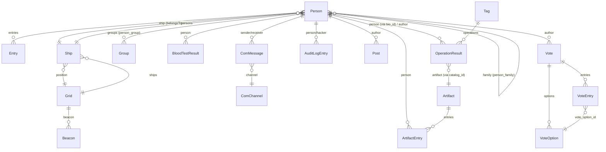

# Bookshelf models

This document describes every Bookshelf model in `src/models/*.js` and `src/models/*.ts`, and the plain SQL a rewrite needs to replace each relation and custom method. Tags are defined in `docs/rewrite/CONVENTIONS.md`.

Two facts about the current setup apply to every model below and are not repeated per model:

- `db/index.ts:12` sets `bookshelf.Model.prototype.requireFetch = false`. Every `.fetch()` call returns `null` when no row matches, instead of throwing. A plain SQL rewrite using `knex(...).first()` already returns `undefined` on no match. This is the closer equivalent. Callers that currently check `if (!thing) throw ...` keep working. But code that relied on a thrown `EmptyResponse` would not; there is none found in `src/`.
- Every model with `hasTimestamps: true` gets `created_at`/`updated_at` auto-managed by Bookshelf on save. A plain SQL rewrite must set these explicitly (`created_at: knex.fn.now()` on insert, `updated_at: knex.fn.now()` on every update).

The five `story-*.ts` files under `src/models/` are **not** Bookshelf models. They already use `knex` directly with `zod` for validation; no translation is needed. They are documented briefly at the end for completeness, since the task description names the whole directory.

---

## `Artifact` (`artifact`)

**Source:** `src/models/artifact.js:52-67`

**Table:** `artifact`

**Bookshelf features used:** `[BOOKSHELF]` `hasTimestamps` (`:55`) and a `hasMany` relation `entries` -> `ArtifactEntry` (`:56-58`). Custom fetch methods `fetchAllWithRelated`/`fetchWithRelated` (`:59-66`) eager-load `entries` and `entries.person`, restricted to `id, first_name, last_name` (`:27-29`).

**Implicit behaviour:** None beyond the timestamps/eager-load.

**Custom methods:**

- `fetchAllWithRelated(isVisible)` (`:59-63`): if `isVisible` is a boolean, runs `SELECT * FROM artifact WHERE is_visible = ? ORDER BY id` (implicit default order), with `entries` eager-loaded. Otherwise runs `SELECT * FROM artifact ORDER BY created_at DESC`, with the same eager-load.
- `fetchWithRelated()` (`:65-66`): `SELECT * FROM artifact WHERE id = ?` plus the same eager-load, for a single artifact.

**Equivalent plain SQL:**
```sql
-- fetchAllWithRelated(isVisible)
SELECT * FROM artifact [WHERE is_visible = :isVisible] ORDER BY created_at DESC;
-- then, per artifact (or one join query grouped in app code):
SELECT ae.*, p.id, p.first_name, p.last_name
FROM artifact_entry ae
LEFT JOIN person p ON p.id = ae.person_id
WHERE ae.artifact_id = :artifactId;
```
A rewrite should do this as one query with `LEFT JOIN artifact_entry ... LEFT JOIN person ...` and group in application code, rather than N+1.

**Rewrite risks:** N+1 if `entries`/`entries.person` are fetched per-artifact in a loop instead of one joined query. `entries.artifact_id` has the FK bug documented in `docs/rewrite/database-schema.md` (`artifact_entry` entry). A rewrite join still works correctly, because the join key (`artifact.id = artifact_entry.artifact_id`) is right, even though the FK constraint target is wrong.

---

## `ArtifactEntry` (`artifact_entry`)

**Source:** `src/models/artifact.js:16-24`

**Table:** `artifact_entry`

**Bookshelf features used:** `[BOOKSHELF]` `hasTimestamps` (`:18`), `hasOne` relations `artifact` -> `Artifact` on `id`/`artifact_id` (`:19-21`) and `person` -> `Person` on `id`/`person_id` (`:22-23`). Note: Bookshelf's `hasOne(Artifact, 'id', 'artifact_id')` here really means "the *foreign* table's `id` matches *this* row's `artifact_id`". This is functionally a `belongsTo`, expressed with `hasOne` and explicit columns.

**Custom methods:** None beyond the relations.

**Equivalent plain SQL:**
```sql
SELECT a.* FROM artifact a WHERE a.id = :entry.artifact_id;
SELECT p.* FROM person p WHERE p.id = :entry.person_id;
```

**Rewrite risks:** None beyond the FK-target bug noted in the schema doc (does not affect this join, which uses `artifact.id`, the correct column).

---

## `Box` (`box`)

**Source:** `src/models/box.js:11-14`

**Table:** `box`

**Bookshelf features used:** `[BOOKSHELF]` `hasTimestamps` only.

**Custom methods:** `getBoxValueById(id)` (`:16-19`): `SELECT value FROM box WHERE id = ? LIMIT 1`, returns `.value` or `undefined`.

**Equivalent plain SQL:** `SELECT value FROM box WHERE id = :id;`

**Rewrite risks:** None functionally. But see `docs/rewrite/database-schema.md` (`box` entry): this model and table are `[DEAD]`, nothing calls `getBoxValueById`. A rewrite can drop this model and table entirely rather than port it.

---

## `ComMessage` (`com_message`)

**Source:** `src/models/communications.js:19-61`

**Table:** `com_message`

**Bookshelf features used:** `[BOOKSHELF]` `hasTimestamps` (`:21`); `hasOne` relations `sender` -> `Person` on `person_id` (`:22-24`), `receiver` -> `Person` on `target_person` (`:25-27`), and `channel` -> `ComChannel` on `target_channel` (`:28-30`). Custom fetch methods `fetchAllWithRelated`/`fetchWithRelated`/`fetchPageWithRelated` (`:31-45`). Custom query methods `getPrivateHistory`/`getChannelHistory` (`:46-60`).

**Implicit behaviour:** `[SIDE-EFFECT]` `fetchPageWithRelated` hardcodes `pageSize: 500000` (`:41`). Its own comment reads: "Feature that caused us great distress, fetching the FIRST 50 entries with no way to fetch more / Quick and dirty fix: increase pageSize to a large number" (`:39-40`). It deliberately disables pagination by requesting an effectively unbounded page. A rewrite should implement real pagination or a deliberate "fetch all" query, not copy this workaround.

**Custom methods:**

- `getPrivateHistory(userId, targetId)` (`:46-56`): messages where `(target_person = targetId AND person_id = userId) OR (target_person = userId AND person_id = targetId)`. Ordered by `created_at`, page 1 of 500000.
- `getChannelHistory(channelId)` (`:58-60`): messages where `target_channel = channelId`, ordered by `created_at`, page 1 of 500000.

**Equivalent plain SQL:**
```sql
-- getPrivateHistory
SELECT cm.*, s.*, r.*, c.*
FROM com_message cm
LEFT JOIN person s ON s.id = cm.person_id
LEFT JOIN person r ON r.id = cm.target_person
LEFT JOIN com_channel c ON c.id = cm.target_channel
WHERE (cm.target_person = :targetId AND cm.person_id = :userId)
   OR (cm.target_person = :userId AND cm.person_id = :targetId)
ORDER BY cm.created_at ASC;

-- getChannelHistory
SELECT cm.*, s.*, r.*, c.*
FROM com_message cm
LEFT JOIN person s ON s.id = cm.person_id
LEFT JOIN person r ON r.id = cm.target_person
LEFT JOIN com_channel c ON c.id = cm.target_channel
WHERE cm.target_channel = :channelId
ORDER BY cm.created_at ASC;
```

**Rewrite risks:** The "500000 page size" pattern must not be copy-pasted. It works around a Bookshelf pagination bug and is really "fetch everything". Aliasing collisions, when joining `person` twice for sender and receiver, must be handled explicitly in raw SQL. Bookshelf hides this.

---

## `ComChannel` (`com_channel`)

**Source:** `src/models/communications.js:70-73`

**Table:** `com_channel`

**Bookshelf features used:** `[BOOKSHELF]` `hasTimestamps` only.

**Custom methods:** None.

**Rewrite risks:** None. See schema doc: table is legacy per its own seed comment.

---

## `ComChannelEvent` (`com_channel_event`)

**Source:** `src/models/communications.js:83-86`

**Table:** `com_channel_event`

**Bookshelf features used:** `[BOOKSHELF]` `hasTimestamps` only.

**Rewrite risks:** None. `[DEAD]`; drop model and table (see schema doc).

---

## `Event` (`event`)

**Source:** `src/models/event.js:17-23`

**Table:** `event`

**Bookshelf features used:** `[BOOKSHELF]` `hasTimestamps` (`:19`).

**Custom methods:** `setActive(active)` (`:20-22`): `this.save({ is_active: !!active })`.

**`[BUG]`:** `setActive` does not `return` the result of `this.save(...)` (`src/models/event.js:20-22`):
```js
setActive: function (active) {
    this.save({ is_active: !!active });
}
```
Its only caller, `src/eventhandler.js:84`, does `await event.setActive(false)`. Because `setActive` returns `undefined`, the `await` resolves immediately. It does not wait for the UPDATE to finish, or observe any save error. A rewrite must either return the promise or make the caller call the update directly.

**Equivalent plain SQL:** `UPDATE event SET is_active = :active, updated_at = now() WHERE id = :id;`

**Rewrite risks:** Fix the missing `return` while rewriting; otherwise a functionally-faithful port would keep the race condition.

---

## `InfoEntry` (`infoboard_entry`)

**Source:** `src/models/infoentry.js:18-21`

**Table:** `infoboard_entry`

**Bookshelf features used:** `[BOOKSHELF]` `hasTimestamps` only. No relations, no custom methods, no listeners.

**Rewrite risks:** None.

---

## `InfoPriority` (`infoboard_priority`)

**Source:** `src/models/infoentry.js:29-32`

**Table:** `infoboard_priority`

**Bookshelf features used:** `[BOOKSHELF]` `hasTimestamps` only.

**Rewrite risks:** See the schema doc: the table has no primary key. So `InfoPriority.forge().fetch()` (used in `src/routes/infoboard.js:36,84`) is really "fetch any one row". `SELECT * FROM infoboard_priority LIMIT 1` is the faithful equivalent, not "fetch the row", since there is no identity to fetch by.

---

## `LogEntry` (`ship_log`)

**Source:** `src/models/log.js:18-37`

**Table:** `ship_log`

**Bookshelf features used:** `[BOOKSHELF]` `hasTimestamps` (`:20`), `initialize` hook with three event listeners (`:21-36`).

**Implicit behaviour:** `[SIDE-EFFECT]` On `destroying`:
```js
this.on('destroying', model => {
    logger.success('Deleted log entry', model.get('id'), model.get('type'), model.get('message'));
    getSocketIoClient().emit('logEntryDeleted', { id: model.get('id') });
});
```
(`src/models/log.js:24-27`). Every delete of a `ship_log` row logs and emits a Socket.IO `logEntryDeleted` event. On `created` (`:28-31`) and `updated` (`:32-35`), analogous `logEntryAdded`/`logEntryUpdated` events are emitted with the full model. None of this happens if a rewrite does a plain `DELETE`/`INSERT`/`UPDATE`. The Socket.IO emits must be added explicitly at every call site (`src/models/log.js:87-95` `addShipLogEntry`, `src/routes/log.js` PUT/DELETE handlers).

**Custom methods:** `addShipLogEntry(type, message, shipId, metadata)` (`:87-95`) is a module-level function, not on the model. It runs `INSERT INTO ship_log (ship_id, message, metadata, type) VALUES (...)` via `LogEntry.forge().save(body, { method: 'insert' })`. `shipLogger` (`:97-102`) is a 4-method convenience wrapper (`info`/`success`/`warning`/`error`) around it.

**Equivalent plain SQL:**
```sql
INSERT INTO ship_log (ship_id, message, metadata, type, created_at, updated_at)
VALUES (:ship_id, :message, :metadata, :type, now(), now());
```
Plus, in application code, an explicit `io.emit('logEntryAdded', row)` after the insert to replace the lost lifecycle hook.

**Rewrite risks:** `[SIDE-EFFECT]` is the whole point of this model. Losing the emits silently breaks any frontend relying on `logEntryAdded`/`logEntryUpdated`/`logEntryDeleted` Socket.IO events.

---

## `AuditLogEntry` (`audit_log`)

**Source:** `src/models/log.js:52-79`

**Table:** `audit_log`

**Bookshelf features used:** `[BOOKSHELF]` `hasTimestamps` (`:54`); an `initialize` hook with a `created` listener (`:55-62`); `hasOne` relations `person` (`:63-65`) and `hacker` (`:66-68`). Custom `fetchWithRelated`/`fetchPageWithRelated` (`:69-77`) eager-load `person`/`hacker`, restricted to `id, first_name, last_name, is_character` (`:39-40`).

**Implicit behaviour:** `[SIDE-EFFECT]` On `created` (`src/models/log.js:56-61`), it logs and emits Socket.IO `auditLogEntryAdded` with the full model. It adds a "(Hacked by X)" suffix in the log line if `hacker_id` is set.

**Custom methods:** `fetchPageWithRelated(page)` (`:72-77`): page of 50, ordered by `created_at`, with `person`/`hacker` eager-loaded.

**Equivalent plain SQL:**
```sql
SELECT al.*, p.id AS person_id_, p.first_name AS person_first_name, p.last_name AS person_last_name, p.is_character AS person_is_character,
       h.id AS hacker_id_, h.first_name AS hacker_first_name, h.last_name AS hacker_last_name, h.is_character AS hacker_is_character
FROM audit_log al
LEFT JOIN person p ON p.id = al.person_id
LEFT JOIN person h ON h.id = al.hacker_id
ORDER BY al.created_at DESC
LIMIT 50 OFFSET :page_offset;
```

**Rewrite risks:** `[SIDE-EFFECT]` lost Socket.IO emit on insert must be added explicitly at both call sites (`src/routes/person.js:96-100,130-133`, `src/routes/log.js:76`).

---

## `MapObject` (`starmap_object`)

**Source:** `src/models/map-object.js:16-26`

**Table:** `starmap_object`

**Bookshelf features used:** `[BOOKSHELF]` No `hasTimestamps` (commented out, `:18-19`; this matches the table having no timestamp columns). Custom `fetchAllWithRelated`/`fetchWithRelated` (`:20-25`) currently eager-load nothing (`shipWithRelated` is `[]`, `:5-7`). This is dead parameterisation.

**Equivalent plain SQL:** `SELECT * FROM starmap_object [WHERE ...];`. No joins are needed today.

**Rewrite risks:** None significant; the eager-load scaffolding is vestigial and can be dropped.

---

## `Entry` (`person_entry`)

**Source:** `src/models/person.js:16-25`

**Table:** `person_entry`

**Bookshelf features used:** `[BOOKSHELF]` `hasTimestamps` (`:18`). `hasOne` relations `person` (`:19-21`) and `added_by` -> `Person` on `id`/`added_by` (`:22-24`). Note: the `person` relation passes no explicit FK columns; it relies on Bookshelf's convention `person_id` -> `person.id`.

**Equivalent plain SQL:**
```sql
SELECT p.* FROM person p WHERE p.id = :entry.person_id;
SELECT p.* FROM person p WHERE p.id = :entry.added_by;
```

**Rewrite risks:** None.

---

## `Group` (`group`)

**Source:** `src/models/person.js:33-43`

**Table:** `group`

**Bookshelf features used:** `[BOOKSHELF]` `hasTimestamps` (`:35`), custom `serialize` override (`:37-39`), `belongsToMany` relation `persons` -> `Person` via pivot table `person_group` (`:40-42`).

**Implicit behaviour:** `[SIDE-EFFECT]`-adjacent serialization difference: `serialize: function () { return this.get('id'); }` (`:37-39`). Every time a `Group` model is turned to JSON, it renders as a **bare string** (the group ID), not `{ id, created_at, updated_at }`. This includes when it appears inside another model's eager-loaded `groups` relation. A plain SQL rewrite might do `SELECT * FROM group` and return the row object as-is. That produces a different, richer shape than the API currently returns. `src/routes/person.js:73` (`GET /person/groups`) returns the raw model collection. So this endpoint currently returns an array of plain ID strings, not group objects. A rewrite must replicate that shape explicitly (`SELECT id FROM "group"`, or map rows to `row.id`), to avoid a breaking API change.

**Equivalent plain SQL:**
```sql
SELECT id FROM "group";  -- must project to raw IDs to match current API shape
SELECT p.* FROM person p
JOIN person_group pg ON pg.person_id = p.id
WHERE pg.group_id = :groupId;
```

**Rewrite risks:** The `serialize` override is easy to miss. If not replicated, it silently changes the `GET /person/groups` response shape from `["role:medic", ...]` to `[{id: "role:medic", created_at: ..., ...}]`.

---

## `BloodTestResult` (`person_blood_test_result`)

**Source:** `src/models/person.js:60-69`

**Table:** `person_blood_test_result`

**Bookshelf features used:** `[BOOKSHELF]` `hasTimestamps` (`:62`), `hasOne` relation `person` (`:63-65`), custom `fetchWithRelated` (`:66-68`).

**`[BUG]`:** `fetchWithRelated` does not return its result (`src/models/person.js:66-68`):
```js
fetchWithRelated() {
    this.fetch({ withRelated: ['person'] });
}
```
Calling it always yields `undefined`. Currently unused: a grep of `src/` shows no caller of `BloodTestResult#fetchWithRelated`. `src/routes/operation.ts:398` calls plain `.fetch()` on a `where()` query instead. So the bug is latent, not active. A rewrite does not need to preserve this method as-is. Just query `person_blood_test_result` directly, optionally joined to `person`.

**Equivalent plain SQL:**
```sql
SELECT bt.*, p.* FROM person_blood_test_result bt
LEFT JOIN person p ON p.id = bt.person_id
WHERE bt.person_id = :personId;
```

**Rewrite risks:** None beyond not copying the broken method.

---

## `Person` (`person`)

**Source:** `src/models/person.js:128-235`

**Table:** `person`

**Bookshelf features used:** `[BOOKSHELF]`

- `hasTimestamps` (`:130`).
- `virtuals.full_name` (`:131-137`), computed as `first_name + ' ' + last_name` when `last_name` is set. This requires the `bookshelf-virtuals-plugin`, registered in `db/index.ts:8`.
- `hasMany` `entries` -> `Entry` (`:138-140`).
- `belongsToMany` `family` -> `Person` (self-referencing) via pivot `person_family` on `person1_id`/`person2_id`, with `.withPivot(['relation'])` (`:141-143`).
- `belongsTo` `ship` -> `Ship` (`:144-146`).
- `belongsToMany` `groups` -> `Group` via pivot `person_group` (`:147-149`).

**Custom methods:**

- `fetchListPage({ page, pageSize, showHidden, filters })` (`:150-186`): paginated, filtered list of persons with a fixed column projection and `ship: {id, name}` eager-loaded.
- `fetchWithRelated()` (`:187-203`): a single person with `entries`, `ship`, `groups` and `family` eager-loaded. Columns are restricted to `id, first_name, last_name, ship_id, status, is_visible, is_character`, plus `entries.added_by` restricted to `id, first_name, last_name`.
- `search(name, showHidden)` (`:204-209`): case-insensitive substring search on full name.
- `addToGroup(groupId)` / `deleteFromGroup(groupId)` (`:210-221`): raw INSERT/DELETE on `person_group`.
- `killPerson()` (`:222-234`): transaction that sets `status = 'Deceased'` and inserts a `person_entry` row.

**Implicit behaviour:** `[SIDE-EFFECT]` `killPerson` is transactional and touches two tables at once. A rewrite must keep both writes in one DB transaction. It also hardcodes the log text `` `542 - Deceased` `` and `added_by: process.env.FLEET_SECRETARY_ID` (`:227-231`). These are game-specific constants that must be preserved or made configurable.

**Equivalent plain SQL:**
```sql
-- fetchListPage (simplified; filters are dynamic AND clauses built from `filters`)
SELECT id, first_name, last_name, title, dynasty, political_party, religion,
       ship_id, status, home_planet, is_visible, card_id, character_group,
       shift, is_character
FROM person
WHERE (:showHidden OR is_visible = true)
  [AND LOWER(CONCAT(first_name, ' ', last_name)) LIKE :nameFilter]
  [AND <other dynamic filters from `filters`>]
  [AND is_character = :isCharacter]
ORDER BY first_name, last_name
LIMIT :pageSize OFFSET (:page - 1) * :pageSize;
-- plus, per row: SELECT id, name FROM ship WHERE id = person.ship_id

-- fetchWithRelated
SELECT * FROM person WHERE id = :id; -- or bio_id / card_id, per caller
SELECT id, type, entry, added_by, created_at, updated_at FROM person_entry WHERE person_id = :id;
SELECT id, first_name, last_name FROM person WHERE id IN (SELECT added_by FROM person_entry WHERE person_id = :id);
SELECT * FROM ship WHERE id = :person.ship_id;
SELECT g.id, g.created_at, g.updated_at FROM "group" g JOIN person_group pg ON pg.group_id = g.id WHERE pg.person_id = :id;
SELECT p2.id, p2.first_name, p2.last_name, p2.ship_id, p2.status, p2.is_visible, p2.is_character, pf.relation
FROM person_family pf JOIN person p2 ON p2.id = pf.person2_id WHERE pf.person1_id = :id;

-- search
SELECT * FROM person
WHERE is_visible = :notShowHidden
  AND LOWER(CONCAT(first_name, ' ', last_name)) LIKE '%' || :name || '%';

-- addToGroup / deleteFromGroup
INSERT INTO person_group (person_id, group_id) VALUES (:personId, :groupId);
DELETE FROM person_group WHERE person_id = :personId AND group_id = :groupId;

-- killPerson (single transaction)
UPDATE person SET status = 'Deceased' WHERE id = :id;
INSERT INTO person_entry (person_id, type, entry, added_by)
VALUES (:id, 'PERSONAL', '542 - Deceased', :FLEET_SECRETARY_ID);
```

**Rewrite risks:** `family` is a **self-referencing many-to-many via two differently-named FK columns** (`person1_id`/`person2_id`). It is the most Bookshelf-specific relation in the codebase. A naive ORM-to-SQL port easily gets the join direction backwards. Note that the relation is one-directional: fetching `personA.family` only returns rows where `personA` is `person1_id`, never rows where `personA` is `person2_id`. This is a **pre-existing asymmetry** in the current code, not a rewrite bug to fix silently. The `PUT /:id/family` route comment even says "WIP - Not working properly yet" (`src/routes/person.js:195`).

`virtuals.full_name` is computed in JS on every serialize. Any raw-SQL rewrite must compute it in the query (`CONCAT`) or in application code, not rely on it appearing "for free". `fetchListPage`'s dynamic filter loop (`forOwn(filters, ...)`, `:154-157`) builds `WHERE key = value` for arbitrary keys. A straight port must keep this allow-list narrow, to avoid SQL-injectable column names in a rewrite that takes the filters object less carefully. Today it only receives pre-picked query params from `src/routes/person.js:37-40`.

---

## `Post` (`post`)

**Source:** `src/models/post.js:23-51`

**Table:** `post`

**Bookshelf features used:** `[BOOKSHELF]` `hasTimestamps` (`:25`), `initialize` hook with `destroying`/`created`/`updated` listeners (`:26-41`), `hasOne` relation `author` (`:42-44`), custom `fetchAllWithRelated`/`fetchWithRelated` (`:45-50`).

**Implicit behaviour:** `[SIDE-EFFECT]` Same pattern as `LogEntry`: delete/create/update each log via `logger`, and emit `postDeleted`/`postAdded`/`postUpdated` over Socket.IO (`src/models/post.js:29-40`). Note that `src/routes/post.js:56,60` **also** emits `postAdded`/`postUpdated` itself, via `req.io.emit(...)`. So today a post insert/update emits **twice**: once from the route, once from the model's `initialize` listener. A rewrite must pick one place to emit. Replicating current behaviour exactly means emitting twice, not once.

**Equivalent plain SQL:**
```sql
INSERT INTO post (title, body, person_id, type, status, is_visible, show_on_infoboard, created_at, updated_at)
VALUES (...) RETURNING *;
UPDATE post SET title=..., body=..., updated_at = now() WHERE id = :id RETURNING *;
SELECT po.*, p.* FROM post po LEFT JOIN person p ON p.id = po.person_id ORDER BY po.created_at DESC;
```

**Rewrite risks:** A double Socket.IO emit (route plus model listener) is easy to "fix" accidentally, by keeping only one. Decide deliberately whether that is a bug to fix, or existing behaviour to keep.

---

## `Grid` (`grid`)

**Source:** `src/models/ship.js:24-50`

**Table:** `grid`

**Bookshelf features used:** `[BOOKSHELF]` `hasTimestamps` (`:26`). **This is mismatched with the actual table schema**; see `[BUG]` below. `hasMany` relation `ships` -> `Ship` (`:27-29`), custom `fetchWithRelated` (`:30-32`), `getCoordinates` (`:33-35`), `getRandomJumpTarget` (`:37-40`, raw SQL `[GIS]`), `containsObject` (`:42-49`, raw SQL `[GIS]`).

**`[BUG]`:** `hasTimestamps: true` (`src/models/ship.js:26`) but the `grid` table has no `created_at`/`updated_at` columns (`db/migrations/20181118152323_starmap-and-fleet.js:7-17` never calls `.timestamps()`). See `docs/rewrite/database-schema.md` (`grid` entry) for the full analysis; latent because nothing calls `.save()` on `Grid`.

**Custom methods:**

- `getRandomJumpTarget()` (`:37-40`): `[GIS]` a random point within about 300km of the grid's centroid, in the grid's own SRID. 3857 units are meters, so ±150000 is about ±150km per axis:
  ```sql
  SELECT ST_Translate(
    ST_Centroid(grid.the_geom),
    FLOOR(RANDOM() * 300000 - 150000),
    FLOOR(RANDOM() * 300000 - 150000)
  ) AS jump_target
  FROM grid WHERE grid.id = :id;
  ```
- `containsObject(nameGenerated)` (`:42-49`): `[GIS]` whether a named, non-star/non-black-hole `starmap_object` lies within this grid cell:
  ```sql
  SELECT ST_WITHIN(
    (SELECT the_geom FROM starmap_object
     WHERE name_generated = UPPER(:nameGenerated)
       AND celestial_body NOT IN ('star', 'black hole')),
    the_geom
  ) AS has_object
  FROM grid WHERE id = :gridId;
  ```

**Equivalent plain SQL:**
```sql
SELECT g.*, s.* FROM grid g LEFT JOIN ship s ON s.grid_id = g.id WHERE g.id = :id;
```

**Rewrite risks:** `[GIS]` both custom methods must stay on PostgreSQL. Fix (or deliberately preserve) the `hasTimestamps` mismatch.

---

## `GridAction` (`grid_action`)

**Source:** `src/models/ship.js:61-64`

**Table:** `grid_action`

**Bookshelf features used:** `[BOOKSHELF]` `hasTimestamps` only.

**Rewrite risks:** None. Nothing in `src/` inserts into this table at runtime (only the seed does); see schema doc.

---

## `Beacon` (`starmap_beacon`)

**Source:** `src/models/ship.js:74-107`

**Table:** `starmap_beacon`

**Bookshelf features used:** `[BOOKSHELF]` `hasTimestamps` (`:76`), `hasOne` relation `grid` (`:77-79`), custom `fetchWithRelated` (`:80-82`), custom `activate(velianMessage)` (`:83-105`).

**Implicit behaviour:** `[SIDE-EFFECT]` `activate` (`:83-105`) is the single most side-effect-heavy method in the codebase:
```js
activate: function (velianMessage) {
    return knex.transaction(async trx =>
        Promise.all([
            knex('starmap_beacon').transacting(trx).update({ is_active: false }).whereNot('id', this.get('id')),
            knex('starmap_beacon').transacting(trx).update({ is_active: true, is_decrypted: true }).where('id', this.get('id'))
        ]).then(() => trx.commit())
            .then(() => {
                dmx.fireEvent(dmx.CHANNELS.LoraBeaconSignalDecrypted);
                if (velianMessage) {
                    shipLogger.warning(`Received a distress signal from area Alpha-5-D2-100: ${velianMessage}`, { showPopup: true });
                    return;
                }
                shipLogger.success(`Decryption key '${this.get('id')}' successfully decrypted an unknown signal originating from area ${this.related('grid').get('name')}`, { showPopup: true });
            })
            .then(() => getSocketIoClient().emit('refreshMap'))
            .catch(() => trx.rollback()));
}
```
(`src/models/ship.js:83-105`). It does five things:

1. Deactivates every other beacon in one UPDATE.
2. Activates and marks this one decrypted.
3. Fires a DMX lighting event.
4. Writes a `ship_log` row with text that depends on whether this is the special Velian beacon. This itself triggers the `LogEntry`/socket side effects documented above.
5. Emits a `refreshMap` Socket.IO event.

`[BUG]`-adjacent: `trx.commit()` is called manually inside a `knex.transaction(async trx => ...)` callback. This callback already auto-commits on success and auto-rolls-back on a thrown error. Calling `.commit()`/`.rollback()` manually here is redundant with Knex's own transaction lifecycle, and can race it.

**Equivalent plain SQL (as one transaction):**
```sql
BEGIN;
UPDATE starmap_beacon SET is_active = false WHERE id != :id;
UPDATE starmap_beacon SET is_active = true, is_decrypted = true WHERE id = :id;
COMMIT;
-- then, outside the DB transaction: dmx.fireEvent(...), INSERT INTO ship_log (...), socket emit('refreshMap')
```

**Rewrite risks:** This is the single richest `[SIDE-EFFECT]` method to port faithfully. One DB update keys off a DMX hardware event, a ship log write (with its own nested Socket.IO side effect), and a map-refresh Socket.IO event. Missing any one of the three breaks a different subsystem: lighting, the in-game log feed, or the live map.

---

## `Ship` (`ship`)

**Source:** `src/models/ship.js:141-231`

**Table:** `ship`

**Bookshelf features used:** `[BOOKSHELF]` `hasTimestamps` (`:143`), `initialize` hook with three listeners (`:144-168`): `updated` (`:146-156`), `fetching fetching:collection` (`:157-162`), `saving` (`:163-167`). `hasOne` relation `position` -> `Grid` (`:169-171`), `hasMany` relation `persons` -> `Person` (`:172-174`). Custom `fetchAllWithRelated`/`fetchWithRelated` (`:175-185`) that conditionally add a computed `geom` GeoJSON column `[GIS]`. Custom `getGrid` (`:186-188`), `jumpFleet` (`:189-202`), `moveTo` (`:203-205`), `destroyShip` (`:206-230`). A `Ships` Bookshelf `Collection` subclass is also defined (`:233-235`).

**Implicit behaviour:** `[SIDE-EFFECT]` Three distinct hooks:

1. `on('updated', ...)` (`:146-156`): **only when the updated ship's id is `'odysseus'`**, re-fetches Odysseus with geometry and emits `shipUpdated` over Socket.IO. Updating any other ship emits nothing.
2. `on('fetching fetching:collection', ...)` (`:157-162`): injects a correlated subquery into **every** `ship`/`ships` fetch, adding a virtual `person_count` column:
   ```sql
   (SELECT COUNT(*) FROM person
    WHERE person.ship_id = ship.id AND person.is_visible IS TRUE
      AND person.status = 'Present and accounted for') AS person_count
   ```
This runs on every single `Ship`/`Ships` fetch anywhere in the codebase, including ones that don't obviously ask for it.

3. `on('saving', ...)` (`:163-167`): strips `person_count` off the model before every save. `person_count` is a computed column injected by hook 2 above; it does not exist as a real column. Without this step, saving a previously-fetched Ship model would try to `UPDATE ship SET person_count = ...` and fail.

**Custom methods:**

- `getColumns(withGeometry)` (`:116-119`): when requested, adds `ST_AsGeoJSON(ship.the_geom)::jsonb AS geom` `[GIS]` to the projection.
- `jumpFleet({ grid_id, metadata, the_geom })` (`:189-202`): a raw UPDATE moves every other visible, present ship to the same `grid_id`/`the_geom`. Then a normal Bookshelf `.save()` of Odysseus itself triggers the `updated` hook above.
- `moveTo(grid_id, the_geom)` (`:203-205`): plain patch save.
- `destroyShip()` (`:206-230`): a transaction sets the ship to `'Destroyed'` and sets every person aboard to `'Killed in action'`. It also inserts one `person_entry` row per person killed. Outside the transaction, it then fires a DMX event and a `refreshMap` Socket.IO emit.

**Equivalent plain SQL:**
```sql
-- every ship fetch needs this subquery to match current behaviour
SELECT ship.*,
  (SELECT COUNT(*) FROM person
   WHERE person.ship_id = ship.id AND person.is_visible IS TRUE
     AND person.status = 'Present and accounted for') AS person_count
  [, ST_AsGeoJSON(ship.the_geom)::jsonb AS geom]
FROM ship [WHERE ...];

-- jumpFleet
UPDATE ship SET grid_id = :grid_id, the_geom = :the_geom, updated_at = now()
WHERE is_visible = TRUE AND status = 'Present and accounted for';
UPDATE ship SET grid_id = :grid_id, metadata = :metadata, the_geom = :the_geom, updated_at = now()
WHERE id = 'odysseus';
-- then: re-fetch odysseus with the person_count/geom projection above, emit 'shipUpdated'

-- destroyShip (single transaction)
UPDATE ship SET status = 'Destroyed' WHERE id = :id;
UPDATE person SET status = 'Killed in action' WHERE ship_id = :id;
INSERT INTO person_entry (person_id, type, entry, added_by)
  SELECT id, 'PERSONAL', '542 - Killed in action on board of ' || :shipName, :FLEET_SECRETARY_ID
  FROM person WHERE ship_id = :id;
-- outside the transaction: dmx.fireEvent(...), socket emit('refreshMap')
```

**Rewrite risks:** The `person_count` computed-column-via-hook pattern is the single most dangerous thing to port. **Every** existing caller of a `Ship`/`Ships` fetch implicitly gets `person_count` today; `getTotalSoulsAlive` (`src/models/ship.js:243-253`) depends on it being present. A rewrite that queries `ship` directly, without adding the subquery, silently returns ships with no `person_count` field. `getTotalSoulsAlive`-equivalent code would then read that as `NaN` or 0. The `updated`-hook's odysseus-only re-fetch-and-emit must be replicated at every UPDATE call site that touches ship id `'odysseus'` (`src/routes/fleet.js` PUT/PATCH handlers, `jumpFleet`, `moveTo`). This applies everywhere, not just where `.save()` happened to be called through Bookshelf.

---

## `SipContact` (`sip_contact`)

**Source:** `src/models/sip-contact.js:15-18`

**Table:** `sip_contact`

**Bookshelf features used:** `[BOOKSHELF]` `hasTimestamps` only.

**Rewrite risks:** None.

---

## `Store` (`store`)

**Source:** `src/models/store.js:10-13`

**Table:** `store`

**Bookshelf features used:** `[BOOKSHELF]` `hasTimestamps` only.

**Custom methods:** None on the model itself, but it is the persistence backend for the entire Redux state tree, driven from `src/store/storePersistance.ts:6-10`:
```js
async function saveState(data, id) {
    const oldState = await Store.forge({ id }).fetch();
    const method = oldState ? 'update' : 'insert';
    return Store.forge({ id }).save({ data }, { method });
}
```
called on a throttle (every `SAVE_STATE_FREQUENCY_MS`, default 5000ms, `src/store/storePersistance.ts:12-17,21-27`) on every Redux state change, and once more synchronously on `SIGINT`/`SIGTERM` (`src/store/storePersistance.ts:30-44`).

**Equivalent plain SQL:**
```sql
INSERT INTO store (id, data, created_at, updated_at) VALUES (:id, :data, now(), now())
ON CONFLICT (id) DO UPDATE SET data = EXCLUDED.data, updated_at = now();
```
(a single upsert replaces the current fetch-then-branch pattern).

**Rewrite risks:** The save is throttled and fire-and-forget. A rewrite must preserve the "save on graceful shutdown" signal handlers (`src/store/storePersistance.ts:40-44`), or risk losing up to `SAVE_STATE_FREQUENCY_MS` of state on every deploy.

---

## `Tag` (`tag`)

**Source:** `src/models/tag.js:16-28`

**Table:** `tag`

**Bookshelf features used:** `[BOOKSHELF]` `hasTimestamps` (`:18`), `hasMany` relation `operations` -> `OperationResult` (`:19-21`), custom `fetchAllWithRelated`/`fetchWithRelated` (`:22-27`).

**Equivalent plain SQL:**
```sql
SELECT t.*, o.* FROM tag t LEFT JOIN operation_result o ON o.tag_id = t.id [WHERE t.id = :id];
```

**Rewrite risks:** None significant.

---

## `OperationResult` (`operation_result`)

**Source:** `src/models/tag.js:54-75`

**Table:** `operation_result`

**Bookshelf features used:** `[BOOKSHELF]` `hasTimestamps` (`:56`). `hasOne` relations: `tag` (`:57-59`); `person` -> `Person`, joined on **`bio_id`, not `id`** (`:60-62`); `author` -> `Person` on `id` (`:63-65`); and `artifact` -> `Artifact`, joined on **`catalog_id`, not `id`** (`:66-68`). Custom `fetchWithRelated`/`fetchAllWithRelated` (`:69-74`).

**Equivalent plain SQL:**
```sql
SELECT o.*,
       t.* /* tag, via o.tag_id = t.id */,
       auth.* /* author, via o.author_id = auth.id */,
       per.* /* person, via o.bio_id = per.bio_id */,
       art.* /* artifact, via o.catalog_id = art.catalog_id */
FROM operation_result o
LEFT JOIN tag t ON t.id = o.tag_id
LEFT JOIN person auth ON auth.id = o.author_id
LEFT JOIN person per ON per.bio_id = o.bio_id
LEFT JOIN artifact art ON art.catalog_id = o.catalog_id
[WHERE o.id = :id];
```

**Rewrite risks:** Two of the four joins are on non-primary-key unique columns (`bio_id`, `catalog_id`), not the tables' own primary keys. This is easy to get wrong in a rewrite that assumes every join is `id = foreign_id`. See `docs/rewrite/database-schema.md` (`operation_result` entry) for the schema-level note on this pattern.

The bulk of the real complexity for this table is not in this model. It is in `src/routes/operation.ts`: automatic posting of blood/gene/xray results into `person_entry`, and scheduling delayed artifact-entry submission through the Redux store. See the `post /operation` route logic cited in the schema doc's `operation_result` entry for the full side-effect chain.

---

## `Task` (`task`)

**Source:** `src/models/task.js:15-18`

**Table:** `task`

**Bookshelf features used:** `[BOOKSHELF]` `hasTimestamps` only.

**Custom methods:** `isTaskActive(id)` (module-level, `:20`): `SELECT is_active FROM task WHERE id = ? LIMIT 1`, defaults to `false` if not found.

**Rewrite risks:** None functionally. But see the schema doc: this model and table are `[DEAD]`, nothing calls `isTaskActive`. Drop rather than port.

---

## `VoteOption` (`vote_option`)

**Source:** `src/models/vote.js:16-19`

**Table:** `vote_option`

**Bookshelf features used:** `[BOOKSHELF]` `hasTimestamps` only.

**Rewrite risks:** None.

---

## `VoteEntry` (`vote_entry`)

**Source:** `src/models/vote.js:29-33`

**Table:** `vote_entry`

**Bookshelf features used:** `[BOOKSHELF]` `hasTimestamps` (`:32`), `idAttribute: 'person_id'` (`:31`).

**`[BUG]`-adjacent:** The table's real primary key is the composite `(person_id, vote_id)` (`db/migrations/20181207151445_social-initial.js:80`), but the model declares `idAttribute: 'person_id'` alone. Bookshelf has no native composite-key support, so this is a workaround. It means `VoteEntry.forge({ id: someId })` would incorrectly treat `someId` as a `person_id` alone. It could then match the wrong row, if that person has voted in multiple votes. Currently latent: `grep` shows `VoteEntry` is only ever used via `.forge().save(..., {method: 'insert'})` (`src/routes/vote.js:198`) or `.where('vote_id', ...).fetchAll()` (`src/rules/social/votes.js:18`), never `.forge({id})`.

**Equivalent plain SQL:**
```sql
INSERT INTO vote_entry (person_id, vote_id, vote_option_id, created_at, updated_at)
VALUES (:person_id, :vote_id, :vote_option_id, now(), now());
SELECT * FROM vote_entry WHERE vote_id = :voteId;
```

**Rewrite risks:** A plain-SQL rewrite naturally uses the real composite key, and has no equivalent problem. Just don't introduce a single synthetic "id" concept for this table, where none exists in the schema.

---

## `Vote` (`vote`)

**Source:** `src/models/vote.js:52-80`

**Table:** `vote`

**Bookshelf features used:** `[BOOKSHELF]` `hasTimestamps` (`:54`); an `initialize` hook with `created`/`updated` listeners (`:55-63`); a `hasOne` relation `author` (`:65-67`); `hasMany` relations `entries` -> `VoteEntry` (`:68-70`) and `options` -> `VoteOption` (`:71-73`). Custom `fetchAllWithRelated`, ordered by `-is_active, -created_at` (`:74-76`), and `fetchWithRelated` (`:77-79`).

**Implicit behaviour:** `[SIDE-EFFECT]` `created`/`updated` listeners log and emit `voteAdded`/`voteUpdated` over Socket.IO (`src/models/vote.js:56-62`). Note that `src/routes/vote.js:134` **also** explicitly emits `voteCreated`, a different event name, via `req.io.emit('voteCreated', null)` on `PUT /vote/create`. So creating a vote today fires **two different Socket.IO event names**: `voteAdded` from the model hook, and `voteCreated` from the route. A rewrite must knowingly replicate or consolidate this.

**Equivalent plain SQL:**
```sql
SELECT v.*, per.*, /* aggregate entries and options separately, Bookshelf hides the two extra queries */
FROM vote v LEFT JOIN person per ON per.id = v.person_id
ORDER BY v.is_active DESC, v.created_at DESC;
SELECT * FROM vote_entry WHERE vote_id = :voteId;
SELECT * FROM vote_option WHERE vote_id = :voteId;
```

**Rewrite risks:** Two independently-named Socket.IO events on vote creation (`voteAdded` + `voteCreated`) is easy to collapse into one by accident; decide deliberately.

---

## Non-Bookshelf story models (`[STORY-DB]`)

These five files export `zod` schemas and plain `knex` query functions, not Bookshelf models. They need no ORM-to-SQL translation; they are already the target shape for a rewrite. But they share a repeated pattern worth naming. **Every "upsert" function deletes all of a parent row's link-table rows and reinserts them from scratch inside one transaction**, rather than diffing. This is simple and correct but is an `O(n)` full-rewrite on every save, not an incremental update.

- **`src/models/story-artifact.ts`** - `getArtifactRelations(id)` (`:17-34`): joins `story_artifact_events`/`story_artifact_plots` to fetch an artifact's linked events/plots.
- **`src/models/story-events.ts`** - `listStoryEvents`/`getStoryEvent` (`:93-170`): joins all 4 story link tables per event. `upsertStoryEvent` (`:181-203`): `INSERT ... ON CONFLICT (id) DO UPDATE` (`[PG]` upsert, `:184`), then delete+reinsert of `story_artifact_events`/`story_person_events`/`story_event_messages`/`story_event_plots` for that event, all in one `knex.transaction`.
- **`src/models/story-messages.ts`** - `listStoryMessages` (`:85-107`) joins two separate queries in JS, not SQL. It fetches all messages, then all person-message links, then matches them by `message_id` in a `.forEach` loop (`:92-105`). This is an N+1-shaped pattern, avoided only because it runs as 2 bulk queries instead of per-row. It is still worth flagging: a straight SQL rewrite could do this in one query with `GROUP BY`/`json_agg` instead. `upsertStoryMessage` (`:170-187`) uses the same delete-and-reinsert transaction pattern.
- **`src/models/story-person.ts`** - `getStoryPersonDetails(id)` (`:94-142`) runs 5 parallel queries: events, receivable/sendable messages, plots, and relations. The relations query self-joins `person` twice, using `first_person`/`second_person` aliases (`:115-128`). `parseRelation` (`:74-92`) then picks which side of the relation is "the other person", relative to the requested `id`, in application code, not SQL.
- **`src/models/story-plots.ts`** - mirrors `story-events.ts`: `listStoryPlots`/`getStoryPlot` (`:93-170`), `upsertStoryPlot` (`:181-202`) with the same delete+reinsert transaction pattern.

**Rewrite risks:** None ORM-related; this is already plain SQL. The repeated delete-and-reinsert-all-links pattern is a performance and consistency consideration, if link tables grow large. The `story-messages.ts` JS-side join (`:92-105`) is a candidate for a single SQL query with aggregation instead.

---

## Bookshelf feature inventory

| Feature | Models using it | Plain-SQL replacement strategy |
|---|---|---|
| `hasTimestamps` | All 27 Bookshelf models except `MapObject` and `Grid` (`Grid` has it but the table lacks the columns - see `[BUG]` above) | Set `created_at`/`updated_at` explicitly on INSERT/UPDATE in a shared query helper |
| `virtuals` | `Person.full_name` (`src/models/person.js:131-137`) | Compute with SQL `CONCAT` in the SELECT, or in application code after the row is loaded |
| `hasOne` (as belongsTo) | `ArtifactEntry`, `ComMessage`, `Entry`, `BloodTestResult`, `OperationResult`, `AuditLogEntry`, `Post`, `Grid`(`ships` is hasMany, not this), `Beacon`, `Ship`(`position`), `Vote`(`author`) | `SELECT ... FROM child LEFT JOIN parent ON parent.key = child.fk` |
| `hasMany` | `Artifact.entries`, `Person.entries`, `Grid.ships`, `Ship.persons`, `Tag.operations`, `Vote.entries`/`options` | `SELECT ... FROM parent JOIN child ON child.fk = parent.key WHERE parent.id = :id` |
| `belongsTo` | `Person.ship` | `SELECT * FROM ship WHERE id = :person.ship_id` |
| `belongsToMany` (pivot) | `Person.family` (self-join via `person_family`), `Person.groups` (via `person_group`), `Group.persons` (via `person_group`) | `SELECT ... FROM other JOIN pivot ON ... JOIN self ON ... WHERE self.id = :id` |
| `withPivot` | `Person.family` pulls `relation` off the pivot (`src/models/person.js:142`) | Include the pivot column directly in the join's SELECT list |
| `initialize` lifecycle hooks | `LogEntry`, `AuditLogEntry`, `Post`, `Ship`, `Beacon`(via method, not hook), `Vote` | Move the logic into the application-layer function that performs the INSERT/UPDATE/DELETE, called explicitly, once, right after the SQL runs |
| `on('created'/'updated'/'destroying', ...)` | See "Model event listeners" below | Same as above - explicit calls after each write |
| `on('fetching'/'fetching:collection', ...)` | `Ship` only (`src/models/ship.js:157-162`, injects `person_count`) | Always include the correlated subquery in the `SELECT` for that table, in a shared query builder function |
| `on('saving', ...)` | `Ship` only (`src/models/ship.js:163-167`, strips computed column before save) | Not needed - a hand-written UPDATE only ever sets real columns |
| Custom `serialize()` | `Group` (`src/models/person.js:37-39`, returns bare ID) | Explicit `.map(row => row.id)` at the call site that needs the old shape |
| Custom fetch/query methods (`fetchAllWithRelated`, `fetchWithRelated`, `fetchPageWithRelated`, `fetchListPage`, `search`, `getPrivateHistory`, etc.) | Nearly every model | Turn each into a named exported SQL function, documented per-model above |
| `idAttribute` override | `VoteEntry` (`src/models/vote.js:31`) | Not needed - a plain SQL layer addresses rows by their real (possibly composite) key |
| `Bookshelf.Collection` subclass | `Ships` (`src/models/ship.js:233-235`) | Not needed - a plain array of rows |
| `requireFetch = false` (global, `db/index.ts:12`) | All models | `knex(...).first()` already returns `undefined` on no match; keep call sites' `if (!x) throw` checks |
| Transactions (`Bookshelf.transaction`/`knex.transaction`) | `Person.killPerson`, `Ship.destroyShip`, `Beacon.activate`, routes for `vote`/`tag`/`sip_contact`/`event` | `knex.transaction(async trx => { ... })`, same as today - this part already reads like plain SQL |

---

## Model event listeners

Every `Model.on(...)` / `initialize()` lifecycle hook found in `src/models/`. A rewrite drops every one of these implicitly, unless the equivalent call is added explicitly at each write site. They are the single biggest source of silent behaviour loss in a Bookshelf-to-SQL rewrite.

| Model | Event(s) | File:line | Effect |
|---|---|---|---|
| `LogEntry` | `destroying` | `src/models/log.js:24-27` | Log + emit `logEntryDeleted` |
| `LogEntry` | `created` | `src/models/log.js:28-31` | Log + emit `logEntryAdded` |
| `LogEntry` | `updated` | `src/models/log.js:32-35` | Log + emit `logEntryUpdated` |
| `AuditLogEntry` | `created` | `src/models/log.js:56-61` | Log + emit `auditLogEntryAdded` |
| `Post` | `destroying` | `src/models/post.js:29-32` | Log + emit `postDeleted` |
| `Post` | `created` | `src/models/post.js:33-36` | Log + emit `postAdded` (also emitted separately by the route, `src/routes/post.js:56`) |
| `Post` | `updated` | `src/models/post.js:37-40` | Log + emit `postUpdated` (also emitted separately by the route, `src/routes/post.js:60`) |
| `Ship` | `updated` | `src/models/ship.js:146-156` | If `id === 'odysseus'`: re-fetch with geometry, emit `shipUpdated` |
| `Ship` | `fetching`, `fetching:collection` | `src/models/ship.js:157-162` | Inject `person_count` correlated subquery into every fetch |
| `Ship` | `saving` | `src/models/ship.js:163-167` | Strip `person_count` before every save |
| `Vote` | `created` | `src/models/vote.js:56-59` | Log + emit `voteAdded` (route separately emits `voteCreated`, `src/routes/vote.js:134`) |
| `Vote` | `updated` | `src/models/vote.js:60-62` | Log + emit `voteUpdated` |

`Beacon.activate()` (`src/models/ship.js:83-105`) and `Ship.destroyShip()` (`src/models/ship.js:206-230`) are not lifecycle hooks, but they hide the same class of effect. Both are ordinary methods, not `on(...)` listeners. But both bundle a DB transaction with DMX hardware events and Socket.IO emits. A rewrite must trigger these explicitly at the same call sites (`src/routes/starmap.js`, `src/routes/fleet.js`).

---

## Relation graph



Note: `Box`, `Task`, `Store`, `SipContact`, `InfoEntry`, `InfoPriority`, `GridAction`, `MapObject` and `ComChannelEvent` have no Bookshelf relations to any other model. They are omitted from the diagram for clarity. See their entries above for details.
