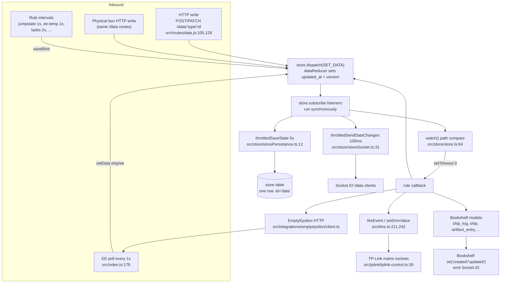
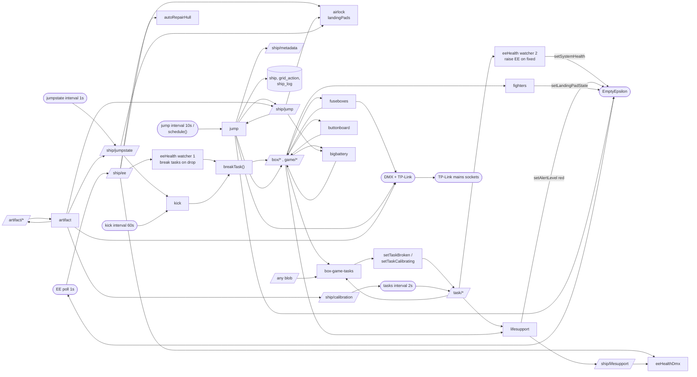

# Rules engine and side-effect machinery

This document describes the Redux store, the rule loader, the `watch()`
mechanism, the DMX and TP-Link hardware layer, the EmptyEpsilon integration and
the seeded initial state.

Read `docs/rewrite/CONVENTIONS.md` first. This document uses the tags defined
there.

A companion document lists every surprising side effect:
`docs/rewrite/side-effects-catalog.md`.

---

## How rules work

### The store

The backend keeps one Redux store. `src/store/store.ts:17` builds it with
`configureStore` from `redux-starter-kit`. The store has one reducer, `data`
(`src/store/reducers/dataReducer.ts:5`).

The state shape is `state.data[type][id] = blob`. A blob is a plain JSON object.
The reducer supports three actions:

| Action | Effect | Location |
|---|---|---|
| `SET_DATA` | Replaces `data[type][id]`. Forces `id`, `type`, sets `updated_at = Date.now()`, increments `version`. | `src/store/reducers/dataReducer.ts:6` |
| `DELETE_DATA` | Deletes `data[type][id]`. | `src/store/reducers/dataReducer.ts:25` |
| `OVERWRITE_STATE` | Replaces the whole `data` sub-tree. Used once at startup. | `src/store/reducers/dataReducer.ts:33` |

`SET_DATA` always replaces the whole blob. There is no field-level merge in the
reducer. The `PATCH /data/:type/:id` route does the merge before it dispatches
(`src/routes/data.js:131`).

The reducer always writes `updated_at` and `version`. Any dispatch therefore
produces a new object identity, even if no field value changed.
[SIDE-EFFECT] This makes every write visible to every watcher.

### The rule loader

`loadRules()` is in `src/rules/rules.js:8`. It reads the directory that holds
`rules.js`. For each **sub-directory** it requires every `.js` and `.ts` file.

Consequences:

- Only files in sub-directories are loaded. The files directly in `src/rules/`
  (`helpers.js`, `breakTask.js`, `shieldHelper.js`, `wiringHelper.js`,
  `reactorHelper.js`, `missileSystemHelper.js`, `bwmsHelper.js`,
  `beamWeaponsHelper.js`) are libraries. Other rules import them.
- A rule file has no export. The `require` call runs the module body. The module
  body calls `watch(...)`, `interval(...)` or `setInterval(...)` as a side
  effect of being imported. [SIDE-EFFECT]
- The load order is the order that `fs.readdirSync` returns. The code does not
  sort. The registration order of rules is therefore not guaranteed.
- The process runs through `ts-node --transpile-only`
  (`package.json:26`). `require()` of a `.ts` file works because of this.

Directories and files that `loadRules()` loads:

```
src/rules/artifacts/artifact.ts
src/rules/boxes/airlock.js
src/rules/boxes/bigbattery.ts
src/rules/boxes/buttonboard.js
src/rules/boxes/driftingValue.js
src/rules/boxes/fuseboxes.js
src/rules/boxes/kick.ts
src/rules/science/analysis.js
src/rules/ship/autoRepairHull.ts
src/rules/ship/ee-temp.js
src/rules/ship/eeHealth.js
src/rules/ship/eeHealthDmx.js
src/rules/ship/fighters.ts
src/rules/ship/jump.js
src/rules/ship/jumpstate.js
src/rules/ship/lifesupport.js
src/rules/social/infoboard.js
src/rules/social/votes.js
src/rules/tasks/box-game-tasks.js
src/rules/tasks/tasks.js
```

### `watch(path, callback)`

`watch()` is in `src/store/store.ts:64`.

```js
export function watch(path: string[], callback: CallbackFn) {
	let previousObject = getPath(path);
	store.subscribe(() => {
		const currentObject = getPath(path);
		const currentState = store.getState();
		if (currentObject !== previousObject) {
			if (initialized) {
				const myPrevious = previousObject;
				// Use setTimeout instead of nextTick to not starve IO in case of infinite loop
				setTimeout(() => callback(currentObject, myPrevious, currentState), 0);
			}
			previousObject = currentObject;
		}
	});
}
```

Behaviour to keep in a rewrite:

1. `watch()` adds a raw `store.subscribe` listener. The listener runs
   **synchronously** on every dispatch, for every watcher. There is no index by
   path. With about 25 watchers, every write walks 25 paths.
2. The comparison is a reference comparison (`!==`), not a deep compare. The
   reducer creates a new object on every `SET_DATA`. A write of an identical
   value still fires the watcher.
3. The callback runs in `setTimeout(..., 0)`. The callback is therefore
   **asynchronous**. When the callback runs, the store can already hold newer
   data. The `currentObject` and `currentState` arguments are a snapshot from
   the time of the dispatch.
4. `previousObject` advances at dispatch time, not at callback time. Two fast
   dispatches queue two callbacks. Each callback gets the correct previous
   value.
5. `initialized` gates the callbacks. `initState()` sets it
   (`src/store/store.ts:78`). Before that, watchers update `previousObject` but
   fire no callback. This is why the seed script `db/redux/seed-redux.ts:9` can
   call `initState({})` and then write about 1000 blobs without any rule
   running... except that the seed script never calls `loadRules()`, so no rule
   exists in the seed process at all.
6. **`watch()` does not catch exceptions.** A throw inside a callback happens in
   a `setTimeout` tick. Node has no `uncaughtException` handler in this codebase
   (`grep process.on` finds only the two signal handlers in
   `src/store/storePersistance.ts:42`). A rule that throws kills the process.
   [BUG] Commit `20146e3` ("Fix potential server crash") fixed exactly one such
   crash in `src/rules/ship/eeHealth.js:129`.
7. A rule callback may dispatch. The dispatch runs the subscriber list again.
   This is how cascades work, and how the feedback loops in the "Cascade map"
   section arise.

### `getPath`

`getPath(['data','ship','ee','landingPads'])` walks the state
(`src/store/store.ts:35`). It returns `undefined` when a segment is missing.
A watcher may therefore watch a path that is deeper than one blob.
`src/rules/boxes/airlock.js:60` uses this to watch a field inside the `ship/ee`
blob.

### Helper functions

`src/rules/helpers.js`:

| Function | Line | Behaviour |
|---|---|---|
| `saveBlob(data)` | 8 | Calls `timeout(...)` with no delay, so it uses `process.nextTick`. Then dispatches `SET_DATA` with `data.type` / `data.id`. [SIDE-EFFECT] The write is deferred by one tick. |
| `interval(fn, ms)` | 26 | `setInterval` with a `try/catch` around `fn`. Errors go to the logger and the interval continues. |
| `timeout(fn, ms)` | 47 | `process.nextTick` when `ms` is `undefined`, `setTimeout` otherwise. Both wrap `fn` in `try/catch`. |
| `schedule(fn, timestamp)` | 76 | `setTimeout` to an absolute time. Keeps a module-level map `scheduled` so the same function is not scheduled twice for the same timestamp. In-memory only. |
| `brownianGenerator(max, mult)` | 100 | Infinite generator of a bounded random walk. |
| `clamp`, `random`, `randomInt`, `chooseRandom`, `rng` | 113-155 | Numeric helpers. `rng(seed)` is a deterministic sine-based generator. |
| `getPriorityTasks(tasks)` | 165 | Returns the tasks whose `priority` equals the maximum. Missing `priority` counts as 0. |

Note the asymmetry: `interval()` and `timeout()` catch exceptions, but `watch()`
does not. A rewrite should make this uniform.

### Persistence

`src/store/storePersistance.ts`:

- `enablePersistance()` (line 20) adds another `store.subscribe`. On every
  dispatch it calls a lodash `throttle` of `saveState` with
  `{ leading: false, trailing: true }` and a period from
  `SAVE_STATE_FREQUENCY_MS` (default 5000 ms).
- `saveState(data, 'data')` (line 7) fetches the `store` row, then does an
  `insert` or an `update` of the **whole** `data` object into one JSONB column.
- `enableGracefulShutdown()` (line 39) hooks `SIGINT` and `SIGTERM`. The handler
  saves the state and then calls `process.exit(0)` (line 37). [SIDE-EFFECT]

Consequences are in the side-effect catalog, entries 1 and 2.

### Socket push

`src/store/storeSocket.ts`:

- `initStoreSocket(io)` (line 33) opens the `/data` Socket.IO namespace.
  A client joins a room named by its `data` query parameter, or `/data`.
- Another `store.subscribe` calls a 100 ms throttle of `sendDataChanges`.
- `sendDataChanges` (line 7) walks the whole `data` tree, compares each blob by
  reference against `previousData`, and emits `dataUpdate` to three rooms:
  `/data/<type>/<id>`, `/data/<type>` and `/data`. Deleted blobs produce
  `dataDelete`.
- There is no authentication and no authorization on the namespace.

### Data flow



The two loops to note in the diagram are `RULES -> DISPATCH -> SUBS` (rule
cascade) and `RULES -> EE -> EEPOLL -> DISPATCH` (EmptyEpsilon round trip).

---

## Rule inventory

### `src/rules/rules.js`

Not a rule. The loader. See "How rules work".

### `src/rules/helpers.js`

Not a rule. Shared helper library. See "How rules work".

### `src/rules/breakTask.js`

Not auto-loaded. `src/rules/ship/eeHealth.js:2`, `src/rules/boxes/kick.ts:3` and
`src/index.ts:39` import it.

**Watches:** nothing.

**Trigger condition:** a caller calls `breakTask(task)`.

**Actions, in order:**

1. Looks up `task.game` or `task.box` in the store and reads the referenced blob
   (`src/rules/breakTask.js:19-24`).
2. Returns and logs an error when the blob is missing, or when its status is
   already `broken` (lines 25-32).
3. Calls `getAdditionalContext` (line 48). For button board boxes it generates a
   random puzzle state and **loops until the generated `measuredValue` differs
   from the current physical switch state** (lines 50-58). This guarantees the
   player must move the switch. The loop is unbounded; the generators return a
   small set of values, so the loop terminates in practice.
   For `reactor_wiring` it picks a random wiring code and the expected wire map
   (lines 59-68).
4. `saveBlob({...box, ...ctx, status: 'broken'})` (line 34). [SIDE-EFFECT]

**Writes back to store:** the `game` or `box` blob. This re-triggers
`src/rules/tasks/box-game-tasks.js`, which then sets the `task` blob to
`broken`. That in turn triggers `src/rules/ship/lifesupport.js` and
`src/rules/ship/eeHealth.js`. Cascade depth 3.

**Hardware:** none directly. The `task` blob update fires `task.dmxBroken` in
`setTaskBroken` (`src/rules/tasks/tasks.js:31`).

**External:** none. **Database:** none. **Timers:** none.

**Rewrite notes.** The reference chain `task -> game/box -> task` exists because
the physical boxes own the truth. Keep the indirection, but make the write
explicit and synchronous rather than a store round trip.

### `src/rules/shieldHelper.js`, `wiringHelper.js`, `reactorHelper.js`, `missileSystemHelper.js`, `bwmsHelper.js`, `beamWeaponsHelper.js`

Not auto-loaded. Pure functions. No store access, no I/O.

- `shieldHelper.js` — base-3 codes, 243 states, 5 switches. `randomState()`
  returns `{code, states, measuredValue}` (line 43).
- `wiringHelper.js` — 320 wiring codes; `getConnections(n)` uses the seeded
  `rng` so a code always gives the same wire pairs (line 14).
- `reactorHelper.js` — 1024 codes, a 10-bit XOR light pattern, two permanently
  dead LEDs `5_3` and `3_0` (line 21). `randomGauges()` returns random gauge
  values.
- `missileSystemHelper.js` — activation interval 2-4 and an initiation point;
  computes the state of switch 8.
- `bwmsHelper.js` — 6-bit code 1..63; bit 6 drives the measured switch.
- `beamWeaponsHelper.js` — charging and discharging mode names; parity of the
  discharge mode index drives the measured switch.

**Rewrite notes.** These are pure and testable. Port them unchanged.

---

### `src/rules/artifacts/artifact.ts`

**Watches:**
`['data','artifact','jump_drive_cooldown']`,
`['data','artifact','calibration_slot']`,
`['data','artifact','scan_range_extender']`,
`['data','artifact','calibration_speedup']` (lines 120-123).

**Trigger condition:** the blob changes. Each handler then checks
`isActivated()` (line 31): `solved && gm_approved && activated`.

**Actions:**

`updateJumpDriveCooldown` (line 46) [SIDE-EFFECT]
1. Reads `ship/jump` and `ship/jumpstate`.
2. Does nothing when `jumpstate.statusno >= STATUS_NUMBERS.ready` (6).
3. Rewinds `jump.last_jump` to `Date.now() - SAFE_JUMP_LIMIT` so a safe jump is
   possible at once.
4. Writes `jumpstate.coherence = 100` and
   `jump_drive_temp_exact = jump.jump_drive_target_temp`.
5. Fires DMX `JumpDriveCoolingArtifactActivated` (channel 304).
6. `markArtifactActivationHandled(current)` — `setTimeout(0)` then writes the
   artifact blob back with `gm_approved: false`.

`updateCalibrationSlot` (line 72) [SIDE-EFFECT]
1. `ship/calibration.slots += 1`.
2. DMX `CalibrationSlotArtifactActivated` (305).
3. Marks handled.

`updateScanRangeExtender` (line 84) [SIDE-EFFECT] [BOOKSHELF]
1. Fetches the `odysseus` row from the `ship` table.
2. Increments `metadata.scan_range` and saves the row.
3. DMX `ScanRangeExtenderArtifactActivated` (306).
4. Marks handled.
   The function is `async` and `watch()` does not await it. A rejected promise
   here is an unhandled rejection. [BUG]

`updateCalibrationSpeedup` (line 98) [SIDE-EFFECT]
1. Writes `ship/calibration.multiplier = speedup_multiplier` (default 100).
2. Starts a `setTimeout` for `speedup_duration_secs * 1000` (default 60 s) that
   writes the **captured** `calibration` object back with the original
   multiplier. Any other change made to `ship/calibration` in the meantime is
   lost. [BUG]
3. DMX `CalibrationSpeedupArtifactActivated` (307).
4. Marks handled.

**Writes back to store:** the watched artifact blob itself
(`markArtifactActivationHandled`). This re-triggers the same watcher. The second
run finds `gm_approved === false`, so `isActivated()` is false and the rule
stops. The loop is bounded at 2 iterations, by design.
Also writes `ship/jump`, `ship/jumpstate` and `ship/calibration`, which trigger
`jump.js`, `jumpstate.js`, `airlock.js`, `bigbattery.ts` and `tasks.js`.

**Hardware:** DMX 304, 305, 306, 307. Each `fireEvent` also drives TP-Link.

**External:** none. **Database:** `ship` table (scan range extender only).

**Timers:** one `setTimeout` per activation of `calibration_speedup`. Lost on
restart; `ship/calibration.multiplier` then stays at 100 forever. [BUG]

**Rewrite notes.** The "activated" state is a transient command flag stored in
persistent state. Model it as a command, not as state. The revert timer must be
persisted or the multiplier must be computed from a stored expiry timestamp.

---

### `src/rules/boxes/airlock.js`

The largest and most stateful rule. It builds two `Airlock` objects at import
time, for `airlock_main` and `airlock_hangarbay` (lines 360-363).

**Watches (per airlock instance):**
- `['data','box',<airlock name>]` (line 36)
- `['data','ship','jump']` (line 42)
- `['data','ship','jumpstate']` (line 53)
- `['data','ship','ee','landingPads']` (line 60)

**Trigger conditions and actions:**

1. **Own blob changed** (line 36). Copies the blob into `this.data`. If
   `data.command` is set, runs `this.command(...)`. Then runs
   `depressurizeIfFightersLaunched()`.

2. **`ship/jump` changed** (line 42). When `status` becomes `jump_initiated`,
   starts a `setTimeout` of `config.jump_close_delay` that calls
   `closeForJump()`. When the status is anything else, clears that timeout.
   [BUG] Line 48 reads `this.data.config.jump_close_delay` without a guard.
   A missing `config` throws inside a `watch` callback and kills the process.

3. **`ship/jumpstate` changed** (line 53). On the transition into `jumping`,
   forces `{status:'closed', pressure:1.0, command:'stop'}`.

4. **`ship/ee.landingPads` changed** (line 60). Stores the pad map and runs
   `depressurizeIfFightersLaunched()`. Because the EE poll runs every second,
   this watcher fires whenever any EE landing pad value changes.

**Command processing** (`command()`, line 89) [SIDE-EFFECT]

- The first action is `patchData({command: null, last_command, last_command_at})`.
  This writes the watched blob and re-enters the same watcher. The re-entry sees
  `command === null` and stops. **This is a deliberate self-feedback loop with a
  one-step guard.**
- `++this.commandCounter` cancels any transition in flight. `waitUntil()` (line
  124) rejects with the string `'cancel'` when the counter changed.
- Command sequences (line 96):

| Command | Steps |
|---|---|
| `pressurize` | `pressurize` |
| `open` | `pressurize`, `openDoor`, `autoClose` |
| `depressurize` | `closeDoor`, `depressurize`, `autoPressurize` |
| `forceDepressurize` | `denyAccess`, `closeAllDoors`, `depressurize`, `autoPressurize`, `allowAccess` |
| `evacuate` | `closeDoor`, `evacuate`, `autoPressurize` |
| `close` | `closeDoor` |
| `stop` | `stopTransition` |

- `forceDepressurize` writes `access_denied` on **both** airlocks, not only the
  one that received the command (lines 323-332). [SIDE-EFFECT]
- Each transition writes a pressure ramp object
  `{t0, p0, t1, p1}` into `pressure` and a `countdown_to` timestamp, then awaits
  the transition time, then writes the end state. Each write is a store
  dispatch.
- Default transition times (line 13): open 6.5 s, close 5 s, pressurize 73 s,
  depressurize 601 s, evacuate 42 s. `airlock_hangarbay` overrides
  depressurize to 5.5 s and pressurize to 23 s
  (`db/redux/box/airlock.js:33`).

**Fighter handling** (lines 149-203) [SIDE-EFFECT]

- `hasFighters()` reads `config.fighter_pads`.
- `fightersLaunched()` is true when any listed pad equals
  `LandingPadStates.Launched` (2).
- On launch: fires the `fighter_launch` DMX event, sets `fighters:'launching'`,
  and starts a `setTimeout` of `config.fighter_launch_delay` (default 20000 ms,
  seed value 19000 ms) that writes `{fighters:'active', command:'depressurize'}`.
- On return: writes `{fighters:'docked', status:'pressurizing',
  command:'pressurize'}`. The comment at line 197 records that calling
  `this.command('pressurize')` directly "apparently triggers an infinite loop".
  [BUG] The root cause is not documented in the code. The workaround writes the
  status and the command in a single blob write.

**Startup behaviour** (lines 65-71)

- The constructor calls `this.command('stop')` at import time. This resets an
  airlock that was stuck mid-transition when the process died.
- The constructor starts `setInterval(() => this.patchData({heartbeat: now()}),
  60000)`. [SIDE-EFFECT] This writes the blob every 60 s per airlock, forever,
  to work around missed UI updates. It also keeps the persistence throttle busy.

**Writes back to store:** its own `box/<name>` blob, many times per command, and
the other airlock's blob during `forceDepressurize`, `denyAccess` and
`allowAccess`.

**Hardware:** DMX through `this.dmx(eventName)` (line 79), which maps a logical
event name through `config.dmx_events`:

| Airlock | Event | Channel name | Number |
|---|---|---|---|
| main | open | `MainAirlockDoorUnlock` | 191 |
| main | close | `MainAirlockDoorLock` | 190 |
| main | pressurize | `MainAirlockPressurize` | 193 |
| main | depressurize | `MainAirlockDepressurizeSlow` | 194 |
| main | evacuate | `MainAirlockDepressurizeFast` | 289 |
| hangarbay | open | `HangarBayDoorUnlock` | 196 |
| hangarbay | close | `HangarBayDoorLock` | 195 |
| hangarbay | fighter_launch | `HangarBayFighterLaunch` | 197 |
| hangarbay | depressurize | `HangarBayDepressurize` | 198 |
| hangarbay | pressurize | `HangarBayPressurize` | 199 |

**External:** none directly. Reads EE landing pad state through the store.

**Database:** none.

**Timers:** `closeBeforeJumpTimeout`, `fighterLaunchTimeout`, one `setInterval`
heartbeat per airlock, and one `timeout()` per `waitUntil` step. All are in
memory. On restart every transition in flight is lost. The constructor's
`command('stop')` is the recovery mechanism: it forces the airlock into a known
state based on the persisted `status` field (`stopTransition`, line 308).

**Rewrite notes.** The pressure ramp is already stored as a linear function of
time (`{t0,p0,t1,p1}`), so the UI can interpolate. Keep that. Replace the
command-counter cancellation with an explicit state machine and a persisted
`transition_ends_at`. Then a restart can resume instead of reset.

---

### `src/rules/boxes/bigbattery.ts`

**Watches:** `['data','box','bigbattery']` (line 58) and
`['data','ship','jump']` (line 59). Both call `updateActiveStatus`.

**Trigger condition:** either blob changes; plus a 60 s interval for depletion.

**Actions:**

`depleteBattery` (line 6), every 60 s [SIDE-EFFECT]
1. Reads `box/bigbattery`. Returns when `capacity_percent <= 0`.
2. Subtracts `100 / depletion_time_mins` percent. Seed value is 195 minutes
   (`db/redux/box/bigbattery.js:17`), so about 0.513 % per minute.
3. `saveBlob`. This re-triggers the `bigbattery` watcher, which runs
   `updateActiveStatus`, and it triggers `src/rules/ship/fighters.ts`.

`updateActiveStatus` (line 26)
1. Logs a position change.
2. `active` is true only when `connected_position === ENGINEERING` **and**
   `ship/jump.status === 'jumping'` (lines 40-46). Other positions have no
   condition yet (`TODO` at line 44).
3. Writes the blob when `active` changed.
   [SIDE-EFFECT] The write re-enters the same watcher. The second pass computes
   the same `active` value, so it does not write again. The loop is bounded at
   2 iterations.
4. The comment at line 38 records that this deliberately ignores
   `emergency_assumed_at_positions`, unlike `isBatteryConnected`.

**Writes back to store:** `box/bigbattery` (self).

**Hardware:** none directly. The box firmware reads `active` and `brightness`
and drives its own LEDs.

**External:** none. **Database:** none.

**Timers:** one `setInterval` of 60000 ms. Not the `interval()` helper, so an
exception inside `depleteBattery` is not caught and kills the process. [BUG]
On restart the depletion resumes from the persisted `capacity_percent`; the
partial minute is lost.

**Rewrite notes.** Depletion is a pure function of elapsed time. Store
`charged_at` and compute the level on read. That removes the timer.

---

### `src/rules/boxes/buttonboard.js`

**Watches:** `['data','box','buttonboard']` (line 22).

**Trigger condition:** the physical button board blob changes. The Raspberry Pi
writes it over `POST /data/box/buttonboard`.

**Actions:**
1. Iterates over **all** `box` blobs.
2. Selects boxes whose `boxType` is one of `shield_button`, `missile_button`,
   `bwms_button`, `beamweapon_button` and whose `status` is `broken`.
3. `getButtonState(button, box.buttonIndex)` (line 41) reads
   `button.connected[index]`. Index 11 is "switch up" (value `1`), index 10 is
   "switch down" (value `-1`), otherwise `0`.
4. When the state equals `box.context.measuredValue`, writes the box blob with
   `status: 'fixed'`. [SIDE-EFFECT]

**Writes back to store:** other `box` blobs, not the watched one. No direct
self-loop. The write triggers `src/rules/tasks/box-game-tasks.js`, which marks
the task `calibrating` or `fixed`.

**Hardware:** none directly.

**External:** none. **Database:** none. **Timers:** none.

**Rewrite notes.** `box.context.measuredValue` is written by
`breakTask.js:getAdditionalContext`. The physical board and the logical boxes
are coupled through `buttonIndex`. The mapping is in
`db/redux/box/buttonboard.js`.

---

### `src/rules/boxes/driftingValue.js`

**Watches:** nothing. Runs on a 1 s `interval()` (line 10).

**Trigger condition:** every second.

**Actions:**
1. Reads `box/drifting_value`.
2. When `value` is outside `config.safeRangeMin` .. `config.safeRangeMax`
   (330 .. 740 in the seed):
   - Fires DMX `DriftingValueOutOfRange` (145) once, on the edge only. The edge
     flag `isOutOfRange` is a module-level variable. [SIDE-EFFECT]
   - With probability `box.engineBreakProb` (seed 0.055 per second) it reduces
     the EmptyEpsilon impulse health by 1 percentage point, then calls
     `updateEmptyEpsilonState()`. [SIDE-EFFECT]
3. When back inside the range, fires `DriftingValueInRange` (146) once.

**Writes back to store:** none directly. `updateEmptyEpsilonState()` writes
`ship/ee`, which triggers `eeHealth.js`, `eeHealthDmx.js`, `autoRepairHull.ts`
and `airlock.js`. `eeHealth.js` then breaks impulse tasks to match the new
health. Cascade depth 3.

**Hardware:** DMX 145 and 146.

**External:** `setGameState('setSystemHealth','impulse', ...)` on EmptyEpsilon.

**Database:** none.

**Timers:** one `interval()` of 1000 ms. `isOutOfRange` is in memory. After a
restart the first pass fires the DMX event again if the value is still out of
range. [SIDE-EFFECT]

**Rewrite notes.** The `value` itself is driven by the physical box firmware,
not by the backend. The backend only reacts.

---

### `src/rules/boxes/fuseboxes.js`

Two watchers, both on `['data','box']` (lines 8 and 31).

**Watcher 1 — DMX on fuse state change** (line 8)

Trigger: any `box` blob changes.
For each box that has `fuses` and a numeric `dmxFuse` index, it compares
`box.fuses[box.dmxFuse]` with the previous value. On a change it fires
`CHANNELS[box.dmxFuseFixed]` or `CHANNELS[box.dmxFuseBroken]`. [SIDE-EFFECT]

Configured pairs (`db/redux/box/fuseboxes.js`):

| Box | `dmxFuse` index | Broken / Fixed channels |
|---|---|---|
| `fusebox_medbay` | 5 | 124 / 125 |
| `fusebox_engineering` | 7 | 122 / 123 |
| `fusebox_bridge` | 4 | 120 / 121 |
| `fusebox_science` | 1 | 126 / 127 |
| `fusebox_lounge` (armory) | 6 | 128 / 129 |

Each of these channels also switches a TP-Link mains socket
(`db/redux/tplink/index.ts:8`).

**Watcher 2 — break life support tasks when fuse blowing fails** (line 31)

Trigger: `box.failed` changed and is not deep-equal to the previous value.
Actions: `breakCount = ceil(box.failed.length / 3)`, then call `breakTask()`
that many times. The local `breakTask()` (line 46) is **not** the shared
`breakTask.js`:

1. Collects all `task` blobs with a finite `lifesupportHealth`, status `fixed`
   or `initial`, and not a used single-use task.
2. Narrows to the highest `priority` group, picks one at random.
3. Reads `data.game[task.game]` and writes it with `status:'broken'`.
   [SIDE-EFFECT]

**Writes back to store:** `game` blobs. This is a write into `data.game` from a
watcher on `data.box`, so no direct self-loop. The write triggers
`box-game-tasks.js`, then `tasks.js`, then `lifesupport.js`.

**Hardware:** the five fuse DMX channel pairs listed above.

**External:** none. **Database:** none. **Timers:** none.

**Rewrite notes.** `box.failed` is written by the fuse box firmware, and the
rule treats it as an event, not as state. A blob write that repeats the same
`failed` array does not re-fire, because of the deep compare. A blob write that
appends re-fires for the whole array.

---

### `src/rules/boxes/kick.ts`

**Watches:** nothing. `setInterval(breakWithProbability, 60000)` (line 18).

**Trigger condition:** every 60 s.

**Actions:**
1. Reads `task/thermic_fusion_regulator` and its
   `failure_probability_per_minute` (seed 0.01, about once per 100 minutes).
2. Reads `ship/jumpstate`.
3. Breaks the task only when `jumpstate.statusno < STATUS_NUMBERS.ready` (6),
   the random draw succeeded, and the task is not already broken.
4. Calls the shared `breakTask(task)`. [SIDE-EFFECT]

**Writes back to store:** through `breakTask`, the `box/thermic_fusion_regulator`
blob. Then `box-game-tasks.js` sets the task blob broken, and `tasks.js` fires
`task.dmxBroken`, that is `ThermicFusionRegulatorBroken` (320). That channel
turns off the TP-Link socket at 172.30.4.74 (the engine room plasma ball).

**Hardware:** indirectly DMX 320 / 321 and one TP-Link socket.

**External:** none. **Database:** none.

**Timers:** plain `setInterval`, not the `interval()` helper. An exception is
uncaught. [BUG]

**Rewrite notes.** The rule reads `task.status` but writes the `box`. The write
path goes through two more rules before the task status actually changes.

---

### `src/rules/science/analysis.js`

**Watches:** nothing. `interval(processInProgressAnalysis, 5000)` (line 40).

**Trigger condition:** every 5 s.

**Actions:**
1. Reads `misc/science_analysis_in_progress`.
2. Splits `analysis_in_progress` on `completes_at <= now`.
3. For each completed entry: fetches the `operation_result` row, then calls
   `addOperationResultsToArtifactEntry` (`src/utils/science.ts:25`). That
   inserts a row into `artifact_entry` and marks the operation result complete.
   [SIDE-EFFECT] [BOOKSHELF]
4. Writes the blob back with only the remaining entries.

**Writes back to store:** `misc/science_analysis_in_progress` (self). The write
re-enters nothing, because this rule has no watcher.

**Hardware:** none.

**External:** none.

**Database:** reads `operation_result`; writes `artifact_entry` and
`operation_result`.

**Timers:** one `interval()` of 5000 ms. The pending analyses live in the Redux
blob, so they survive a restart. They complete late by up to 5 s plus the
persistence window.

**Bugs found.**
- Line 28 logs `operation_result_id`, an identifier that does not exist in
  scope. Reaching that line throws a `ReferenceError`. The `interval()` wrapper
  catches it, so the whole batch is skipped and retried in 5 s, forever. [BUG]
- The blob write at line 34 uses `scheduledOperationsBlob` captured before the
  awaits. Any entry added by `POST /operation` during the awaits is dropped.
  [BUG]

**Rewrite notes.** This is a work queue kept in a JSON blob. Move it to a table.

---

### `src/rules/ship/autoRepairHull.ts`

**Watches:** `['data','ship','ee']` (line 32).

**Trigger condition:** the EE state blob changes. The poll writes it up to once
per second.

**Actions:**
1. Reads `current.general.shipHull` (hull hit points, not a percentage).
2. When it is below 2, calls a 2 s trailing throttle of
   `client.setHullHealthPoints(2)`. [SIDE-EFFECT]
3. Otherwise cancels the pending throttle.

The comment at line 20 explains the intent: EmptyEpsilon fires its own damage
DMX only when the hull actually takes damage, so the hull is kept above 1.

**Writes back to store:** none directly. The EE write is picked up by the next
poll, which writes `ship/ee`, which re-enters this watcher. The rule then sees
hull >= 2 and stops. **Bounded feedback loop through an external system.**

**Hardware:** none directly.

**External:** `GET <ee>/set.lua?setHull("2")`.

**Database:** none.

**Timers:** the lodash throttle. In memory, lost on restart. That is harmless;
the next poll re-arms it.

**Rewrite notes.** This silently rewrites the game master's hull value. It is
invisible in any UI. Document it prominently for the operators.

---

### `src/rules/ship/ee-temp.js`

**Watches:** nothing. `interval(..., 1000)` (line 42).

**Trigger condition:** every second.

**Actions:**
1. Reads `ship/ee.systems.heat`.
2. For each of 7 system types, maps heat 0..1 onto a temperature range and adds
   a Brownian noise term of amplitude 200.
3. Sets `<type>Status` to `NOMINAL` (heat < 0.3), `HIGH` (< 0.9) or `CRITICAL`.
4. `saveBlob` into `ship/ee_temp`. [SIDE-EFFECT]

Temperature ranges (line 9): reactor 800-5700, maneuver 400-4200,
impulse 600-5100, frontshield 600-3200, rearshield 600-3200,
missilesystem 300-2700, beamweapons 400-5600.

**Writes back to store:** `ship/ee_temp`, once per second, forever. This blob is
**not seeded**; the rule creates it (line 44).

**Hardware:** none. **External:** none. **Database:** none.

**Timers:** one `interval()` of 1000 ms.

**Rewrite notes.** [SIDE-EFFECT] This alone marks the store dirty every second,
so the 5 s persistence write never idles. The Brownian generator state is in
memory; after a restart the values jump.

---

### `src/rules/ship/eeHealth.js`

The core coupling between EmptyEpsilon system health and engineering tasks.

**Watches:** `['data','ship','ee']` (line 96) and `['data','task']` (line 125).
Plus a 60 s `interval()` consistency check (line 146).

Types handled (line 13): reactor, impulse, maneuver, frontshield, rearshield,
missilesystem, beamweapons, hull.

**Watcher 1 — EE health dropped, break tasks** (line 96) [SIDE-EFFECT]

1. For each type, compares the previous and current health. Hull uses
   `general.shipHullPercent`; the others use `systems.health.<type>Health`.
2. Special case: when the hull was already at or below 2 hit points before and
   after, it logs and **returns from the whole callback**, not only from the
   hull iteration (lines 105-111). Hull is last in `TYPES`, so today no other
   type is skipped. The code is fragile. [BUG]
3. When the health dropped, calls `breakTasks(type, nowHealth)`.
4. `breakTasks` (line 62) computes the task-derived health as
   `1 - sum(eeHealth of broken or calibrating tasks)`. It then breaks tasks,
   highest `priority` first and at random inside that group, until the derived
   health reaches the EE health. Each break calls the shared `breakTask`.
5. When it runs out of tasks it logs an error and stops.

**Watcher 2 — task fixed, raise EE health** (line 125) [SIDE-EFFECT]

1. For each task that became `fixed` and has `eeType` and `eeHealth`, adds
   `task.eeHealth` to the current EE health, clamped to -1..1.
2. Calls `setEEHealth` (line 36), which calls EmptyEpsilon and then
   `updateEmptyEpsilonState()`.
3. The callback is `async` and `watch()` does not await it.

**Watcher 3 — consistency check** (line 146), every 60 s

Logs an error when the EE health and the task-derived health differ by more than
the largest broken task. It only logs; it does not correct.

**Writes back to store:** through `breakTask` into `game` and `box` blobs;
through `updateEmptyEpsilonState` into `ship/ee`.

**The main feedback loop:**

```
ship/ee changes  ->  watcher 1  ->  breakTask  ->  box/game blob
    ->  box-game-tasks  ->  setTaskBroken  ->  task blob
    ->  watcher 2 sees a status change (not 'fixed', so it stops)
```

and

```
task becomes 'fixed'  ->  watcher 2  ->  EE setSystemHealth  ->  EE poll
    ->  ship/ee changes  ->  watcher 1 sees a health RISE, so it stops
```

Both directions terminate because watcher 1 acts only on a fall and watcher 2
acts only on a rise. There is no damping. A concurrent fall while a rise is in
flight can break extra tasks.

**Hardware:** none directly.

**External:** `setSystemHealth`, `setHullHealthPercent` on EmptyEpsilon, plus a
full state re-poll after each write.

**Database:** none. **Timers:** one `interval()` of 60000 ms.

**Rewrite notes.** This is the single most delicate rule. The task-derived
health and the EE health are two copies of the same number that are reconciled
by two one-way rules. Make one of them authoritative.

---

### `src/rules/ship/eeHealthDmx.js`

**Watches:** `['data','ship','ee']` (line 174) and
`['data','ship','lifesupport']` (line 175). Plus `interval(..., 30000)` (line
176) "in case something is missed".

**Trigger condition:** either blob changes, or every 30 s.

**Actions** (`updateHealthValues`, line 149):

1. For each of 8 reported types (frontshield, rearshield, impulse,
   missilesystem, reactor, maneuver, beamweapons, hull, general — the `general`
   value is the mean of reactor, impulse, maneuver, hull and lifesupport,
   line 92):
2. `getHealthStatus` maps the value to `disabled` (<= 0), `critical`,
   `damaged` or `normal` using `ship/dmx_limits[type]` = `[criticalLimit,
   damagedLimit]` (seed `[0.25, 0.7]` for every type).
3. On a status change it fires the matching DMX channel, but only when the
   per-channel cooldown has passed. The cooldown is
   `dmx_limits.cooldown_seconds`, default 60 s (line 140). [SIDE-EFFECT]
4. On any value change it sets the continuous `...Value` channel with
   `mapDmxValue(value, min, max)`. The range is -1..1 for systems and 0..1 for
   hull (line 73).

[BUG] `canFireEvent` records the timestamp when it returns `true`, and the
caller then updates `previousHealthStatus[type]`. When the cooldown blocks the
event, `previousHealthStatus[type]` is **not** updated. The next pass therefore
re-tries. That is intended. But a status that changes and changes back within
the cooldown is never reported at all.

**Writes back to store:** none.

**Hardware:** 45 DMX channels. See the "DMX and hardware" section.

**External:** none. **Database:** none.

**Timers:** one `interval()` of 30000 ms. `previousHealthStatus`,
`previousHealthValue` and `lastEventTime` are in memory. After a restart the
first pass fires an event for every type whose status is not `undefined`.
[SIDE-EFFECT] A restart therefore produces a burst of DMX events.

**Rewrite notes.** Life support is deliberately excluded from this table
(comment at line 84) because `lifesupport.js` also writes ship log entries.

---

### `src/rules/ship/fighters.ts`

**Watches:** `['data','box','bigbattery']` (line 55).

**Trigger condition:** the big battery blob changes. The battery depletion timer
writes it every 60 s, so this runs at least once a minute.

**Actions** (`checkIfFighterFixed`, line 27):
1. Reads `box/bigbattery` and `ship/ee`.
2. For each of landing pads 1, 2 and 3: when the pad is `Destroyed` (0) **and**
   `isBatteryConnectedAndCharged(battery, FIGHTER<n>)`, calls
   `repairFighter(n)`.
3. `repairFighter` (line 21) calls
   `setLandingPadState(pad, LandingPadStates.Docked)` on EmptyEpsilon and then
   writes a random ship log entry from a list of five templates. [SIDE-EFFECT]

Fighter names are hard coded: `ESSODY18`, `ESSODY23`, `ESSODY36` (line 7).

**Writes back to store:** none directly. The EE change reaches the store through
the poll, which triggers `airlock.js`.

**Hardware:** none.

**External:** EmptyEpsilon `setLandingPadState`.

**Database:** `ship_log` through `shipLogger.info`.

**Timers:** none of its own.

**Bug.** The function is `async` and the watcher does not await it. Two runs can
overlap: the battery blob changes again before the EE call returns. The pad is
still `Destroyed` in the stale `ship/ee` snapshot, so a second repair call and a
second log entry are possible. [BUG]

---

### `src/rules/ship/jump.js`

The jump drive state machine. 582 lines. The most side-effect dense file.

**Watches:** `['data','ship','jump']` (line 574). Plus `interval(update, 10000)`
(line 582) "for safety", plus `schedule(update, t)` calls for exact deadlines.

**Trigger condition:** the `ship/jump` blob changes, or the 10 s tick fires, or
a scheduled deadline arrives.

The watcher calls `handleTransition` when `status` changed, then always calls
`handleStatic`.

**States** (`STATUS_NUMBERS`, `src/rules/ship/jumpstate.js:7`):
`broken` 0, `cooldown` 1, `ready_to_prep` 2, `calculating` 3, `preparation` 4,
`prep_complete` 5, `ready` 6, `jump_initiated` 7, `jumping` 8.

**Constants** (lines 21-24): `COOLDOWN_LIMIT` 2 h 15 min 43 s,
`SAFE_JUMP_LIMIT` 2 h 47 min, `BREAKING_JUMP_TIME` 5 min, `COUNTDOWN` 1 min.

**`handleTransition` actions per transition** [SIDE-EFFECT]

| Transition | Actions |
|---|---|
| `jumping>broken` | Breaks tasks: major if `breaking_jump`, minor if `minor_breaking_jump`, otherwise normal. Then breaks the jump reactor box and the jump cooling system box. Falls through into the next case. |
| `jumping>cooldown` (and the fall-through) | Sets the jump drive target temperature. Fires `JumpEndBreaking` (111) or `JumpEnd` (110). Charges the big battery if it is plugged into engineering. Writes `ship/jump` with a new `last_jump`, `jump_at: 0`, `breaking_jump: true`, and a fresh 33 % chance of `minor_breaking_jump`. Writes a ship log entry. Schedules `setSystemsEnabled(true)` 3600 ms later. Schedules `setEeSyncEnabled(true)` 3000 ms later, but only when the EE connection is healthy. Then, unless the `CRYSTAL_GENERATOR` artifact is used, decrements `ship.metadata.jump_crystal_count` in the **database**, writes warnings to the ship log, and fires `LoraJumpCrystalsDepleted` (252) at 0 or `LoraJumpCrystalsLow` (251) at exactly 5. |
| `broken>cooldown` | DMX `JumpFixed` (100). |
| `cooldown>ready_to_prep` | DMX `JumpPrepReady` (101), ship log. |
| `ready_to_prep>calculating` | DMX `JumpPrepStart` (102), ship log. |
| `calculating>ready_to_prep` | DMX `JumpRejected` (104), ship log error. |
| `preparation>ready_to_prep`, `prep_complete>ready_to_prep`, `ready>ready_to_prep` | DMX `JumpRejected` (104), ship log warning. |
| `calculating>preparation` | DMX `JumpApproved` (103), ship log, then `setupJumpDrivePreparationTasks()`: breaks the `jump_drive_insert_jump_crystal` game and the `jump_reactor` box with a fresh random reactor code. |
| `preparation>prep_complete` | DMX `JumpPrepEnd` (105), ship log. |
| `prep_complete>ready` | DMX `JumpReady` (106), ship log. |
| `jump_initiated>prep_complete` | DMX `JumpAbort` (112). Writes `ship/jump` with `jump_at: 0`, `breaking_jump: true`. |
| `prep_complete>jump_initiated`, `ready>jump_initiated` | Ship log warning only. |
| `jump_initiated>jumping` | `setSystemsEnabled(false)` (disables the jump UI, the social UI and the infoboard through `ship/metadata`). Sets the EE alert level to `normal`. Schedules `setEeSyncEnabled(false)` 2000 ms later. Ship log. DMX `JumpStart` (108). Sets the target temperature. Fires the mood channel `JumpStartMood<n>` (115-117). Calls `performShipJump(jump.coordinates)`. |
| anything else | Logs "Invalid jump drive transition". |

After the switch, for **any** transition into `jump_initiated`, it writes
`ship/jump` with `jump_at = now + 60 s`, `breaking_jump = previousStatus !== 'ready'`,
`break_notified = false`, and fires DMX `JumpInit` (107) (lines 348-358).

**`performShipJump`** (line 64) [SIDE-EFFECT] [BOOKSHELF] [GIS]
1. Fetches the `odysseus` ship, the target `grid` (by sub-quadrant / sector /
   sub-sector) and optionally the target planet `map_object`.
2. Picks the target geometry: the planet position, otherwise
   `grid.getRandomJumpTarget()`.
3. Resets `metadata.jump_range` to 1.
4. Calls `ship.jumpFleet(...)`, which runs a **raw SQL update over every visible
   present ship row** (`src/models/ship.js:162`) and then updates Odysseus
   separately so the `updated` model hook fires.
5. Inserts a `grid_action` row of type `JUMP`.
   The function is `async` and the caller does not await it (line 337). [BUG]

**`handleStatic` actions** (line 361)

| State | Action |
|---|---|
| `broken` | When more than 500 ms since `updated_at` and the jump reactor task is fixed, moves to `cooldown`. |
| `cooldown` | Moves to `ready_to_prep` at `last_jump + COOLDOWN_LIMIT`; otherwise `schedule(update, ...)`. |
| `ready_to_prep`, `calculating` | No action. |
| `preparation` | When more than 500 ms since `updated_at` and both the crystal task and the reactor task are fixed, moves to `prep_complete`. |
| `prep_complete` | Moves to `ready` at `last_jump + SAFE_JUMP_LIMIT`; otherwise schedules. |
| `ready` | Clears a stray `breaking_jump` flag, and writes the blob to do it. |
| `jump_initiated` | Moves to `jumping` at `jump_at`, writing `last_jump = now`; otherwise schedules. |
| `jumping` | At `last_jump + BREAKING_JUMP_TIME`, sets `break_notified` and fires DMX `JumpBreaking` (109); otherwise schedules. |

The 500 ms guards at lines 365 and 399 are races against the rules that break
the preparation tasks. The task blobs are written asynchronously by
`saveBlob`, so `handleStatic` can observe the pre-break state.

**Breakage profiles** (lines 497-515)
- `breakTasksMajor`: 5..10 fuses per fuse box; every EE type loses 0.5..0.8.
- `breakTasksMinor`: 0..2 fuses; each EE type has a 50 % chance to lose 0.05..0.2.
- `breakTasksNormal`: 0..2 fuses only.
- `breakFuses(min,max)` (line 549) writes a `blow` array into every box that has
  `fuses`. The box firmware reads `blow` and physically blows those fuses.
  [SIDE-EFFECT]
- `breakEE(type, min, max)` (line 521) calls EmptyEpsilon directly and is
  exported. `src/index.ts:135` also calls it.

**Writes back to store:** `ship/jump` (its own watched blob, many times),
`ship/metadata`, `box/*` (fuses, jump reactor, jump cooling system, big
battery), `game/jump_drive_insert_jump_crystal`.

**The `ship/jump` self-loop is real and intentional.** `handleTransition` and
`handleStatic` both write `ship/jump`. Each write re-enters the watcher.
Termination depends on the writes converging on a status that produces no
further write. In `cooldown`, `prep_complete` and `jump_initiated` the guard is
a time comparison, so the loop stops until the deadline. In `ready` the guard is
`if (jump.breaking_jump)`, and the write clears it, so it stops after one extra
pass.

**Hardware:** DMX 100-117, 251, 252, plus every fuse channel indirectly.

**External:** EmptyEpsilon `setAlertLevel`, `setSystemHealth`,
`setHullHealthPercent`.

**Database:** `ship` (position, grid, metadata, jump crystal count),
`grid_action`, `ship_log`, `map_object` and `grid` reads.

**Timers:** one `interval()` of 10 s, several `schedule()` entries, and four
`setTimeout` calls (lines 208, 212, 317, 486). All in memory. A restart during
the 60 s countdown is safe, because `jump_at` is persisted and the 10 s tick
recovers. A restart in the 3.6 s window after `JumpEnd` leaves
`jump_ui_enabled` false forever. [BUG]

**Rewrite notes.** Split this into: a state machine with explicit guards and
persisted deadlines; a separate effects layer (DMX, log, EE); and a separate
breakage generator. The current file mixes all three.

---

### `src/rules/ship/jumpstate.js`

**Watches:** nothing. `interval(updateData, 1000)` (line 169).

**Trigger condition:** every second.

**Actions** (`updateData`, line 155):
1. Copies `ship/jumpstate`, then overwrites `status`, `statusno` and
   `breaking_jump` from `ship/jump`.
2. `updateTemperature` (line 47): moves `jump_drive_temp_exact` 2 % of the way
   towards `jump.jump_drive_target_temp`, clamped to -0.6 .. +17 per second.
   Adds Brownian noise of amplitude 100 for the displayed `jump_drive_temp`.
3. `updateCoherence` (line 56): fixed while `jump_initiated`; a 10 % chance per
   second of losing one point while `jumping`; otherwise computed from the time
   since `last_jump` as `floor((dt/SAFE_JUMP_LIMIT)^7.566 * 100)`.
4. `updateTValues` (line 103): formats `readyT`, `cooldownT` and `jumpT` as
   `T-HH:MM:SS` strings and their numeric remainders.
5. `saveBlob(jumpstate)`. [SIDE-EFFECT]

**Writes back to store:** `ship/jumpstate`, every second, forever. This
re-triggers the `airlock.js` watcher on `ship/jumpstate` (which acts only on the
transition into `jumping`) and it marks the store dirty for the persistence
throttle.

**Hardware:** none. **External:** none. **Database:** none.

**Timers:** one `interval()` of 1000 ms. The Brownian generator is in memory.

**Rewrite notes.** [SIDE-EFFECT] Together with `ee-temp.js` this guarantees at
least two store writes per second, so the persistence layer writes the whole
store to the database every 5 s for the whole game. The countdown strings could
be computed by the client from `last_jump` and the limits.

---

### `src/rules/ship/lifesupport.js`

**Watches:** `['data','box']` (line 108) and `['data','task']` (line 109). Plus
`interval(updateLifeSupport, 30000)` (line 110).

**Trigger condition:** any box or task blob changes, or every 30 s.

**Actions** (`updateLifeSupport`, line 13):
1. `countFuseHealth()` (line 33): the fraction of unblown fuses across every box
   that has a `fuses` array.
2. `countTaskHealthReduction()` (line 48): the sum of `lifesupportHealth` over
   tasks that are `broken` or `calibrating`. The 20 life support games each
   contribute 0.0425 (`db/redux/game/lifesupport.js:22`), plus one manual task
   with 0.20 (`db/redux/game/manualTasks.js:3218`).
3. `health = clamp(fuseHealth - tasksBroken, -1, 1)`.
4. When the value changed, writes the `ship/lifesupport` blob, sets the
   continuous DMX channel `LifeSupportValue` (244), and starts a
   `setTimeout(checkLevel, 270000)` — a 4.5 minute delay. [SIDE-EFFECT]
5. `checkLevel` (line 68) compares the current level with the module-level
   `oldLevel`. On a change it fires `LifeSupportNormal` (240),
   `LifeSupportDamaged` (241) or `LifeSupportCritical` (242), writes a ship log
   entry with `showPopup: true`, and, for `critical`, calls EmptyEpsilon
   `setAlertLevel('red')`. [SIDE-EFFECT]

The 4.5 minute delay models the time for the CO2 and oxygen levels to change
(comment at line 8).

**Writes back to store:** `ship/lifesupport`. That triggers `eeHealthDmx.js`.
The rule watches `data.box` and `data.task`, not `data.ship`, so there is no
self-loop.

**Hardware:** DMX 240, 241, 242 and the continuous channel 244.

**External:** EmptyEpsilon `setAlertLevel('red')`. The call is not awaited and
its rejection is unhandled. [BUG]

**Database:** `ship_log`.

**Timers:** one `interval()` of 30 s, plus one 4.5 minute `setTimeout` per
health change. Many can be in flight at once; each one re-reads the current
health, so only the level transitions matter. All are lost on restart, and
`oldLevel` resets to `NORMAL`. After a restart the first level change re-fires
the DMX event and the log entry. [SIDE-EFFECT]

**Rewrite notes.** `getLevel` reads `ship/dmx_limits.lifesupport`, the same
limits table used by `eeHealthDmx.js`.

---

### `src/rules/social/infoboard.js`

**Watches:** nothing. Two `interval()` calls of 10 s each (lines 56 and 59).

**Actions:**

`processScheduledInfoEntries` (line 15) [SIDE-EFFECT] [BOOKSHELF]
1. Fetches every enabled `info_entry` with a non-null `active_until`.
2. Clears and rebuilds a `Map` of close timers.
3. For each entry: closes it now when it already expired; skips it when it
   expires more than 20 s from now; otherwise arms a `setTimeout` to set
   `enabled: false`.

[BUG] Lines 26 and 29 use `return`, not `continue`. The loop therefore stops at
the first entry that is expired or far in the future. Only the first entry of the
collection is ever processed. `src/rules/social/votes.js` has the same defect at
lines 77 and 80.

`updateSurvivorsCount` (line 39) [SIDE-EFFECT] [BOOKSHELF]
1. Fetches the `info_entry` with `identifier = 'survivors-count'` and the total
   number of living souls (`getTotalSoulsAlive`, a `person` table aggregate).
2. Replaces the text inside `<span class="survivors">...</span>` in the entry
   body.
3. Saves the row **every 10 seconds**, whether or not the number changed.
   Each save fires the `updated` model hook, which emits a Socket.IO event.

**Writes back to store:** none.

**Hardware:** none. **External:** none.

**Database:** `info_entry` (read and write), `person` (aggregate read).

**Timers:** two `interval()` of 10 s, plus one `setTimeout` per near-expiry
entry. The close timers are in memory. A restart loses them, but the 10 s poll
re-arms them within 10 s.

---

### `src/rules/social/votes.js`

**Watches:** nothing. One `interval(processVotesScheduledToClose, 10000)`
(line 91).

**Actions:**

`processVotesScheduledToClose` (line 69) — the same structure and the same
`return`-instead-of-`continue` defect as `infoboard.js`. [BUG]

`closeVote` (line 11) [SIDE-EFFECT] [BOOKSHELF]
1. Saves `is_active: false` on the vote row. That fires the `updated` model hook
   and emits `voteUpdated` over Socket.IO.
2. Calls `createVoteResultsInfoEntry(vote)`.

`createVoteResultsInfoEntry` (line 17) [SIDE-EFFECT]
1. Reads every `vote_entry` and `vote_option` for the vote.
2. Builds a results array, sorts it, computes percentages relative to the
   winner.
3. Inserts a new `info_entry` row with the results, active for 60 minutes, or
   10 minutes when nobody voted.
   [BUG] Line 49 divides by `results[0].votes`. When the leading option has zero
   votes but other entries exist, this produces `Infinity` or `NaN`.

**Database:** `vote`, `vote_entry`, `vote_option`, `info_entry`.

**Timers:** one `interval()` of 10 s plus per-vote `setTimeout`s. In memory.

---

### `src/rules/tasks/box-game-tasks.js`

The bridge between physical boxes / HANSCA games and the task list.

**Watches:** `['data']` — the **entire** store (line 37). Plus
`interval(..., 10000)` (line 51) "just for safety".

**Trigger condition:** any dispatch at all changes the identity of `state.data`,
so this callback runs after every single store write.

**Actions:**
1. Iterates over every `box` id and every `game` id.
2. Acts only when `data.<type>[id].status !== previous.<type>[id].status`.
3. `updateTask(blob, data)` (line 7): resolves `blob.task` to a task blob.
   - `blob.status === 'broken'` and the task is not broken -> `setTaskBroken`.
   - `blob.status` is anything else and the task is broken ->
     `setTaskCalibrating`.
   [SIDE-EFFECT]
4. The 10 s interval runs `updateTask` for **every** box and game, without the
   status-change guard. It corrects any missed transition.

**Writes back to store:** `task` blobs, through `tasks.js`. The watcher is on
`['data']`, which includes `data.task`, so **every write it makes re-enters
itself**. The guard is the status comparison: after the task blob is written,
the box and game statuses did not change, so nothing more happens. The loop is
bounded at 2 iterations per change, but the callback runs on every write in the
whole system.

[BUG] Lines 39 and 44 read `previous.box[id]` and `previous.game[id]` without
checking that `previous.box` and `previous.game` exist. On the first tick after
an `OVERWRITE_STATE` with an empty store this throws inside a `watch` callback,
which kills the process.

**Hardware:** through `tasks.js`, the `dmxBroken` / `dmxCalibrating` /
`dmxFixed` channels of the task.

**External:** none. **Database:** none.

**Timers:** one `interval()` of 10 s.

**Rewrite notes.** Watching the root of the store is the largest single
performance and correctness problem in the rules engine. Replace it with two
targeted watchers on `data.box` and `data.game`.

---

### `src/rules/tasks/tasks.js`

Generic task lifecycle plus the calibration timer.

**Watches:** nothing. One `interval(..., 2000)` (line 104).

**Exported functions** (called from `box-game-tasks.js` and from itself):

`setTaskBroken(task, ctx)` (line 16) [SIDE-EFFECT]
1. `status = 'broken'`, `sort = Date.now()`.
2. When the task has a `description_template` and a context, renders it with
   Handlebars into `description`.
3. Dispatches `SET_DATA` on the next tick.
4. Fires `task.dmxBroken` when set.

`setTaskCalibrating(task, ctx)` (line 45) [SIDE-EFFECT]
1. When `calibrationCount` or `calibrationTime` is falsy, calls `setTaskFixed`
   instead.
2. Otherwise sets `calibrationRemaining` to an array of `calibrationCount`
   copies of `calibrationTime`, and `calibrationSpeed` to an array of random
   factors in 0.8 .. 1.3.
3. Renders the description template, dispatches, fires `task.dmxCalibrating`.

`setTaskFixed(task, ctx)` (line 76) [SIDE-EFFECT]
1. `status = 'fixed'`, `fixed_at = Date.now()`, `sort = -fixed_at`.
2. Sets `used = true` when `singleUse`.
3. Renders the description template, dispatches, fires `task.dmxFixed`.

**Calibration timer** (line 104), every 2 s [SIDE-EFFECT]
1. Returns at once when `ship/jump.status` is `jump_initiated` or `jumping`.
2. Reads `ship/calibration.slots` (default 3 with an error log) and
   `ship/calibration.multiplier` (default 1).
3. Sorts the calibrating tasks by `sort` ascending — oldest first.
4. Walks the list and, for each remaining slot, subtracts
   `calibrationSpeed[i] * 2 * multiplier` seconds from
   `calibrationRemaining[i]`. Slots are consumed globally, across tasks.
5. A task whose entries all reach zero becomes `fixed`.
6. Every modified task is dispatched.

**Writes back to store:** `task` blobs. That triggers `box-game-tasks.js`
(no action, box status unchanged), `lifesupport.js` and `eeHealth.js`.

**Hardware:** whatever `dmxBroken` / `dmxCalibrating` / `dmxFixed` names the
task carries. Today only `thermic_fusion_regulator` sets them
(`db/redux/box/kick.js:32`).

**External:** none. **Database:** none.

**Timers:** one `interval()` of 2000 ms.

**Rewrite notes.** The calibration progress is stored as a remaining time, not
as a deadline, so it must be ticked. A restart pauses calibration for the
downtime. That is probably the desired behaviour, but it should be a decision,
not an accident. The `calibrationSpeed` randomisation makes the total time
non-deterministic by design.

---

## Cascade map



### Cycles

| # | Cycle | Terminates because |
|---|---|---|
| C1 | `ship/jump` -> `jump.js handleStatic` -> `ship/jump` | Each state has a guard: a time deadline, a task status, or a flag that the write clears. Steady state produces no write. |
| C2 | `box/<airlock>` -> `airlock.js command()` -> `box/<airlock>` (`command: null`) | The second pass sees `command === null`. Bounded at 2. |
| C3 | `box/bigbattery` -> `bigbattery.ts updateActiveStatus` -> `box/bigbattery` | The second pass computes the same `active`, so it does not write. Bounded at 2. |
| C4 | `artifact/<id>` -> `artifact.ts` -> `artifact/<id>` (`gm_approved: false`) | `isActivated()` is false on the second pass. Bounded at 2. |
| C5 | `data` (root) -> `box-game-tasks.js` -> `task/*` -> `data` (root) | The box and game statuses are unchanged on the second pass. Bounded at 2, but the callback runs on **every** store write. |
| C6 | `misc/science_analysis_in_progress` -> `analysis.js` -> same blob | No watcher; the rule is interval-driven. No cycle. |
| C7 | `ship/ee` -> `eeHealth` watcher 1 -> break tasks -> `task/*` -> `eeHealth` watcher 2 -> EE write -> poll -> `ship/ee` | Watcher 1 acts only on a **fall**, watcher 2 only on a task becoming **fixed**. The directions do not chain. **No damping**; a genuine concurrent fall during a rise breaks extra tasks. |
| C8 | `ship/ee` -> `autoRepairHull` -> EE `setHull(2)` -> poll -> `ship/ee` | The second pass sees hull >= 2. Bounded, but it repeats forever while the hull sits at 1. |
| C9 | `box/*` (fuses) -> `fuseboxes` watcher 2 -> `game/*` -> `box-game-tasks` -> `task/*` -> `lifesupport` -> `ship/lifesupport` | Terminates: the rule keys on `box.failed` changing, and it writes `game`, not `box`. |
| C10 | `box/bigbattery` -> `fighters.ts` -> EE `setLandingPadState` -> poll -> `ship/ee` -> `airlock.js` -> `box/airlock_*` | Terminates: the pad is no longer `Destroyed`. |

### Rules that write into the path they watch

| Rule | Watched path | Written path | Guard |
|---|---|---|---|
| `jump.js` | `data.ship.jump` | `data.ship.jump` | state guards, time deadlines |
| `airlock.js` | `data.box.<name>` | `data.box.<name>` and the other airlock | `command: null` |
| `bigbattery.ts` | `data.box.bigbattery` | `data.box.bigbattery` | value comparison |
| `artifact.ts` | `data.artifact.<id>` | `data.artifact.<id>` | `gm_approved: false` |
| `box-game-tasks.js` | `data` (root) | `data.task.*` | status comparison |
| `fuseboxes.js` (watcher 2) | `data.box` | `data.game` | different sub-tree |
| `buttonboard.js` | `data.box.buttonboard` | `data.box.<other>` | different id |
| `lifesupport.js` | `data.box`, `data.task` | `data.ship.lifesupport` | different sub-tree |

---

## Timers and background loops

Every timer in the backend, with its period and what a restart loses.

| # | Location | Type | Period | State lost on restart |
|---|---|---|---|---|
| 1 | `src/store/storePersistance.ts:12` | lodash throttle | 5000 ms (`SAVE_STATE_FREQUENCY_MS`) | Up to 5 s of every store change. |
| 2 | `src/store/storeSocket.ts:31` | lodash throttle | 100 ms | Nothing. Clients re-read on reconnect. |
| 3 | `src/index.ts:179` | `interval()` | 1000 ms (`EMPTY_EPSILON_UPDATE_INTERVAL_MS`) | Nothing; re-polls. |
| 4 | `src/dmx.ts:229` | `setTimeout` | 1000 ms per `fireEvent` | The channel stays at its fired value forever if the process dies inside the window. [BUG] |
| 5 | `src/tplink/tplink-control.ts:77` | `setTimeout` | once, 10 s after start | Nothing. |
| 6 | `src/tplink/tplink-control.ts:78` | `setInterval` | 10 min | Nothing; `tplink/deviceinfo` is informational. |
| 7 | `src/tplink/tplink-control.ts:54` | `setTimeout` 0 per matched signal | per DMX event | A mains socket may stay in the wrong power state. [SIDE-EFFECT] |
| 8 | `src/rules/ship/jumpstate.js:169` | `interval()` | 1000 ms | The Brownian generator phase. The temperature jumps. |
| 9 | `src/rules/ship/ee-temp.js:63` | `interval()` | 1000 ms | The Brownian generator phase. |
| 10 | `src/rules/ship/jump.js:582` | `interval()` | 10 s | Nothing; it is the recovery tick. |
| 11 | `src/rules/helpers.js:82` (`schedule`) | `setTimeout` | absolute | The `scheduled` map. The 10 s tick re-arms them. |
| 12 | `src/rules/ship/jump.js:208` | `setTimeout` | 3600 ms after `JumpEnd` | `jump_ui_enabled`, `social_ui_enabled` and `infoboard_enabled` stay `false`. [BUG] |
| 13 | `src/rules/ship/jump.js:212` | `setTimeout` | 3000 ms | `ee_sync_enabled` stays `false`. [BUG] |
| 14 | `src/rules/ship/jump.js:317` | `setTimeout` | 2000 ms | `ee_sync_enabled` stays `true` during a jump. |
| 15 | `src/rules/ship/jump.js:486` | `setTimeout` 0 | immediate | The jump drive target temperature is not updated. |
| 16 | `src/rules/ship/eeHealth.js:146` | `interval()` | 60 s | Nothing; it only logs. |
| 17 | `src/rules/ship/eeHealthDmx.js:176` | `interval()` | 30 s | `previousHealthStatus`, `previousHealthValue`, `lastEventTime`. A restart re-fires a DMX event for every type. [SIDE-EFFECT] |
| 18 | `src/rules/ship/autoRepairHull.ts:15` | lodash throttle | 2000 ms | Nothing; re-armed by the next poll. |
| 19 | `src/rules/ship/lifesupport.js:28` | `setTimeout` | 270 s per health change | The pending notification and `oldLevel`. A restart re-fires the level DMX and the ship log entry. |
| 20 | `src/rules/ship/lifesupport.js:110` | `interval()` | 30 s | Nothing. |
| 21 | `src/rules/tasks/tasks.js:104` | `interval()` | 2000 ms | Calibration is paused for the downtime. |
| 22 | `src/rules/tasks/box-game-tasks.js:51` | `interval()` | 10 s | Nothing; it is the recovery tick. |
| 23 | `src/rules/boxes/bigbattery.ts:56` | raw `setInterval` | 60 s | The partial minute of depletion. Exceptions are uncaught. [BUG] |
| 24 | `src/rules/boxes/kick.ts:18` | raw `setInterval` | 60 s | The partial minute. Exceptions are uncaught. [BUG] |
| 25 | `src/rules/boxes/driftingValue.js:10` | `interval()` | 1000 ms | `isOutOfRange`. A restart re-fires the DMX event. |
| 26 | `src/rules/boxes/airlock.js:71` | raw `setInterval` | 60 s per airlock | Nothing; a heartbeat blob write. |
| 27 | `src/rules/boxes/airlock.js:49` | `setTimeout` | `config.jump_close_delay` | The automatic close before a jump does not happen. |
| 28 | `src/rules/boxes/airlock.js:183` | `setTimeout` | `config.fighter_launch_delay` (19-20 s) | The automatic depressurize does not happen. |
| 29 | `src/rules/boxes/airlock.js` `waitUntil` | `timeout()` | per transition step | The whole transition. The constructor's `command('stop')` forces a safe state. |
| 30 | `src/rules/science/analysis.js:40` | `interval()` | 5000 ms | Nothing; the queue is in the store. |
| 31 | `src/rules/social/infoboard.js:56` | `interval()` | 10 s | Nothing. |
| 32 | `src/rules/social/infoboard.js:59` | `interval()` | 10 s | Nothing. |
| 33 | `src/rules/social/infoboard.js:34` | `setTimeout` | up to 20 s | Re-armed within 10 s. |
| 34 | `src/rules/social/votes.js:91` | `interval()` | 10 s | Nothing. |
| 35 | `src/rules/social/votes.js:85` | `setTimeout` | up to 20 s | Re-armed within 10 s. |
| 36 | `src/rules/artifacts/artifact.ts:38` | `setTimeout` 0 | immediate | The artifact stays `gm_approved: true` and re-triggers on the next write. |
| 37 | `src/rules/artifacts/artifact.ts:106` | `setTimeout` | `speedup_duration_secs` (60 s) | `ship/calibration.multiplier` stays at 100 forever. [BUG] |
| 38 | `src/eventhandler.js:99` | `setTimeout` | until `occurs_at` | **The object scan never completes.** The `event` row stays `is_active = true`. Only a restart plus `loadEvents()` re-arms it (`src/index.ts:162`), and `getTimeUntilEvent` then returns a negative value, which `addScanObjectEvent` rejects with a throw. [BUG] |
| 39 | `src/eventhandler.js:150` | `setTimeout` | until `occurs_at` | Same for grid scans. In addition, the probe was already consumed. |
| 40 | `src/routes/person.js:106` | `setTimeout` | hacker detection time (1-5 min) | The intrusion warning and DMX 257 never fire. |
| 41 | `src/store/store.ts:69` | `setTimeout` 0 | per watcher per dispatch | Any queued rule callback. |
| 42 | `src/rules/helpers.js:14` (`saveBlob`) | `process.nextTick` | immediate | Any queued blob write. |

**In-memory only state** that a restart destroys:

- `src/eventhandler.js:10-11` — `currentEvents` and `eventTimers` maps.
- `src/rules/helpers.js:64` — the `scheduled` map.
- `src/rules/ship/eeHealthDmx.js:128-130` — DMX status, value and cooldown maps.
- `src/rules/ship/lifesupport.js:67` — `oldLevel`.
- `src/rules/boxes/driftingValue.js:8` — `isOutOfRange`.
- `src/rules/boxes/bigbattery.ts:25` — `previousLocation`.
- `src/rules/boxes/airlock.js:31-34` — `commandCounter`, both timeout handles,
  `eeLandingPadStatus`.
- `src/rules/social/*.js` — `closeVoteTimers`, `closeInfoEntryTimers`.
- `src/integrations/emptyepsilon/client.ts:39` — `previousState`, which
  `setHullHealthPercent` needs for `shipHullMax`. Before the first successful
  poll, `setHullHealthPercent` throws. [BUG]
- `src/messaging.ts:18-19` — `connectedUsers` and `socketUserDetails`.
- `src/store/storeSocket.ts:5` — `previousData`.

---

## Redux store data model

The store holds `data[type][id]`. Every blob carries `id`, `type`,
`updated_at` and `version` because the reducer writes them
(`src/store/reducers/dataReducer.ts:14-21`).

The seed produces 671 blobs in total: 311 `task`, 288 `game`, 34 `box`,
13 `game_config`, 10 `misc`, 8 `ship`, 5 `artifact`, 2 `tplink`. `ship/ee_temp`
is created at runtime, so a running store holds 672.

The seed is `db/redux/seed-redux.ts`. It deletes the whole `store` table
(line 8), calls `initState({})` (line 9), requires the six seed modules
(lines 11-16), then writes the result as one row with `id = 'data'`.

### Types

| Type | Count in seed | Written by | Read by |
|---|---|---|---|
| `box` | 34 | box firmware over `POST /data/box/<id>`, `breakTask.js`, `buttonboard.js`, `bigbattery.ts`, `airlock.js`, `fuseboxes.js`, `jump.js` | `box-game-tasks.js`, `lifesupport.js`, `buttonboard.js`, `fighters.ts`, `jump.js`, admin UI, HANSCA |
| `game` | 288 | `breakTask.js`, `fuseboxes.js`, `jump.js`, HANSCA over `POST /data/game/<id>` | `box-game-tasks.js`, HANSCA |
| `game_config` | 13 | seed only | HANSCA |
| `task` | 311 | `tasks.js` only | `eeHealth.js`, `lifesupport.js`, `jump.js`, `kick.ts`, task list UI |
| `ship` | 8 seeded + `ee_temp` | `jump.js`, `jumpstate.js`, `lifesupport.js`, `ee-temp.js`, `artifact.ts`, EE poll | almost every rule |
| `misc` | 10 | routes and `analysis.js` | routes, `jump.js`, HANSCA, Datahub |
| `artifact` | 5 | admin UI, HANSCA | `artifact.ts` |
| `tplink` | 2 | `tplink-control.ts` (`deviceinfo` only) | `tplink-control.ts` |

### `ship` blobs

| id | Shape | Written by | Read by |
|---|---|---|---|
| `jump` | `status`, `jump_at`, `last_jump`, `last_jump_override`, `breaking_jump`, `minor_breaking_jump`, `break_notified`, `jump_end_warning_secs`, `next_jump_mood`, `jump_drive_target_temp`, `cooldown_target_temp`, `regular_jump_target_temp`, `breaking_jump_target_temp`, `coordinates`, `presets` (`db/redux/ship/index.js:4`) | `jump.js`, `artifact.ts`, admin UI | `jump.js`, `jumpstate.js`, `airlock.js`, `bigbattery.ts`, `tasks.js` |
| `jumpstate` | `status`, `statusno`, `coherence`, `jump_drive_temp`, `jump_drive_temp_exact`, `readyT`, `readyRemaining`, `cooldownT`, `cooldownRemaining`, `jumpT`, `breaking_jump` (line 57) | `jumpstate.js` every 1 s, `artifact.ts` | `airlock.js`, `kick.ts`, `artifact.ts`, jump UI |
| `lifesupport` | `health`, `fuseHealth`, `tasksBroken` (line 69) | `lifesupport.js` | `eeHealthDmx.js` |
| `metadata` | `ee_sync_enabled`, `ee_connection_enabled`, `jump_ui_enabled`, `social_ui_enabled`, `infoboard_enabled` (line 75) | `jump.js`, admin UI | EE client and state, UIs |
| `calibration` | `slots`, `multiplier` (line 85) | `artifact.ts`, admin UI | `tasks.js` |
| `ee` | `general{shipHull, shipHullMax, shipHullPercent, shipEnergy, shipFrontShield, shipRearShield, alertLevel}`, `systems{heat{...9}, health{...9}}`, `weapons{...5Count}`, `landingPads{landingPadStatus1..4}` (line 93; schema in `src/integrations/emptyepsilon/types.ts:3`) | EE poll only (`setData('ship','ee', state, true)`) | `eeHealth.js`, `eeHealthDmx.js`, `autoRepairHull.ts`, `ee-temp.js`, `airlock.js`, `fighters.ts`, `driftingValue.js`, `jump.js`, `POST /state/full-push` |
| `ee_metadata` | `isConnectionHealthy`, `lastErrorMessage`, `isEmulated` (line 145) | EE poll | admin UI |
| `dmx_limits` | one `[critical, damaged]` pair per health type, plus `cooldown_seconds` (line 154) | seed and admin UI | `eeHealthDmx.js`, `lifesupport.js` |
| `ee_temp` | `<type>Temp` and `<type>Status` for 7 types | `ee-temp.js` every 1 s | engineering UI. **Not seeded.** |

### `box` blobs

| id / group | Shape | Notes |
|---|---|---|
| `airlock_main`, `airlock_hangarbay` | `status`, `command`, `pressure` (number or ramp object), `countdown_to`, `last_command`, `last_command_at`, `fighters`, `access_denied`, `heartbeat`, `config{title_bar_text, allow_depressurize, fighter_launch_delay, jump_close_delay, auto_close_delay, auto_pressurize_delay, pressure_curve, fighter_pads[], dmx_events{}, transition_times{}, messages{}}` (`db/redux/box/airlock.js`) | `status` values: `initial`, `closed`, `closing`, `open`, `opening`, `pressurizing`, `depressurizing`, `vacuum`. |
| `fusebox_medbay`, `fusebox_engineering`, `fusebox_bridge`, `fusebox_science`, `fusebox_lounge` | `status`, `task`, `fuses[]` (1 = intact), `blow[]` (indices to blow, written by the backend), `failed[]` (written by the box), `config{blowing[], measure[]}`, `dmxFuse`, `dmxFuseFixed`, `dmxFuseBroken`, `name`, `description`, `presets` (`db/redux/box/fuseboxes.js`) | Bridge has 12 fuses; the others 8. |
| `buttonboard` | `connected{0..21: number[]}`, `config{pins[22]}` (`db/redux/box/buttonboard.js:7`) | The physical board. Index 10 = switch down, 11 = switch up. |
| `frontshield_btn_FS01..05`, `rearshield_btn_RS01..05`, `missile_btn_M01..04`, `missile_btn_BWMS-01`, `beamweapons_btn_BWMS-02`, `beamweapons_btn_B01..04` | `task`, `status`, `boxType`, `buttonIndex`, `context{...puzzle, measuredValue}` | Logical boxes. 20 of them. |
| `reactor_wiring` | `task`, `status`, `boxType: 'reactor_wiring'`, `connected{}`, `expected{}`, `config{pins[24]}`, `context{code}` (`db/redux/box/reactorWiring.js`) | |
| `jump_reactor` | `status`, `task`, `expected{}` (random gauges), `lights{}`, `context{code}`, `toptext` (`db/redux/box/jumpdrive.js:38`) | Written by `jump.js:124`. |
| `jump_cooling_system` | `status`, `task`, `description` (`db/redux/box/jumpdrive.js:83`) | A Unity game. |
| `drifting_value` | `value`, `rndMagnitude`, `brownNoiseValue`, `drift`, `driftPause`, `sinePosition`, `engineBreakProb`, `minDriftPerMinute`, `maxDriftPerMinute`, `config{safeRangeMin, safeRangeMax, ...}`, `presets` (`db/redux/box/driftingValue.js`) | The box firmware drives `value`; the backend only reads it. |
| `bigbattery` | `status`, `capacity_percent`, `connected_position` (enum 0-6), `active`, `brightness`, `depletion_time_mins`, `emergency_assumed_at_positions[]`, `led_rotation`, `presets` (`db/redux/box/bigbattery.js`) | Enum in `src/utils/bigbattery-helpers.ts:4`. |
| `thermic_fusion_regulator` | `task`, `status`, `kick_success_probability`, `config{pin}` (`db/redux/box/kick.js:3`) | |

### `game` and `task` blobs

Every playable task uses a pair: one `game` blob that HANSCA reads and one
`task` blob that the task list shows. They usually share the id. The `game`
holds `task: <task id>` and the `task` holds `game: <game id>` or
`box: <box id>`.

`game` blob shape:

```
{ type: 'game', id, task, game_config, status, config: { title, pages?, buttons?, ... } }
```

`task` blob shape:

```
{ type: 'task', id, game? | box?,
  eeType?, eeHealth?, lifesupportHealth?, priority?,
  singleUse?, used?,
  status, sort?, fixed_at?,
  calibrationCount, calibrationTime,
  calibrationRemaining?: number[], calibrationSpeed?: number[],
  title, description, description_template?,
  location?, map, mapX, mapY, mapPosX?, mapPosY?,
  dmxBroken?, dmxCalibrating?, dmxFixed?,
  presets? }
```

`status` values: `initial`, `broken`, `calibrating`, `fixed`.

Sources of `game` / `task` pairs:

| File | Pairs | Notes |
|---|---|---|
| `db/redux/game/eeHealthTasks.js` | 160 | 8 EE types x 20. Ids `reactor_A1`.. `hull_R10`. |
| `db/redux/game/manualTasks.js` | 99 | Manual tasks, all with `game_config: 'manual'`. |
| `db/redux/game/lifesupport.js` | 20 | `lifesupport_A1` .. `lifesupport_E4`. |
| `db/redux/game/eventTasks.js` | 2 | `gas_leak`, `radiation_leak`. |
| `db/redux/game/velian.js` | 3 + 3 | `velian1..3` plus three "skip" games. No `task` blobs. |
| `db/redux/box/*` | 24 | Boxes with `task` blobs. |

#### `db/redux/game/eeHealthTasks.js` shape

The file is repetitive. Its distinct behaviour is:

1. A local seeded generator `rnd()` (line 10) makes the priority assignment
   deterministic between seeds.
2. `priorityGenerator(normalCount, lowCount, highCount)` (line 21) yields a
   shuffled array of `0`, `-1` and `1` values, one per task.
3. Eight blocks, one per EE system. Each block builds 20 `game` + 20 `task`
   pairs and one `game_config`.

| Block | Line | Ids | `eeHealth` | Calibration | Priority split (normal / low / high) | Game |
|---|---|---|---|---|---|---|
| reactor | 30 | `reactor_A1..D5` | 0.10 | 1 x 600 s | 17 / 0 / 3 | `phasesync` |
| impulse | 106 | `impulse_A1..D5` | see file | see file | 10 / 10 | `nonogram` / others |
| maneuver | 179 | `maneuver_*` | | | 10 / 10 | |
| frontshield | 254 | `frontshield_A1..J2` | 0.10 | 5 x 120 s | 12 / 8 | `lightsout`, size 4, random 10 |
| rearshield | 327 | `rearshield_*` | | | 12 / 8 | `lightsout` |
| missilesystem | 400 | `missilesystem_*` | | | 10 / 10 | `snake` |
| beamweapons | 484 | `beamweapons_*` | | | 10 / 10 | |
| hull | 556 | `hull_L1..L10`, `hull_R1..R10` | 0.05 | 1 x 1200 s | 5 / 15 | `flappy`, `preCondition: '/data/misc/flappy_drone'` |

Five mini-game engines appear: `phasesync`, `lightsout`, `nonogram`, `snake`,
`flappy`. Each `game_config` has a `default` variant plus `skill:master` and
`skill:expert` variants. HANSCA picks the variant from the player's skill.
Only the `flappy` config uses `preCondition`, `failDescription` and
`preFailDescription`.

#### `db/redux/game/manualTasks.js` shape

3517 lines, 199 blobs: 99 `game`, 99 `task`, 1 `game_config` (`manual`,
line 61). The first pair (`manual_example`, line 7) is a documented template and
is the only `singleUse: true` example plus `eeType: 'none'`.

The distinct behaviour of the whole file is:

- A `manual` game holds `config.pages` (an array of HTML strings) and
  `config.buttons` (one label per page, the last one completes the task).
  HANSCA renders the pages in order.
- Images are referenced as `images/manual/*.png` and live in the HANSCA repo.
- `eeType` distribution across the 99 tasks:
  maneuver 16, hull 15, missilesystem 15, impulse 14, frontshield 10,
  rearshield 10, beamweapons 9, reactor 8, `none` 1.
- Three tasks are `singleUse: true`.
- Exactly one task carries `lifesupportHealth` (0.20, line 3218).
- Every task carries `map`, `mapX`, `mapY` for the deck plan overlay.

There is no logic in the file. It is data.

### `misc` blobs (`db/redux/misc/index.ts`)

| id | Shape | Written by | Read by |
|---|---|---|---|
| `velian` | `isActive`, `canSendSignal`, `hasSentSignal`, `hackingComplete` | `PUT /starmap/velian-distress-signal` (`src/routes/starmap.js:65`), Datahub | Datahub |
| `artifact_actions` | `actions.CRYSTAL_GENERATOR{is_usable,is_used,used_at,log_message}`, `actions.HEALTH_BOOST{...}` | `PUT /science/artifact/use/:code` | `jump.js:218` |
| `hansca` | `analyseBaseTime` | admin UI | HANSCA |
| `flappy_drone` | `amount` | HANSCA | the `hull` game `preCondition` |
| `medical` | `show_20110_tumor`, `show_20070_alien` | admin UI | `src/routes/operation.ts:38` |
| `hacker_detection_times` | `detection_times{novice, master, expert}` in ms | admin UI | `src/routes/person.js:95` |
| `science_analysis_times` | `analysis_times{novice, master, expert, batteryless_operation_penalty}` | admin UI | `src/utils/science.ts:80` |
| `science_analysis_in_progress` | `analysis_in_progress[]` of `{artifact_catalog_id, author_name, completes_at, operation_additional_type, operation_result_id, started_at}` | `POST /operation`, `analysis.js` | `analysis.js` |
| `tag_uid_to_artifact_catalog_id` | a map of NFC tag UID to artifact catalog id (23 entries) | seed | HANSCA |
| `starcaller_game` | `first_task_started`, `second_task_finished`, `third_task_finished` | Unity game | admin UI |

Zod schemas for three of these are in `src/store/types.ts`.

### `artifact` blobs (`db/redux/artifact/index.ts`)

`{type:'artifact', id, code, info?, solved, gm_approved, activated,
speedup_multiplier?, speedup_duration_secs?}`.

Ids: `power_source`, `jump_drive_cooldown`, `calibration_slot`,
`scan_range_extender`, `calibration_speedup`. `code` and `info` are for humans
and are unused by the code (comment at line 16).

State machine (documented at line 4 of both
`db/redux/artifact/index.ts` and `src/rules/artifacts/artifact.ts`):

```
solved:false                                   startup
solved:true,  gm_approved:false, activated:false  puzzle solved
solved:true,  gm_approved:true,  activated:false  ready
solved:true,  gm_approved:true,  activated:true   activated (transient)
solved:true,  gm_approved:false, activated:true   used (backend set this)
```

Only three of the five ids have a rule. `power_source` has no backend rule; its
DMX channel `ArtefactPowerSourceActivated` (302) is fired manually.

### `tplink` blobs (`db/redux/tplink/index.ts`)

- `dmxconfig.signals[]` = `{dmx: <channel name>, ip, powerstate}`. 17 entries in
  the seed, covering 5 devices.
- `deviceinfo` = `{scanned_at, devices{ip: sysinfo}}`. Written every 10 minutes
  and whenever `dmxconfig` changes. Informational only (comment at line 41).

---

## DMX and hardware

### The DMX layer

`src/dmx.ts` opens one universe named `backend`. Without `DMX_DRIVER` it
installs a mock that only logs (line 193).

Two write functions:

| Function | Line | Behaviour |
|---|---|---|
| `fireEvent(channel, value = 255)` | 211 | Validates the channel (0..511) and the value (0..255). Sets the channel to `value`, then sets it back to 0 after 1000 ms. Then calls `processDmxSignal(<channel name>)` **without awaiting it** (line 232). [SIDE-EFFECT] |
| `setDmxValue(channel, value)` | 242 | Sets the channel and leaves it there. Used for the continuous `...Value` channels. |

`mapDmxValue(value, inMin, inMax)` (line 235) maps a range onto 0..255.

`fireEvent` accepts a channel **name** as a string and looks it up in `CHANNELS`
(line 212). `findChannelName` does the reverse lookup for the TP-Link call
(line 201). The `CHANNELS` map contains marker entries whose value is `0`
(`__JUMP_DRIVE_SIGNALS__` and similar). `fireEvent` rejects channel 0, so those
markers cannot be fired.

### TP-Link

`src/tplink/tplink-control.ts`:

- `processDmxSignal(name)` (line 39) walks `tplink/dmxconfig.signals` and, for
  every entry whose `dmx` equals the fired channel name, schedules a
  `setTimeout(0)` that connects to the device by IP and calls
  `setPowerState(powerstate)`. [SIDE-EFFECT] **Firing a DMX event switches mains
  power.**
- `DISABLE_TPLINK_SCANNING` disables both the scan and `processDmxSignal`.
- `scanTplinkDevices` (line 9) polls every unique IP and writes
  `tplink/deviceinfo`.
- `initializeTplinkScanning` (line 70) starts a 10 s one-shot, a 10 minute
  interval, and a `watch(['data','tplink','dmxconfig'])`.

Configured devices (`db/redux/tplink/index.ts:8`):

| IP | Purpose | Off on | On on |
|---|---|---|---|
| 172.30.4.70 | Medbay examination light | `MedbayFuseBroken` | `MedbayFuseFixed` |
| 172.30.4.71 | Science lab research lights | `ScienceFuseBroken`, `JumpStart` | `ScienceFuseFixed`, `JumpEnd`, `JumpEndBreaking` |
| 172.30.4.72 | Security room camera displays | `LoungeFuseBroken`, `JumpStart` | `LoungeFuseFixed`, `JumpEnd`, `JumpEndBreaking` |
| 172.30.4.73 | Engine room displays | `EngineeringFuseBroken`, `JumpStart` | `EngineeringFuseFixed`, `JumpEnd`, `JumpEndBreaking` |
| 172.30.4.74 | Engine room plasma ball | `ThermicFusionRegulatorBroken` | `ThermicFusionRegulatorFixed` |

### Channel list and triggers

All numbers from `src/dmx.ts:12`.

**Manual and event channels**

| Ch | Name | Fired by |
|---|---|---|
| 290 | `StartAllBasicAmbience` | admin UI (`POST /dmx/event/...`) |
| 291 | `StopAllAmbience` | admin UI |
| 150-154 | `BreachEvent1Starting`, `BreachEvent1Breach`, `BreachEvent2Starting`, `BreachEvent2Breach`, `BreachEventEnd` | admin UI |
| 168, 169 | `EventGasLeak`, `EventGasLeakRepaired` | admin UI |
| 170 | `EventMissileExplosion` | admin UI |
| 171, 172 | `RadiationLeakEventOn`, `RadiationLeakEventOff` | admin UI |
| 160, 161 | `CaptainDisplayOn`, `CaptainDisplayOff` | admin UI |
| 163, 164 | `StartStandingScanner`, `StartTableScanner` | admin UI |
| 330-338 | `AnomalyJumpIncoming`, `DeepspaceSignalDetected`, `Solaris7Transmission`, `EndingMusic`, `ThermicFusionRegulatorAnnouncement`, `StarcallerLaunched`, `StarcallerEmp`, `Anthem`, `EvaMessageScientists` | admin UI |

**Jump drive** — all from `src/rules/ship/jump.js`

| Ch | Name | Trigger |
|---|---|---|
| 100 | `JumpFixed` | `broken>cooldown` (line 241) |
| 101 | `JumpPrepReady` | `cooldown>ready_to_prep` (245) |
| 102 | `JumpPrepStart` | `ready_to_prep>calculating` (252) |
| 103 | `JumpApproved` | `calculating>preparation` (273) |
| 104 | `JumpRejected` | `calculating>ready_to_prep`, and any cancel back to `ready_to_prep` (261, 268) |
| 105 | `JumpPrepEnd` | `preparation>prep_complete` (283) |
| 106 | `JumpReady` | `prep_complete>ready` (290) |
| 107 | `JumpInit` | any entry into `jump_initiated` (357) |
| 108 | `JumpStart` | `jump_initiated>jumping` (321) |
| 109 | `JumpBreaking` | 5 min into a breaking jump (461) |
| 110 | `JumpEnd` | end of a non-breaking jump (190) |
| 111 | `JumpEndBreaking` | end of a breaking jump (188) |
| 112 | `JumpAbort` | `jump_initiated>prep_complete` (296) |
| 113 | `JumpEndingSoon` | **never fired by the backend.** [DEAD] Only `jump.jump_end_warning_secs` in the seed hints at an intended use. |
| 115-117 | `JumpStartMood1..3` | `jump_initiated>jumping`, selected by `jump.next_jump_mood` (328) |

**Fuse boxes** — from `src/rules/boxes/fuseboxes.js:8`

| Ch | Name |
|---|---|
| 120, 121 | `BridgeFuseBroken`, `BridgeFuseFixed` |
| 122, 123 | `EngineeringFuseBroken`, `EngineeringFuseFixed` |
| 124, 125 | `MedbayFuseBroken`, `MedbayFuseFixed` |
| 126, 127 | `ScienceFuseBroken`, `ScienceFuseFixed` |
| 128, 129 | `LoungeFuseBroken`, `LoungeFuseFixed` |

**Health statuses** — from `src/rules/ship/eeHealthDmx.js`, except life support

| Group | normal / damaged / critical / disabled / value |
|---|---|
| Front shield | 200 / 201 / 202 / 203 / 204 |
| Rear shield | 205 / 206 / 207 / 208 / 209 |
| Impulse | 210 / 211 / 212 / 213 / 214 |
| Missile system | 215 / 216 / 217 / 218 / 219 |
| Reactor | 220 / 221 / 222 / 223 / 224 |
| Maneuver | 225 / 226 / 227 / 228 / 229 |
| Beam weapons | 230 / 231 / 232 / 233 / 234 |
| Hull | 235 / 236 / 237 / 238 / 239 |
| Life support | 240 / 241 / 242 / — / 244 (243 is reserved and commented out) |
| General status | 245 / 246 / 247 / 248 / 249 |

The status channels are events with a 60 s per-channel cooldown. The `value`
channels are continuous levels set with `setDmxValue`. Life support is fired by
`src/rules/ship/lifesupport.js:74-83`, which also writes ship log entries and
raises the EE alert level to red on `critical`.

**Drifting value** — from `src/rules/boxes/driftingValue.js`

| Ch | Name | Trigger |
|---|---|---|
| 145 | `DriftingValueOutOfRange` | the value leaves 330..740 |
| 146 | `DriftingValueInRange` | the value returns |

**Airlocks** — from `src/rules/boxes/airlock.js:79`, mapped through
`config.dmx_events`

| Ch | Name |
|---|---|
| 190, 191 | `MainAirlockDoorLock`, `MainAirlockDoorUnlock` |
| 193 | `MainAirlockPressurize` |
| 194 | `MainAirlockDepressurizeSlow` |
| 289 | `MainAirlockDepressurizeFast` |
| 195, 196 | `HangarBayDoorLock`, `HangarBayDoorUnlock` |
| 197 | `HangarBayFighterLaunch` |
| 198, 199 | `HangarBayDepressurize`, `HangarBayPressurize` |

Channel 192 is unused.

**Ship notifications**

| Ch | Name | Fired by |
|---|---|---|
| 250 | `LoraBeaconSignalDecrypted` | `src/models/ship.js:97` (`Beacon.activate`) |
| 251 | `LoraJumpCrystalsLow` | `src/rules/ship/jump.js:233`, exactly at 5 crystals |
| 252 | `LoraJumpCrystalsDepleted` | `src/rules/ship/jump.js:228`, at 0 crystals |
| 253 | `LoraGridScanInitiated` | `src/eventhandler.js:130` |
| 254 | `LoraGridScanCompleted` | `src/eventhandler.js:241` |
| 255 | `IncomingJumpWarning` | `src/routes/log.js:45`, when a new ship log message contains the text "incoming jump into current sector" |
| 256 | `FleetShipDestroyed` | **never fired by the backend.** [DEAD] Admin UI only. |
| 257 | `DataHubHackingDetected` | `src/routes/person.js:108`, after the hacker detection delay |
| 258 | `DataHubNewsApproved` | `src/routes/post.js:71` |
| 259 | `DataHubVoteApproved` | `src/routes/vote.js:173` |
| 260 | `BlackHoleProximityAlert` | **never fired by the backend.** [DEAD] |

**Alien artifacts**

| Ch | Name | Fired by |
|---|---|---|
| 302 | `ArtefactPowerSourceActivated` | **never fired by the backend.** [DEAD] The `power_source` blob has no rule. |
| 303 | `ArtefactCloakingDeviceActivated` | **never fired by the backend.** [DEAD] |
| 304 | `JumpDriveCoolingArtifactActivated` | `src/rules/artifacts/artifact.ts:66` |
| 305 | `CalibrationSlotArtifactActivated` | `src/rules/artifacts/artifact.ts:79` |
| 306 | `ScanRangeExtenderArtifactActivated` | `src/rules/artifacts/artifact.ts:93` |
| 307 | `CalibrationSpeedupArtifactActivated` | `src/rules/artifacts/artifact.ts:115` |

Channel 301 is reserved but has no name.

**Task channels**

| Ch | Name | Fired by |
|---|---|---|
| 320 | `ThermicFusionRegulatorBroken` | `src/rules/tasks/tasks.js:32` via `task.dmxBroken` |
| 321 | `ThermicFusionRegulatorFixed` | `src/rules/tasks/tasks.js:96` via `task.dmxFixed` |

No task uses `dmxCalibrating` today.

### EmptyEpsilon

`src/integrations/emptyepsilon/client.ts` builds one singleton client
(`getEmptyEpsilonClient`, line 342). Without `EMPTY_EPSILON_HOST` and
`EMPTY_EPSILON_PORT` it installs the `nock`-based emulator
(`src/integrations/emptyepsilon/emulator.ts`) and points the URLs at
`http://ee-emulation.local`.

The emulator intercepts HTTP at the library level. It keeps a mutable
`mockState` object (line 22) that survives for the process lifetime and is never
persisted.

Reads: `getGameState()` (line 112) makes two parallel `GET /get.lua` calls, one
for the game state (26 fields, line 296) and one for the four landing pads
(line 331). The split exists because a single large request fails with a socket
error (comment at line 88). The flat response is reshaped into
`general` / `systems.health` / `systems.heat` / `weapons` / `landingPads`
(line 122), `shipHullPercent` is computed (line 137), and the result is
validated with Zod (line 143).

Writes:

| Method | Line | HTTP |
|---|---|---|
| `setAlertLevel(level)` | 161 | `GET /set.lua?commandSetAlertLevel("<level>")` |
| `setHullHealthPoints(n)` | 178 | `GET /set.lua?setHull("<n>")` |
| `setHullHealthPercent(p)` | 171 | Multiplies by the cached `shipHullMax`, then calls the above. **Throws when no state has been fetched yet.** [BUG] |
| `setLandingPadState(pad, state)` | 186 | `GET /set.lua?setLandingPadState(<pad>,<state>)` |
| `setGameState(cmd, target, value)` | 195 | `GET /set.lua?<cmd>("<target>",<value>)`. Silently returns `undefined` when `ship/metadata.ee_connection_enabled` is false. |
| `pushFullGameState(state)` | 211 | Fans out into ~27 `setGameState` calls plus an alert level and a hull write, all in parallel. |
| `enableDamageDmx` / `disableDamageDmx` / `isDamageDmxEnabled` | 222, 234, 246 | `POST /exec.lua` with a raw Lua string. This executes Lua on the EmptyEpsilon server. [SIDE-EFFECT] |

The poll loop is `interval(updateEmptyEpsilonState, 1000)` in `src/index.ts:179`.
`updateEmptyEpsilonState` (`src/integrations/emptyepsilon/state.ts:6`):

1. Returns at once when `ship/metadata.ee_connection_enabled` is false. The
   comment at line 8 says the EE HTTP server crashes the game if it gets a
   request before it has fully loaded.
2. Writes `ship/ee_metadata` when the connection status changed.
3. Returns on an error, or when `ship/metadata.ee_sync_enabled` is false.
4. Writes `ship/ee` with `force = true` when the state changed.

The `force` flag bypasses the optimistic version check in
`src/routes/data.js:18`. Every EE poll therefore wins over any concurrent write.

### Startup order

`src/index.ts`:

1. Express, Socket.IO, middleware and every route are registered (lines 45-153).
2. `loadMessaging(io)` (line 159) and `loadEvents(io)` (line 162) run. `loadEvents`
   starts a database query and arms scan timers when it resolves.
3. `Store.forge({id:'data'}).fetch()` (line 165). Inside the `.then`:
   `initState(data)` -> `enablePersistance()` -> `enableGracefulShutdown()` ->
   `loadRules()` -> `initializeTplinkScanning()` -> `startServer()` ->
   the EE poll interval.
4. `loadSwagger(app)` and `initStoreSocket(io)` run outside the promise
   (lines 183, 185).

`http.listen` happens **after** the state loads and the rules register. A request
that arrives before that is refused at the TCP level, not answered with an
error. That is the safe behaviour. But `initStoreSocket(io)` at line 185 runs on
the same tick as the module body, so the Socket.IO namespace exists before the
state does; `previousData` is then the empty pre-`initState` object.

There is no retry and no `.catch` on the `Store.forge(...).fetch()` promise
(line 165). A database failure at startup leaves a process that answers nothing
and logs nothing. [BUG]
