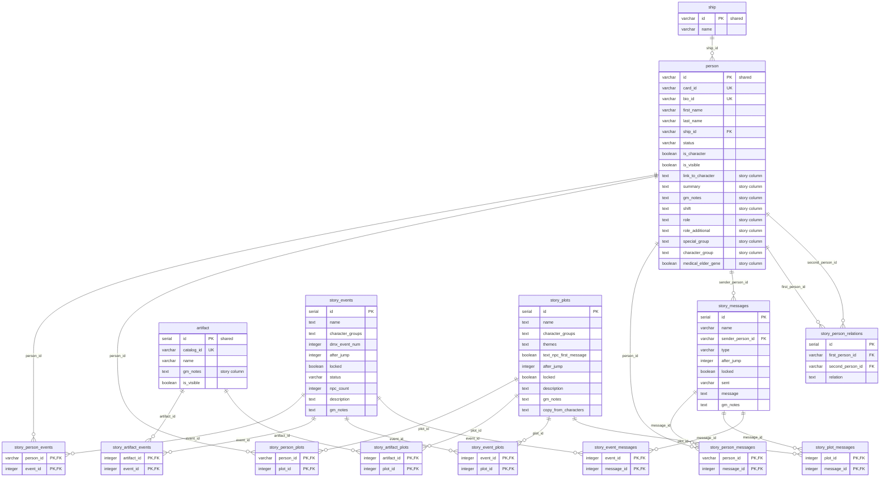

# Story DB

`[STORY-DB]` applies to this whole document unless a section says otherwise.

This document describes the Story DB subsystem as it exists in the Odysseus backend today. The goal is to show where the boundary is if the Story DB becomes a separate system.

## What the Story DB is

The Story DB is the game master (GM) planning database. It holds the written story of the LARP. It does not hold live game state.

It has six domain concepts.

**Plots** (`story_plots`). A plot is a story arc. A plot has a name, a size, a theme list, an importance, a description, GM actions, and GM notes. A plot has a target jump number (`after_jump`). A `locked` flag says the plot must happen exactly at that jump. `text_npc_first_message` says a GM must send the first message to the player. See `db/migrations/20240103185349_add-story-admin-tables.ts:59`.

**Events** (`story_events`). An event is a scene that happens at a place and a time. An event has a status, an NPC location, an NPC count, and a DMX event number. It also has `after_jump` and `locked`. See `db/migrations/20240103185349_add-story-admin-tables.ts:4`.

**Messages** (`story_messages`). A message is pre-written text. A GM sends it to a player during the game. A message has a type (Text NPC, EVA, Fleet Coms, News, and others), a sender, receivers, and a `sent` state. The `sent` values are `Yes`, `No need`, `Not yet`, and `Repeatable`. See `db/migrations/20240109184905_add-story-admin-messages.ts:4`.

**Characters and persons**. The Story DB does **not** own a character table. It uses the shared `person` table. Nine GM-only columns were added to `person` for the Story DB. See `db/migrations/20240103180509_character-updates.ts:4`.

**Relations** (`story_person_relations`). A relation is a free-text sentence between two persons. Example: "Caleb Wong and Malak Kovalenko are roommates." See `db/migrations/20240109191454_add-story-admin-relations.ts:4` and `db/data/relations.csv`.

**Artifacts**. The Story DB does not own an artifact table either. It links plots and events to rows in the shared `artifact` table.

Six link tables connect these concepts many-to-many. Two more link tables connect them to `person` and `artifact`.

What GMs do with it: they write the story before the game in spreadsheets. The spreadsheets are exported to CSV and seeded into the database (`db/seeds/06-story-admin.ts`). During the game they open the story tool front end. They read plots, events, and messages. They check which character is in which plot. They send a pre-written message to a player. They mark the message as sent. They add GM notes to a character or an artifact.

## Routes

All routes are mounted at `/story` in `src/index.ts:94`. The router is `src/routes/story-admin.ts`.

**Authentication and authorization.** `[BY-DESIGN]` This follows the trust model in `00-overview.md`, section 2. `src/index.ts:45-98` installs body parsing, a logger, `cors()` with no options, and a Prometheus middleware. It installs no auth middleware. No route in `src/routes/story-admin.ts` checks a token, a session, or an API key. `package.json` has no auth dependency. Every `/story` route is open to any client that can reach the server. This includes the GM notes, the plot text and the message text.

Error handling is shared. `handleAsyncErrors` (`src/routes/helpers.ts:7`) forwards rejected promises to `errorHandlingMiddleware` (`src/routes/helpers.ts:13`). A `ZodError` becomes HTTP 400. An `http-errors` object keeps its `statusCode`. Everything else becomes HTTP 500.

`src/routes/story-admin.ts:10` imports `StatusCodes`. Nothing in the file uses it. `[DEAD]`

No route under `/story` emits a socket event, writes a non-story table, or calls an external system. There is no `[SIDE-EFFECT]` in this router.

---

### `GET /story/artifact/:id`

`src/routes/story-admin.ts:35`

Purpose: list the events and the plots that reference one artifact.

Request: path parameter `id`. `NumericIdSchema` (`src/routes/story-admin.ts:14`) parses it with `parseInt(val, 10)` and requires a positive integer. `id=0` is rejected with HTTP 400.

Response: `{ id, events: [{id, name}], plots: [{id, name}] }`. Shape from `StoryArtifactRelations` (`src/models/story-artifact.ts:4`). HTTP 404 if the artifact row does not exist.

DB reads: `artifact` (`src/models/story-artifact.ts:18`), `story_artifact_events` joined to `story_events` (`src/models/story-artifact.ts:24`), `story_artifact_plots` joined to `story_plots` (`src/models/story-artifact.ts:28`).

DB writes: none.

Side effects: none.

Rewrite notes: the `artifact` read at line 18 is only an existence check. The response does not use any artifact column. A split Story DB can drop this read if it accepts unknown artifact ids, or it can check against a replicated artifact id list.

---

### `GET /story/events`

`src/routes/story-admin.ts:50`

Purpose: list every event with all its relations.

Request: no parameters. No pagination.

Response: array of `StoryEventWithRelations` (`src/models/story-events.ts:62`). Each element has the event columns plus `artifacts`, `persons`, `messages`, and `plots`.

DB reads: `story_events` (`src/models/story-events.ts:94`). Then, per event, four more queries (`src/models/story-events.ts:99-118`): `story_artifact_events` join `artifact`; `story_person_events` join `person`; `story_event_messages` join `story_messages`; `story_event_plots` join `story_plots`.

DB writes: none.

Side effects: none.

Rewrite notes: this is an N+1 query. With 278 seeded events (`db/data/events.csv`) one request runs 1 + 4 × 278 = 1113 queries. Rewrite it as four bulk queries plus an in-memory group-by.

---

### `GET /story/events/:id`

`src/routes/story-admin.ts:61`

Purpose: get one event with all its relations.

Request: path parameter `id`, `NumericIdSchema`.

Response: one `StoryEventWithRelations`. HTTP 404 if not found.

DB reads: `story_events` (`src/models/story-events.ts:135`), then the same four relation queries at `src/models/story-events.ts:141-160`.

DB writes: none.

Side effects: none.

---

### `POST /story/events`

`src/routes/story-admin.ts:76`

Purpose: create or update one event and replace all its links.

Request: body is `StoryEventCreate` (`src/models/story-events.ts:172`). It is the full `StoryEvent` shape with `id` optional, plus `artifacts: number[]`, `persons: string[]`, `messages: number[]`, and `plots: number[]`. This is an upsert. There is no separate create route and no update route.

Response: `{ id }` only.

DB reads: none.

DB writes, all inside one transaction (`src/models/story-events.ts:182`):

- `story_events`: `insert(...).onConflict('id').merge().returning('id')` at line 184. `[PG]` knex compiles this to `INSERT ... ON CONFLICT (id) DO UPDATE SET ... RETURNING id`. MySQL has no `RETURNING`. SQLite added `RETURNING` in 3.35 only.
- `story_artifact_events`, `story_person_events`, `story_event_messages`, `story_event_plots`: delete-all-then-reinsert for this event id (lines 185-200).

Side effects: none outside the story tables.

Rewrite notes: the delete-then-insert pattern means a concurrent read inside the transaction window sees a partial link set. It also loses any column that a future link table might add. `onConflict('id').merge()` merges every column in the payload, so a client that omits a column writes `undefined` into it. There is no optimistic concurrency check. Two GMs editing the same event overwrite each other silently.

---

### `GET /story/messages`

`src/routes/story-admin.ts:88`

Purpose: list every message with its sender name and receiver names.

Request: no parameters. No pagination.

Response: array of `StoryMessageWithPersons` (`src/models/story-messages.ts:69`). Each element has the message columns plus `receivers: [{id, name}]` and `sender: {id, name} | null`.

DB reads: `story_messages` left-joined to `person` (`src/models/story-messages.ts:86`) and `story_person_messages` joined to `person` (`src/models/story-messages.ts:89`). Two queries only, then an in-memory join at line 92.

DB writes: none.

Side effects: none.

Rewrite notes: this route is the only list route that avoids N+1. Use it as the model for the others.

---

### `GET /story/messages/:id`

`src/routes/story-admin.ts:100`

Purpose: get one message with sender, receivers, events, and plots.

Request: path parameter `id`, `NumericIdSchema`.

Response: one `StoryMessageWithRelations` (`src/models/story-messages.ts:36`). The sender object carries `card_id`, `is_character`, and `status` from `person`. HTTP 404 if not found.

DB reads: `story_messages` left-joined to `person` (`src/models/story-messages.ts:110`); `story_event_messages` join `story_events` (line 126); `story_person_messages` join `person` (line 130); `story_plot_messages` join `story_plots` (line 139).

DB writes: none.

Side effects: none.

---

### `POST /story/messages`

`src/routes/story-admin.ts:115`

Purpose: create or update one message and replace its receiver, event, and plot links.

Request: body is `StoryMessageCreate` (`src/models/story-messages.ts:162`), with `receivers: string[]` (person ids), `plots: number[]`, `events: number[]`.

Response: `{ id }`.

DB reads: none.

DB writes, in one transaction (`src/models/story-messages.ts:171`): `story_messages` upsert at line 173 `[PG]`; then delete-and-reinsert on `story_person_messages` (174-177), `story_event_messages` (178-181), and `story_plot_messages` (182-185).

Side effects: none. The route does **not** send the message to a player. The front end calls `POST /messaging/send` separately for that. See the front end section.

Rewrite notes: `sent` is a free string. The migration comment lists four allowed values (`db/migrations/20240109184905_add-story-admin-messages.ts:22`) but neither the DB nor the zod schema enforces them. The front end sets `sent: 'Yes'` after a successful send (`odysseus-admin-story-tool/src/components/modals/SendMessageModal.js:113`).

---

### `GET /story/person/:id`

`src/routes/story-admin.ts:128`

Purpose: get the GM view of one person, with events, messages, plots, and relations.

Request: path parameter `id`, `StringIdSchema` (`src/routes/story-admin.ts:17`). Person ids are strings, not integers.

Response: `StoryAdminPersonDetailsWithRelations` (`src/models/story-person.ts:41`). The base object is the nine GM columns of `person` plus `id`. It adds `events`, `messages` (each tagged `direction: 'sender' | 'receiver'`), `plots`, and `relations`. HTTP 404 if the person row does not exist.

DB reads: `person` (`src/models/story-person.ts:95`); `story_person_events` join `story_events` (line 101); `story_person_messages` join `story_messages` (line 105). Also `story_messages` filtered by `sender_person_id` (line 109); `story_person_plots` join `story_plots` (line 110); `story_person_relations` double-joined to `person` (line 114).

DB writes: none.

Side effects: none.

`[BUG]` The route returns HTTP 400 for any person whose `medical_elder_gene` is `NULL`. `StoryAdminPersonDetails.medical_elder_gene` is `z.boolean()` and is not nullable (`src/models/story-person.ts:27`). The column is nullable (`db/migrations/20240103180509_character-updates.ts:13`). The survivor seed sets it to `null` for every survivor (`src/utils/person-parser.ts:60` used at `src/utils/person-parser.ts:108`). Survivors are the majority of the `person` table. Characters seeded from `db/data/characters.csv` get a real boolean (`src/utils/person-parser.ts:189`), so the story tool does not hit this in normal use. Any other caller that passes a survivor id does hit it.

Rewrite notes: this route is the deepest coupling to `person`. See the coupling section.

---

### `GET /story/plots`

`src/routes/story-admin.ts:143`

Purpose: list every plot with all its relations.

Request: no parameters. No pagination.

Response: array of `StoryPlotWithRelations` (`src/models/story-plots.ts:62`).

DB reads: `story_plots` (`src/models/story-plots.ts:94`), then per plot four queries (`src/models/story-plots.ts:99-118`): `story_artifact_plots` join `artifact`; `story_event_plots` join `story_events`; `story_plot_messages` join `story_messages`; `story_person_plots` join `person`.

DB writes: none.

Side effects: none.

`[BUG]` This handler does not use `handleAsyncErrors` (`src/routes/story-admin.ts:143`). Every other route does. A rejected promise here is an unhandled rejection, not an HTTP 500. It never reaches `errorHandlingMiddleware`. The client hangs until timeout.

Rewrite notes: same N+1 problem as `GET /story/events`. 649 seeded plots (`db/data/plots.csv`) means 1 + 4 × 649 = 2597 queries per request.

---

### `GET /story/plots/:id`

`src/routes/story-admin.ts:155`

Purpose: get one plot with all its relations.

Request: path parameter `id`, `NumericIdSchema`.

Response: one `StoryPlotWithRelations`. HTTP 404 if not found.

DB reads: `story_plots` (`src/models/story-plots.ts:135`) then the four relation queries at `src/models/story-plots.ts:141-160`.

DB writes: none.

Side effects: none.

Note: the declared return type is `Promise<StoryPlot | null>` (`src/models/story-plots.ts:134`) but the function returns `StoryPlotWithRelations`. The type annotation is wrong. The runtime behaviour is correct.

---

### `POST /story/plots`

`src/routes/story-admin.ts:170`

Purpose: create or update one plot and replace all its links.

Request: body is `StoryPlotCreate` (`src/models/story-plots.ts:172`), with `artifacts: number[]`, `events: number[]`, `messages: number[]`, and `persons: string[]`.

Response: `{ id }`.

DB reads: none.

DB writes, in one transaction (`src/models/story-plots.ts:182`): `story_plots` upsert at line 184 `[PG]`; delete-and-reinsert on `story_artifact_plots`, `story_event_plots`, `story_plot_messages`, and `story_person_plots` (lines 185-200).

Side effects: none.

---

### Routes that do NOT exist

There is no `DELETE` route for any story entity. There is no route to create, update, or delete a `story_person_relations` row. Relations arrive only through the seed (`db/seeds/06-story-admin.ts:296`). They are read-only through the API.

## Data model

### Story-owned tables

All twelve tables below are created by story migrations. No non-story code in `src/` reads or writes them. A grep for `story_` over `src/` returns hits only in `src/models/story-*.ts` and `src/routes/story-admin.ts`.

#### `story_events`
`db/migrations/20240103185349_add-story-admin-tables.ts:4`

| Column | Type | Notes |
|---|---|---|
| `id` | serial, PK | `increments` |
| `name` | text NOT NULL | |
| `character_groups` | text NULL | comma-separated free text, not a FK |
| `size` | varchar NULL | |
| `importance` | varchar NULL | |
| `dmx_event_num` | integer NULL | see note below |
| `type` | varchar NULL | |
| `gm_actions` | text NULL | |
| `after_jump` | integer NULL | jump number, not a FK |
| `locked` | boolean NOT NULL DEFAULT false | |
| `status` | varchar NULL | |
| `npc_location` | text NULL | |
| `npc_count` | integer NOT NULL DEFAULT 0 | |
| `description` | text NULL | |
| `gm_note_npc` | text NULL | |
| `gm_notes` | text NULL | |

`[DEAD]` `dmx_event_num` is never read by any DMX code. It appears only in the migration, in the zod schema (`src/models/story-events.ts:30`), and in the seed (`db/seeds/06-story-admin.ts:44`). It is documentation for a human, not a trigger.

#### `story_plots`
`db/migrations/20240103185349_add-story-admin-tables.ts:59`

| Column | Type | Notes |
|---|---|---|
| `id` | serial, PK | |
| `name` | text NOT NULL | |
| `character_groups` | text NULL | comma-separated free text |
| `size` | varchar NULL | |
| `themes` | text NULL | |
| `importance` | varchar NULL | |
| `gm_actions` | text NULL | |
| `text_npc_first_message` | boolean NOT NULL DEFAULT false | |
| `after_jump` | integer NULL | |
| `locked` | boolean NOT NULL DEFAULT false | |
| `description` | text NULL | |
| `gm_notes` | text NULL | |
| `copy_from_characters` | text NULL | |

#### `story_messages`
`db/migrations/20240109184905_add-story-admin-messages.ts:4`

| Column | Type | Notes |
|---|---|---|
| `id` | serial, PK | |
| `name` | varchar NOT NULL | |
| `sender_person_id` | varchar NULL | **FK to `person.id`**, ON DELETE CASCADE |
| `type` | varchar NOT NULL | |
| `after_jump` | integer NULL | |
| `locked` | boolean NOT NULL DEFAULT false | |
| `sent` | varchar NOT NULL DEFAULT 'Not yet' | not constrained |
| `message` | text NOT NULL | |
| `gm_notes` | text NULL | |

#### `story_person_relations`
`db/migrations/20240109191454_add-story-admin-relations.ts:4`

| Column | Type | Notes |
|---|---|---|
| `id` | serial, PK | |
| `first_person_id` | varchar NULL | **FK to `person.id`**, ON DELETE CASCADE |
| `second_person_id` | varchar NULL | **FK to `person.id`**, ON DELETE CASCADE |
| `relation` | text NULL | free-text sentence |

There is no unique constraint on `(first_person_id, second_person_id)`. Duplicate pairs are possible.

#### Link tables

| Table | Columns | PK | FKs | Migration |
|---|---|---|---|---|
| `story_person_events` | `person_id`, `event_id` | both | `person.id` CASCADE, `story_events.id` CASCADE | `...185349...ts:26` |
| `story_artifact_events` | `artifact_id`, `event_id` | both | `artifact.id` CASCADE, `story_events.id` CASCADE | `...185349...ts:43` |
| `story_person_plots` | `person_id`, `plot_id` | both | `person.id` CASCADE, `story_plots.id` CASCADE | `...185349...ts:79` |
| `story_artifact_plots` | `artifact_id`, `plot_id` | both | `artifact.id` CASCADE, `story_plots.id` CASCADE | `...185349...ts:96` |
| `story_event_plots` | `event_id`, `plot_id` | both | `story_events.id` CASCADE, `story_plots.id` CASCADE | `...185349...ts:113` |
| `story_person_messages` | `person_id`, `message_id` | both | `person.id` CASCADE, `story_messages.id` CASCADE | `...184905...ts:29` |
| `story_plot_messages` | `plot_id`, `message_id` | both | `story_plots.id` CASCADE, `story_messages.id` CASCADE | `...184905...ts:45` |
| `story_event_messages` | `event_id`, `message_id` | both | `story_events.id` CASCADE, `story_messages.id` CASCADE | `...184905...ts:61` |

### Shared tables the story code touches

#### `person` — SHARED, read-only from the story code

Created in `db/migrations/20181029232235_personnel-initial.js:6`. Altered by `db/migrations/20190117222559_person-updates.js`, `db/migrations/20190423200411_person-updates.js`, `db/migrations/20190526104729_person-updates.js`, `db/migrations/20240103180509_character-updates.ts`, `db/migrations/20240217115233_add-personal-secret-info-column.ts`, and `db/migrations/20240421130146_add-military-academy-column.ts`.

Key columns:

| Column | Type | Owner | Read by story code |
|---|---|---|---|
| `id` | varchar, PK | game | yes, everywhere |
| `card_id` | varchar UNIQUE (was `chip_id`) | game | `story-messages.ts:113,133` |
| `bio_id` | varchar UNIQUE | game | no |
| `first_name` | varchar NOT NULL | game | yes, name concat |
| `last_name` | varchar NULL | game | yes, name concat |
| `ship_id` | varchar, FK -> `ship.id` | game | `story-person.ts:121-122` |
| `status` | varchar | game | `story-person.ts:125-126`, `story-messages.ts:114` |
| `is_character` | boolean NULL | game | `story-person.ts:123-124`, `story-plots.ts:114`, `story-events.ts:106` |
| `is_visible` | boolean DEFAULT true | game | no |
| `title`, `dynasty`, `home_planet`, `religion`, `citizenship`, `social_class`, `political_party`, `occupation`, `birth_year`, `citizen_id`, `created_year`, `military_*`, `medical_*` | mixed | game | returned by `SELECT *` at `story-person.ts:95` but not in the response schema |
| `link_to_character` | text NULL | **story** | yes |
| `summary` | text NULL | **story** | yes |
| `gm_notes` | text NULL | **story** | yes |
| `shift` | text NULL | **story** | yes |
| `role` | text NULL | **story** | yes |
| `role_additional` | text NULL | **story** | yes |
| `special_group` | text NULL | **story** | yes |
| `character_group` | text NULL | **story** | yes |
| `medical_elder_gene` | boolean NULL DEFAULT false | **story** | yes |

The nine "story" columns were added by `db/migrations/20240103180509_character-updates.ts:4-14`. They are GM planning data on a game-owned table. They are the clearest candidate to move.

#### `artifact` — SHARED, read-only from the story code

Created in `db/migrations/20190113195533_science-artifacts.js:5`. Altered by `db/migrations/20190611170541_tags-and-operations.js:2` (adds `catalog_id` UNIQUE), `db/migrations/20190612214620_artifact-updates.js:4` (adds `discovered_at`, `discovered_by`, `discovered_from`, `type`, `text`), `db/migrations/20240103174232_artifact-updates.ts:4` (adds `gm_notes`, `is_visible`), and `db/migrations/20240428103808_add-artifact-test-columns.ts:5` (adds `test_material`, `test_microscope`, `test_age`, `test_history`, `test_xrf`).

Story code reads `id`, `name`, and `catalog_id` only (`src/models/story-plots.ts:99-102`, `src/models/story-events.ts:99-102`). The `SELECT *` in `src/models/story-artifact.ts:18` reads the whole row but uses only `artifact.id`.

`gm_notes` on `artifact` was added in the same commit series as the story tables. The story tool writes it, but through `PUT /science/artifact`, not through `/story`.

#### `ship` — not touched by the story code

`src/models/story-person.ts:121` reads `person.ship_id` as a string. It does not join `ship`. The story tool resolves ship names by calling `/fleet` directly.

#### `com_message` — not touched by the story code

The story tool sends live messages through `POST /messaging/send` (`src/messaging.ts:65`), which writes `com_message`. No story model reads or writes `com_message`.

### ER diagram



## Coupling analysis

This section decides the split. There are eight foreign keys that cross the boundary. There are two shared tables. There are nine story columns that live on a shared table.

### Foreign keys crossing the boundary

Six FKs point at `person`. Two point at `artifact`. All use `ON DELETE CASCADE`. All are declared in story migrations, so a split removes them from the game database schema automatically.

| # | Story table | Column | Target | Migration file:line | What the split needs |
|---|---|---|---|---|---|
| 1 | `story_person_events` | `person_id` | `person.id` | `db/migrations/20240103185349_add-story-admin-tables.ts:28-32` | replicated `person` id + name + display fields |
| 2 | `story_person_plots` | `person_id` | `person.id` | `db/migrations/20240103185349_add-story-admin-tables.ts:80-85` | same |
| 3 | `story_person_messages` | `person_id` | `person.id` | `db/migrations/20240109184905_add-story-admin-messages.ts:30-35` | same |
| 4 | `story_messages` | `sender_person_id` | `person.id` | `db/migrations/20240109184905_add-story-admin-messages.ts:7-12` | same, plus `card_id` and `status` |
| 5 | `story_person_relations` | `first_person_id` | `person.id` | `db/migrations/20240109191454_add-story-admin-relations.ts:6-11` | same, plus `ship_id` and `is_character` |
| 6 | `story_person_relations` | `second_person_id` | `person.id` | `db/migrations/20240109191454_add-story-admin-relations.ts:12-17` | same |
| 7 | `story_artifact_events` | `artifact_id` | `artifact.id` | `db/migrations/20240103185349_add-story-admin-tables.ts:44-49` | replicated `artifact` id + name + catalog_id |
| 8 | `story_artifact_plots` | `artifact_id` | `artifact.id` | `db/migrations/20240103185349_add-story-admin-tables.ts:97-102` | same |

Analysis per target.

**`person` (FKs 1-6).** A synthetic id does not work. The story tool shows the person's name, ship, status, and `is_character` flag in every list. It also writes `person.gm_notes` through the game API. The Story DB therefore needs a **replicated person table**, kept fresh by an **event feed**. The replica needs at least these columns: `id`, `first_name`, `last_name`, `card_id`, `ship_id`, `status`, `is_character`, `is_visible`.

The nine story columns on `person` are different. They are written only by the seed (`src/utils/person-parser.ts:181-189`) and by `PUT /person/:id` (`src/routes/person.js:185`). The game never reads them. They should **move** to a Story DB table keyed by person id. That removes them from the replica.

`ON DELETE CASCADE` is a real behaviour today. If a person row is deleted, every plot link, event link, message link, and relation for that person disappears silently. After a split, the delete event must carry that same rule, or the Story DB keeps orphan links. Note that no route in the backend deletes a person row. `killPerson` (`src/models/person.js:222`) sets `status = 'Deceased'`; it does not delete. Only the seed deletes (`db/seeds/02-personnel.ts:32`).

**`artifact` (FKs 7-8).** The story code reads only `id`, `name`, and `catalog_id`. A replicated artifact table with those three columns plus `gm_notes` and `is_visible` is enough. `catalog_id` is the stable business key (`db/migrations/20190611170541_tags-and-operations.js:3`, UNIQUE). The seed already joins on `catalog_id`, not on `id` (`db/seeds/06-story-admin.ts:204`). **Key `catalog_id` in the split, not `id`.** `artifact.id` is a `serial` and is reassigned on every reseed.

### SQL joins crossing the boundary

Nine query sites join a non-story table. Every one of them lives in a story model.

**1. `src/models/story-plots.ts:99-102` — `story_artifact_plots` -> `artifact`**

```js
knex('story_artifact_plots')
  .join('artifact', 'story_artifact_plots.artifact_id', 'artifact.id')
  .select('artifact.name', 'artifact.id', 'artifact.catalog_id')
  .where({ plot_id: plot.id }),
```

Same query at `src/models/story-plots.ts:141-144`.

**2. `src/models/story-plots.ts:111-118` — `story_person_plots` -> `person`**

```js
knex('story_person_plots')
  .join('person', 'story_person_plots.person_id', 'person.id')
  .select(
    'person.id',
    'person.is_character',
    knex.raw("TRIM(CONCAT(person.first_name, ' ', person.last_name)) as name")
  )
  .where({ plot_id: plot.id }),
```

Same query at `src/models/story-plots.ts:153-160`.

`[PG]` The `knex.raw` string is the pattern to watch. `TRIM(CONCAT(a, ' ', b))` is standard SQL on PostgreSQL and MySQL. SQLite has no `CONCAT()` before version 3.44 (2023); it uses the `||` operator. Any port to SQLite must rewrite this expression. The larger point is that the display name is computed in SQL, not stored. A replicated person table must either store `full_name` or repeat the same expression. `person.js:132` already has a `full_name` Bookshelf virtual `[BOOKSHELF]` that does the same thing in JavaScript, with different null handling. Two implementations of one concept.

**3. `src/models/story-events.ts:99-102` — `story_artifact_events` -> `artifact`**

```js
knex('story_artifact_events')
  .join('artifact', 'story_artifact_events.artifact_id', 'artifact.id')
  .select('artifact.name', 'artifact.id', 'artifact.catalog_id')
  .where({ event_id: event.id }),
```

Same query at `src/models/story-events.ts:141-144`.

**4. `src/models/story-events.ts:103-110` — `story_person_events` -> `person`**

```js
knex('story_person_events')
  .join('person', 'story_person_events.person_id', 'person.id')
  .select(
    'person.id',
    'person.is_character',
    knex.raw("TRIM(CONCAT(person.first_name, ' ', person.last_name)) as name")
  )
  .where({ event_id: event.id }),
```

`[PG]` same raw expression. Same query at `src/models/story-events.ts:145-152`.

**5. `src/models/story-messages.ts:86-88` — `story_messages` LEFT JOIN `person`**

```js
const messages = await knex('story_messages')
  .select('story_messages.*', knex.raw("TRIM(CONCAT(person.first_name, ' ', person.last_name)) as sender_name"))
  .leftJoin('person', 'story_messages.sender_person_id', 'person.id');
```

`[PG]` same raw expression. This is a `LEFT JOIN` because `sender_person_id` is nullable.

**6. `src/models/story-messages.ts:89-91` — `story_person_messages` -> `person`**

```js
const storyPersonMessage = await knex('story_person_messages')
  .select('story_person_messages.*', knex.raw("TRIM(CONCAT(person.first_name, ' ', person.last_name)) as name"))
  .join('person', 'story_person_messages.person_id', 'person.id');
```

`[PG]` same raw expression. This query has no `WHERE`. It loads every person-message link row on every `GET /story/messages` call.

**7. `src/models/story-messages.ts:110-120` — `story_messages` LEFT JOIN `person` with more columns**

```js
const message = await knex('story_messages')
  .select(
    'story_messages.*',
    'person.card_id',
    'person.is_character',
    'person.status',
    knex.raw("TRIM(CONCAT(person.first_name, ' ', person.last_name)) as sender_name")
  )
  .leftJoin('person', 'story_messages.sender_person_id', 'person.id')
  .where('story_messages.id', '=', id)
  .first();
```

`[PG]` same raw expression. This is the only place that reads `person.card_id` and `person.status` for a sender.

**8. `src/models/story-messages.ts:130-138` — `story_person_messages` -> `person` with `card_id`**

```js
knex('story_person_messages')
  .join('person', 'story_person_messages.person_id', 'person.id')
  .select(
    'person.id',
    'person.card_id',
    'person.is_character',
    knex.raw("TRIM(CONCAT(person.first_name, ' ', person.last_name)) as name")
  )
  .where({ message_id: id }),
```

`[PG]` same raw expression.

**9. `src/models/story-person.ts:114-128` — `story_person_relations` double-joins `person` twice**

```js
knex('story_person_relations')
  .join('person as first_person', 'story_person_relations.first_person_id', 'first_person.id')
  .join('person as second_person', 'story_person_relations.second_person_id', 'second_person.id')
  .select(
    'story_person_relations.*',
    knex.raw('TRIM(CONCAT(first_person.first_name, \' \', first_person.last_name)) as first_person_name'),
    knex.raw('TRIM(CONCAT(second_person.first_name, \' \', second_person.last_name)) as second_person_name'),
    'first_person.ship_id as first_person_ship_id',
    'second_person.ship_id as second_person_ship_id',
    'first_person.is_character as first_person_is_character',
    'second_person.is_character as second_person_is_character',
    'first_person.status as first_person_status',
    'second_person.status as second_person_status',
  )
  .where({ first_person_id: id }).orWhere({ second_person_id: id }),
```

`[PG]` two raw expressions. This is the heaviest cross-boundary join. It needs `person.id`, `first_name`, `last_name`, `ship_id`, `is_character`, and `status` for **both** sides of every relation. It is an `INNER JOIN` on both sides, so a relation whose person is missing disappears from the result with no error.

**10. `src/models/story-person.ts:95` — plain `person` read**

```js
const person = await knex('person').select('*').where({ id }).first();
```

This reads the whole `person` row. The response schema keeps only the nine story columns plus `id` (`src/models/story-person.ts:17-28`). Zod strips the rest.

**Summary of the person fields needed across the boundary:** `id`, `first_name`, `last_name`, `card_id`, `ship_id`, `status`, `is_character`. Seven fields. Nothing else from the game side of `person` is read.

**Summary of the artifact fields needed across the boundary:** `id`, `name`, `catalog_id`. Three fields.

### Shared writes

This is the hardest coupling. Three shared tables are written on both sides of the proposed boundary.

**`person.gm_notes` — story writes it through the game API.** The story tool calls `PUT /person/:id` with `{ gm_notes }` (`odysseus-admin-story-tool/src/api/character.js:8-14`, called from `odysseus-admin-story-tool/src/components/modals/EditCharacterModal.js:44`). The backend handler is `src/routes/person.js:185`. It is an unvalidated patch: `await person.save(req.body, { method: 'update', patch: true })` at `src/routes/person.js:190`. The comment on line 187 says `// TODO: Validate input`. Any field name in the body is written. After a split, either the Story DB owns `gm_notes` in its own table, or it must keep calling the game API.

**`artifact.gm_notes` — story writes it through the game API.** The story tool calls `PUT /science/artifact` with `{ id, gm_notes }` (`odysseus-admin-story-tool/src/api/artifact.js:9-15`, called from `odysseus-admin-story-tool/src/components/modals/EditArtifactModal.js:44`). The backend handler is `src/routes/science.js:57`. It is the same unvalidated upsert pattern (`src/routes/science.js:72`).

`[BUG]` `PUT /science/artifact` with an `id` that does not exist falls into the insert branch (`src/routes/science.js:63`). Suppose the insert throws for any reason other than a duplicate catalog id. The `catch` at line 65 swallows the error. Line 74 then responds with `undefined` and HTTP 200.

**`person.status` — the game writes it, the story reads it.** Three writers:

- `killPerson` sets `status = 'Deceased'` and inserts a `person_entry` row (`src/models/person.js:222-234`). `[SIDE-EFFECT]` It writes two tables and uses `process.env.FLEET_SECRETARY_ID` as the author.
- `Ship.killAllPersons` sets `status = 'Killed in action'` for every person on a ship (`src/models/ship.js:210-214`). `[SIDE-EFFECT]`
- `PUT /person/:id` (`src/routes/person.js:190`), unvalidated patch.

The story tool shows this status next to every relation and every message sender. If the Story DB replicates `person`, a kill must produce an event.

**`person.is_visible` — the game writes it, the story tool filters on it.** `setPersonsVisible` updates every non-blacklisted person (`src/models/person.js:323-327`), called from `PUT /person/set-visible` (`src/routes/person.js:171`). `odysseus-admin` also calls it (`odysseus-admin/src/components/Fleet.vue:518`). The story tool always passes `show_hidden=true`, so it bypasses the filter. The Story DB itself never reads `is_visible`.

**`com_message` — the story tool writes it, the game owns it.** `POST /messaging/send` (`src/messaging.ts:65`) creates an admin mock socket for the sender (`src/messaging.ts:21-30`). It then calls `onSendMessage`. `[SIDE-EFFECT]` This writes a `com_message` row and emits a socket event to the receiving player's device. This is the only write path from the story tool into live game state. After a split, the Story DB front end must still call the game API for this. It is a command, not a data sync.

**The seeds are the biggest shared write.** `db/seeds/02-personnel.ts:32` runs `knex('person').del()`. It deletes every person. `db/seeds/06-story-admin.ts:269-281` deletes every story table row and reseeds them. Order matters: `06` runs after `02` and resolves person ids by full name (`db/seeds/06-story-admin.ts:144-162`). A reseed of `02` alone breaks `06`'s links through `ON DELETE CASCADE`. After a split, this cross-database name resolution stops working. The seed becomes two seeds that must agree on person ids.

`[PG]` The story seed uses PostgreSQL-only sequence commands: `ALTER SEQUENCE story_person_relations_id_seq RESTART WITH 1` (`db/seeds/06-story-admin.ts:282`) and three more at `db/seeds/06-story-admin.ts:311-313`.

### Read-only vs read-write

| Table | Story DB reads | Story DB writes | Verdict |
|---|---|---|---|
| `story_events` | yes | yes | story-owned, moves |
| `story_plots` | yes | yes | story-owned, moves |
| `story_messages` | yes | yes | story-owned, moves |
| `story_person_relations` | yes | seed only | story-owned, moves; no write API exists |
| `story_person_events` | yes | yes | story-owned, moves |
| `story_person_plots` | yes | yes | story-owned, moves |
| `story_person_messages` | yes | yes | story-owned, moves |
| `story_artifact_events` | yes | yes | story-owned, moves |
| `story_artifact_plots` | yes | yes | story-owned, moves |
| `story_event_plots` | yes | yes | story-owned, moves |
| `story_event_messages` | yes | yes | story-owned, moves |
| `story_plot_messages` | yes | yes | story-owned, moves |
| `person` (game columns) | yes, 7 fields | **no** | shared, read-only -> replicate |
| `person` (9 story columns) | yes | **only via `PUT /person/:id`, from the front end** | shared today, should move to the Story DB |
| `artifact` (`id`, `name`, `catalog_id`) | yes, 3 fields | **no** | shared, read-only -> replicate |
| `artifact.gm_notes` | no (front end reads via `/science/artifact`) | **only via `PUT /science/artifact`, from the front end** | shared, keep in the game or move |
| `ship` | no | no | not coupled; the front end reads `/fleet` itself |
| `com_message` | no | **only via `POST /messaging/send`, from the front end** | game-owned command target |

The clean result: **no story model writes any non-story table.** Every cross-boundary write comes from the front end, through public game endpoints. That is a much easier boundary than it first looks. The Story DB service itself needs a read-only feed. Only the front end needs write access to the game API, and it already has it.

### What data would need to flow in real time

Two entity streams plus one bootstrap.

#### Stream 1: `person`

Source of truth: the game backend. Fields the Story DB needs:

```
id, first_name, last_name, card_id, ship_id, status, is_character
```

Emit on:

| Trigger | Code site | Event |
|---|---|---|
| seed reload | `db/seeds/02-personnel.ts:32,46,50` | `person.reset` (full snapshot) |
| person patch | `src/routes/person.js:190` | `person.updated` |
| kill one person | `src/models/person.js:224` | `person.updated` (status change) |
| kill a ship's crew | `src/models/ship.js:214` | `person.updated` × N |
| set all visible | `src/models/person.js:326` | not needed; `is_visible` is unused by the Story DB |
| row delete | seed only today | `person.deleted` (must cascade story links) |

Proposed shape:

```json
{
  "type": "person.updated",
  "version": 1,
  "occurred_at": "2026-09-06T12:00:00.000Z",
  "id": "1042",
  "data": {
    "id": "1042",
    "first_name": "Caleb",
    "last_name": "Wong",
    "card_id": "AB12CD",
    "ship_id": "odysseus",
    "status": "Deceased",
    "is_character": true
  }
}
```

```json
{ "type": "person.deleted", "version": 1, "occurred_at": "...", "id": "1042" }
```

```json
{ "type": "person.reset", "version": 1, "occurred_at": "...", "count": 4032 }
```

`person.reset` tells the Story DB to re-pull the full list from a snapshot endpoint. A delete-and-reseed of 4032 rows should not become 4032 events.

Note: the Story DB does **not** need `first_name`/`last_name` if the game publishes a `full_name` computed the same way as `TRIM(CONCAT(first_name, ' ', last_name))`. Publishing both fields is safer, because the Story DB then owns the formatting.

#### Stream 2: `artifact`

Source of truth: the game backend. Fields the Story DB needs:

```
id, catalog_id, name
```

The front end also needs `gm_notes`, `is_visible`, `type`, `text`, `discovered_*`, and the five `test_*` columns, but it reads those from `/science/artifact` directly. Only the three fields above cross into story tables.

Emit on:

| Trigger | Code site | Event |
|---|---|---|
| artifact insert | `src/routes/science.js:64` | `artifact.created` |
| artifact patch | `src/routes/science.js:72` | `artifact.updated` |
| seed reload | `db/seeds/04-science-engi-medical.ts` | `artifact.reset` |

Proposed shape:

```json
{
  "type": "artifact.updated",
  "version": 1,
  "occurred_at": "...",
  "id": 42,
  "data": { "id": 42, "catalog_id": "ODY-042", "name": "Cracked lens" }
}
```

`catalog_id` is the stable key across reseeds; `id` is not. The Story DB should store both and match on `catalog_id` when it re-syncs after a reset.

#### Not needed as a stream

- `ship`. No story model joins it. The front end calls `/fleet` itself.
- `com_message`. Write-only from the story side, and only from the front end.
- `person.is_visible`. Never read by story code.
- `group`, `person_entry`, `person_family`, `tag`, `operation_result`. Never touched by story code.

#### Transport

The backend already runs Socket.IO (`src/index.ts:47`) with a `/messaging` namespace (`src/messaging.ts:84`). A new namespace such as `/story-sync` is the lowest-friction option. It needs no new infrastructure. It has no delivery guarantee, so the Story DB must also poll a snapshot endpoint on reconnect. A `GET /person?show_hidden=true` (`src/routes/person.js:32`) already returns the needed fields, and `GET /science/artifact` (`src/routes/science.js:19`) returns the artifacts.

Note that socket delivery is best-effort. Add a monotonic sequence number to each event so the Story DB can detect a gap and trigger a full resync.

## Story tool front end

`/Users/nicou/git/odysseus-admin-story-tool`

It is a Create React App single-page application. Package name `admin-story` (`package.json:2`). It is not published; `"private": true`.

Stack:

- React 17, React Router 6, React Bootstrap 5 (`odysseus-admin-story-tool/package.json:6-30`)
- `swr` 2.2.5 for data fetching and caching
- `react-bootstrap-table-next` with filter, paginator, and toolkit plugins
- `react-calendar-timeline` 0.27, `interactjs`, `moment`
- `react-hot-toast` for notifications, `react-select` for multi-selects
- `react-scripts` 5.0.0 build

It has no authentication code. It has no Socket.IO client. A grep for `socket` over its `src/` returns nothing. All data flow is `fetch` over HTTP. This matches the trust model in `00-overview.md`, section 2.

The base URL comes from one environment variable, `REACT_APP_ODYSSEUS_API_URL` (`src/api/index.js:2`). The live build sets it to `https://odysseus-server.live.odysseuslarp.dev` (`odysseus-admin-story-tool/package.json:38`).

Every request goes through `apiUrl(path)` (`src/api/index.js:1`) or `apiGetRequest(url)` (`src/api/index.js:5`).

### Endpoints under `/story`

| Endpoint | Method | Call site |
|---|---|---|
| `/story/plots` | GET | `src/components/Plots.js:18`, `src/components/modals/CreateEditEventModal.js:50`, `src/components/modals/CreateEditPlotModal.js:49`, `src/components/modals/CreateEditMessageModal.js:39` |
| `/story/plots/:id` | GET | `src/components/Plot.js:18` |
| `/story/plots` | POST | `src/api/plots.js:13` (`upsertPlot`) |
| `/story/events` | GET | `src/components/Events.js:18`, `src/components/modals/CreateEditEventModal.js:48`, `src/components/modals/CreateEditPlotModal.js:47`, `src/components/modals/CreateEditMessageModal.js:40` |
| `/story/events/:id` | GET | `src/components/Event.js:30` |
| `/story/events` | POST | `src/api/events.js:13` (`upsertEvent`) |
| `/story/messages` | GET | `src/components/Messages.js:18`, `src/components/modals/CreateEditEventModal.js:51`, `src/components/modals/CreateEditPlotModal.js:50` |
| `/story/messages/:id` | GET | `src/components/Message.js:22` |
| `/story/messages` | POST | `src/api/messages.js:22` (`upsertMessage`) |
| `/story/person/:id` | GET | `src/components/Character.js:31` |
| `/story/artifact/:id` | GET | `src/components/Artifact.js:24` |

### Endpoints NOT under `/story`

This is the part that constrains the split. The tool depends on six game endpoints.

| Endpoint | Method | Call site | Why |
|---|---|---|---|
| `/person/:id` | GET | `src/components/Character.js:30` | full person record for the character page |
| `/person/:id` | PUT | `src/api/character.js:8` | **writes `person.gm_notes`** |
| `/person?show_hidden=true&is_character=true` | GET | `src/components/Characters.js:19`, `CreateEditEventModal.js:46`, `CreateEditPlotModal.js:45`, `CreateEditMessageModal.js:37`, `SendMessageModal.js:37` | character picker |
| `/person?show_hidden=true&is_character=false` | GET | `src/components/Characters.js:24`, `CreateEditEventModal.js:47`, `CreateEditPlotModal.js:46`, `CreateEditMessageModal.js:38`, `SendMessageModal.js:38` | NPC picker |
| `/person?show_hidden=true&ship_id=…&title=…` | GET | `src/components/Ship.js:25` | captain / grand admiral of a ship |
| `/person?show_hidden=true&is_character=false&ship_id=…` | GET | `src/components/Ship.js:30` | ship passengers |
| `/person/search/:name` | GET | `src/components/Artifact.js:29` | resolves `artifact.discovered_by`, which is a **name string**, not an id |
| `/science/artifact` | GET | `src/components/Artifacts.js:18`, `src/components/Ship.js:20`, `CreateEditEventModal.js:49`, `CreateEditPlotModal.js:48` | artifact list and picker |
| `/science/artifact/:id` | GET | `src/components/Artifact.js:19` | artifact detail |
| `/science/artifact` | PUT | `src/api/artifact.js:9` | **writes `artifact.gm_notes`** |
| `/fleet?show_hidden=true` | GET | `src/components/Fleet.js:18`, `src/components/Character.js:32` | ship list, for ship names |
| `/fleet/:id` | GET | `src/components/Ship.js:15` | ship detail page |
| `/messaging/send` | POST | `src/api/messages.js:63` | **sends a live message to a player** |

The tool has twelve React Router routes (`src/App.js:99-111`). Two of them, `/fleet` and `/fleet/:id`, read **no** story data at all. `Fleet.js` and `Ship.js` call only `/fleet`, `/science/artifact`, and `/person`. Those two pages are a game-data browser that happens to live in the story tool.

The send flow is two calls, not one. `SendMessageModal.js:113` sets `sent: 'Yes'` in the local object. Line 116 calls `upsertMessage` -> `POST /story/messages`. Line 119 calls `sendMessage` -> `POST /messaging/send`, once per receiver (`src/api/messages.js:80`). `[BUG]` These two calls are not atomic. If `upsertMessage` succeeds and `sendMessage` fails, the message is marked `Yes` but no player got it.

### Consumers in other repos

`odysseus-data-hub/src/app/api/Storyadmin.ts` and `odysseus-jump-ui/src/app/api/Storyadmin.ts` contain generated clients for every `/story` route. Both files carry the header `// Auto-generated, edits will be overwritten`. A grep for `Storyadmin` in both repos returns only the files themselves. `[DEAD]` Nothing imports them. They are a by-product of generating the whole Swagger client, not a real dependency.

`odysseus-admin` does not reference `/story` or any `story_` table. A grep over its `src/` returns nothing. It does share two write paths with the story tool: `PUT /person/set-visible` (`odysseus-admin/src/components/Fleet.vue:518`) and `PUT /science/artifact/` (`odysseus-admin/src/components/Social.vue:558`).

## odysseus-story-llm-tools

`/Users/nicou/git/odysseus-story-llm-tools`

It is a small set of Python experiment scripts. The README is two lines: "This repository contains tools that utilize LLMs to help work with the story of Odysseus LARP."

Five scripts, in two groups.

**Group 1: character search over Markdown.**

- `src/search-from-characters/load-embeddings-to-chroma.py` reads every `.md` file in `./docs/characters` (line 14, line 31) and splits on `#` and `##` headings (lines 19-23). It embeds with OpenAI and persists to a local Chroma store at `./chroma_db` (line 41).
- `src/search-from-characters/search-embeddings.py` opens the same Chroma store (line 12) and runs a similarity search.
- `src/search-from-characters/ask-question.py` builds a `SelfQueryRetriever` over the same store (line 42) and answers a question passed as `sys.argv[1]`.

**Group 2: summarisation.**

- `src/plot-and-relationship-summary/short-description.py` reads one hard-coded file, `./docs/characters/torrey-watson.md` (line 28), and asks GPT-4 for a short character description.
- `src/plot-and-relationship-summary/extract-plots.py` builds a prompt template and stops. It defines `llm` and `prompt` and never runs a chain. `[DEAD]`

**How it reads the data: neither API nor DB nor CSV.** It reads three hand-written Markdown files, `docs/characters/nikita-watson.md`, `docs/characters/mel-mcbride.md`, and `docs/characters/torrey-watson.md`. There is no `requests`, `psycopg`, `sqlalchemy`, or `csv` import in any script. There is no reference to `odysseus-server`, to `/story`, or to any table name. Its only configuration is `OPENAI_API_KEY` (`.env.example`).

**What the split would break: nothing.** The repo has no connection to the backend, the database, or the Story DB. It is a dead end that a human feeds by hand. It is stale too: it pins `gpt-4-1106-preview` and `gpt-3.5-turbo`, and it uses the pre-1.0 `langchain.*` import paths that were removed in later releases.

If someone wants this to work against the split Story DB, that is new work, not a migration. The Story DB would need a "character dossier as Markdown" export.

## Split plan sketch

### Tables that move to the Story DB

All twelve story tables, unchanged: `story_plots`, `story_events`, `story_messages`, `story_person_relations`, `story_person_plots`, `story_person_events`, `story_person_messages`, `story_artifact_plots`, `story_artifact_events`, `story_event_plots`, `story_event_messages`, `story_plot_messages`.

Plus a new table for the nine GM columns now on `person`. Call it `story_person` with the primary key `person_id` and the columns `link_to_character`, `summary`, `gm_notes`, `shift`, `role`, `role_additional`, `special_group`, `character_group`, `medical_elder_gene`. Drop those nine columns from `person` (`db/migrations/20240103180509_character-updates.ts` gets a reverse migration).

Plus two replica tables, written only by the sync process: `ext_person` (`id`, `first_name`, `last_name`, `card_id`, `ship_id`, `status`, `is_character`, `synced_at`) and `ext_artifact` (`id`, `catalog_id`, `name`, `synced_at`).

Every FK from a story table then points at `ext_person.id` or `ext_artifact.id` inside one database. The joins in the models change table name only. The `TRIM(CONCAT(...))` expressions keep working.

### Tables that stay in the game backend

`person`, `artifact`, `ship`, `com_message`, and everything else. The game backend loses only the nine `person` columns and the twelve story tables.

### What the sync interface looks like

**Inbound to the Story DB (read-only).**

1. Snapshot: `GET /person?show_hidden=true` and `GET /science/artifact` on startup and after any gap. These already exist (`src/routes/person.js:32`, `src/routes/science.js:19`).
2. Live: a Socket.IO namespace `/story-sync` on the existing server (`src/index.ts:47`), emitting `person.updated`, `person.deleted`, `person.reset`, `artifact.created`, `artifact.updated`, `artifact.reset`, each with a monotonic sequence number.

**Outbound from the story front end (commands, unchanged).** The front end keeps calling the game backend directly. This covers `PUT /person/:id` (until `gm_notes` moves), `PUT /science/artifact`, `POST /messaging/send`, `GET /fleet`, and `GET /person/search/:name`. No server-to-server call is needed in this direction.

### What breaks first

1. **The seed.** `db/seeds/06-story-admin.ts:144-162` resolves person ids by full name against a live `person` table. After the split, that table is a replica that may be empty when the seed runs. The story seed must either wait for the first sync or read `characters.csv` itself. This is the single highest-risk item.
2. **`ALTER SEQUENCE` calls** at `db/seeds/06-story-admin.ts:282,311-313` assume the story tables and the sequences are in the same database. They keep working after the move, but only if the Story DB is PostgreSQL. `[PG]`
3. **`ON DELETE CASCADE` from `person`.** Today a deleted person cleans up its story links. After the split the cascade is gone. The `person.deleted` event handler must do it. Today nothing deletes a person except the seed, so this is latent, not immediate.
4. **`artifact.id` instability.** The seed matches artifacts by `catalog_id` (`db/seeds/06-story-admin.ts:204`) because `artifact.id` is a `serial` that changes on reseed. The replica must resolve on `catalog_id`, not `id`.
5. **`person.gm_notes` writes.** `PUT /person/:id` (`src/routes/person.js:190`) is an unvalidated patch. The moment `gm_notes` moves off `person`, that call silently writes nothing. There is no error. The front end must switch to a story endpoint in the same release.
6. **`GET /story/person/:id`** returns the nine columns from `person` today (`src/models/story-person.ts:95`). It must read `story_person` after the move.

### Migration order

1. Add the `/story-sync` event feed to the game backend. Emit on the six triggers listed above. Change nothing else. Ship it. Verify the feed against the live game.
2. Stand up the Story DB service with `ext_person` and `ext_artifact`. Run the sync. Do not move any table yet. Verify the replica matches the game database.
3. Copy the twelve story tables into the Story DB and repoint their FKs at `ext_person` / `ext_artifact`. Run both copies in parallel. Compare the `/story` responses from both.
4. Move the story tool's `/story/*` calls to the new service. Keep its other calls pointed at the game backend. Ship it.
5. Drop the twelve story tables from the game database. Delete `src/routes/story-admin.ts`, `src/models/story-*.ts`, and the three story migrations' effect. Keep the migration files; do not rewrite history.
6. Move the nine GM columns from `person` to `story_person` in the Story DB. Add a story endpoint for GM notes. Switch `odysseus-admin-story-tool/src/api/character.js` to it. Drop the nine columns from `person` last, when nothing writes them.
7. Split `db/seeds/06-story-admin.ts` out of the backend repo. Give it its own person-id resolution, either from `characters.csv` or from a sync barrier.

Steps 1-4 are reversible. Step 5 is the point of no return. Step 6 is independent of steps 1-5 and can be deferred.

## Open questions

1. **Who owns the GM columns on `person`?** They are story data on a game table. Moving them is clean, but `PUT /person/:id` is an unvalidated patch route (`src/routes/person.js:190`) that other tools may already use for these fields. I checked `odysseus-admin`, `odysseus-data-hub`, `odysseus-jump-ui`, `odysseus-hackbar`, `odysseus-HANSCA`, `odysseus-misc-ui`, `odysseus-mct`, and `odysseus-python`, and found no other writer. I did not check `odysseus-server-configs` or any tool outside `~/git`.
2. **Does anything read `story_*` tables outside this repo?** A direct database connection would not show up in a code grep for `/story`. `personal/`, `dump.sh`, `planet.sql`, and `hullbreaker.js` in the working tree are untracked and were not in scope.
3. **How fresh must the person replica be?** If a GM kills a character and then opens the character page, how much lag is acceptable? Seconds or minutes changes the transport choice.
4. **Should `artifact.gm_notes` move too?** It is the same shape of problem as `person.gm_notes`, and the same commit added both (`db/migrations/20240103174232_artifact-updates.ts`). Only the story tool writes it. But `odysseus-admin/src/components/Social.vue:558` also calls `PUT /science/artifact/`, and I did not verify which fields it sends.
5. **Does the Story DB need write access to `story_person_relations`?** There is no API route for it today. Relations come only from `db/data/relations.csv`. Is a GM expected to edit relations during a game?
6. **Is `dmx_event_num` meant to trigger anything?** It is stored and never read. Unclear: I checked `src/routes/dmx.js`, `src/rules/`, and every reference to `dmx_event_num` in the repo, and found no consumer.
7. **Does the split change the trust model?** No. `[BY-DESIGN]` The Story DB keeps the same open model as the game backend. See the trust model in `00-overview.md`, section 2. Add authentication only if the network changes, not because the Story DB becomes a separate service.
8. **Which database does the Story DB run on?** The seed uses `ALTER SEQUENCE ... RESTART WITH` and the models use `ON CONFLICT ... RETURNING`. Both are PostgreSQL-shaped. Nothing in the story code needs PostGIS. SQLite is possible but needs the `TRIM(CONCAT(...))` and `ALTER SEQUENCE` rewrites listed above.
